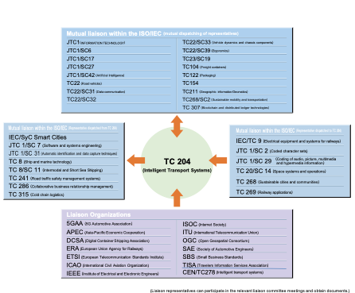

<!-- about.md -->

# About ISO/TC204 Intelligent Transport Systems

## Overview

Since our establishment in 1992, TC204 has developed and maintained a suite of standards and other artefacts for the Intelligent Transport Systems (ITS) environment. The ITS environment interacts with many other domains and TC 204 coordinates with other ISO technical committees (e.g., TC 22) to ensure a proper division of work as defined by our scope.

<blockquote> </blockquote>

To date, we have published over 360 documents that collectively describe broad swaths of the ITS domain. This work exists within a much broader operating context requiring collaboration with other developers of related standards, both **_within ISO_** (such as [TC22 Road Vehicles](https://www.iso.org/committee/46706.html) and [TC344 Innovative Logistics](https://www.iso.org/committee/9824329.html)) **_and beyond_** (such as [CEN/TC278 ITS Standards](https://www.itsstandards.eu/) and [ISO/IEC JTC 4 Smart and sustainable cities and communities](https://www.iso.org/committee/11064026.html)). We currently have [liaisons](https://www.iso.org/committee/54706.html#liaisons) with roughly 40 other groups.

{.figure}

/// caption
TC 204 Liaisons
///

## TC204 Committee Structure

TC204 executes its [official work programme](https://www.iso.org/contents/data/committee/05/47/54706/x/catalogue/p/0/u/1/w/0/d/0) through a broad range of groups consisting of:

- **AHG** - Ad-hoc Groups, which are short-lived groups to advise the TC regarding specific issues
- **AG** - Advisory Groups, which are standing groups that advise the TC on long-term subjects
- **WG** - Working Groups, which develop standards and other formal publications of TC 204
- **JWG** - Joint Working Groups, which formally collaborate with experts outside of TC204 in their development of standards and other documents. JWGs are hosted by a specific TC, but generally have co-chairs from each participating TC.

Our structure is shown below together with our [participating and observing](https://www.iso.org/en/contents/data/committee/05/47/54706.html?view=participation) members. All of [TC204’s groups and convenors](https://www.iso.org/en/contents/data/committee/05/47/54706.html#structure) may be approached via the [TC204 Secretariat.](https://www.iso.org/en/contents/data/committee/05/47/54706.html#secretariat)

## Scope of TC204 Working Groups

TC204's current active groups and their purposes are outlined below.

- [AG 2](ag2/index.md): Identifiers
- [AG 3](ag3/index.md): Operational improvement group
- [AG 4](ag4/index.md): Program coordination
- [AG 5](ag5/index.md): Publication and marketing review
- [AHG 2](ahg2/index.md): ITS CyberSecurity
- [JWG 1](jwg1/index.md): City data model — Transport
- [WG 1](wg1/index.md): Architecture
- [WG 3](wg3/index.md): ITS geographic data
- [WG 5](wg5/index.md): Fee and toll collection
- [WG 7](wg7/index.md): General fleet management and commercial/freight
- [WG 8](wg8/index.md): Public transport/emergency
- [WG 9](wg9/index.md): Integrated transport information, management and control
- [WG 10](wg10/index.md): Traveller information systems
- [WG 14](wg14/index.md): Driving automation and active safety systems
- [WG 16](wg16/index.md): Communications
- [WG 17](wg17/index.md): Nomadic Devices in ITS Systems
- [WG 18](wg18/index.md): Cooperative systems
- [WG 19](wg19/index.md): Mobility integration
- [WG 20](wg20/index.md): Big Data and Artificial Intelligence supporting ITS
- TC 211 JWG 11: GIS-ITS

## Naming Convention for TC204 Deliverables

Our document titles may seem a little daunting, however they typically use the multi-level naming structure:

`<Publishing SDO(s)>`/`<Deliverable Type>` `<Number[-Part]>`:`<Year of Publication>`[(`<language>`)] `<Title 1>` - `<Title 2>` [ - `<Title 3>`]

!!! example
    ISO/TS 14813-1:2015(en) Intelligent transport systems — Reference model architecture(s) for the ITS sector - Part 1: ITS service domains, service groups and services

|Name Component      |Example|Description|
|:------------------:|:-----:|:-----------------------------------------------------|
|Publishing SDO(s)   |ISO    |The Standards Development Organisation(s) that will publish the deliverable      |
|Deliverable Type    |TS     |The [type of deliverable](http://www.iso.org/iso/home/standards_development/deliverables-all.htm) |
|Number[-Part]       |14813-1|Unique identifier of the deliverable, which can include an optional *Part* number to indicate they are focussed components detailing a specific aspect. This can also facilitate progressive development and publishing and use of a suite of documents over time. |
|Year of Publication |2015   |Year that the deliverable is formally published and released for use             |
|language            |en     |Used to distinguish between English and French editions of a document            |
|Title 1  |Intelligent transport systems |Used for most TC204 deliverables                                     |
|Title 2  |Reference model architecture(s) for the ITS sector|Key concept                                      |
|Title 3  |Part 1: ITS service domains, service groups and services|An optional component, but frequently used in order to describe specific aspects of the Key concept. Note that “Part 1: “ is considered part of the title    |
