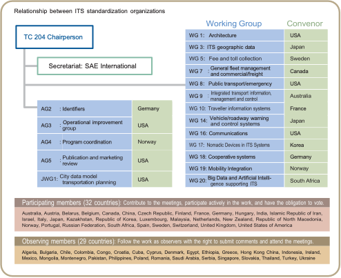

# About ISO/TC204 Intelligent Transport Systems

## Overview

Since our establishment in 1992, TC204 has developed and maintained a suite of standards and other artefacts for the Intelligent Transport Systems (ITS) environment. The ITS environment interacts with many other domains and TC 204 coordinates with other ISO technical committees (e.g., TC 22) to ensure a proper division of work as defined by our scope.

<blockquote> </blockquote>

Our 360 active documents collectively describe:

- a common **ITS framework** including:
    - Reference ITS Architecture
    - Terminology and Definitions
    - Data Concepts
    - A [Registry of ITS Information (RITSI)](https://iso-tc204.github.io/iso5345/)
- many specialised deliverables that describe and define various components that help deliver ITS Services and solutions.

TC204 and our work exists within a much broader operating context requiring collaboration with other developers of related standards, both **_within ISO_** (such as [TC22 Road Vehicles](https://www.iso.org/committee/46706.html) and [TC344 Innovative Logisitics](https://www.iso.org/committee/9824329.html)) **_and beyond_** (such as [CEN/TC278 ITS Standards](https://www.itsstandards.eu/) and [ISO/IEC/JTC 1/WG 11 Smart cities](https://jtc1info.org/sd-2-history/jtc1-working-groups/wg-11/)). Our current liaisons are illustrated below, with links available [here.](https://www.iso.org/committee/54706.html#liaisons)

{.figure}

*TC 204 Liaisons*{:.figcaption}
 
### TC204 Committee Structure
TC204 delivers its [official work programme](https://www.iso.org/contents/data/committee/05/47/54706/x/catalogue/p/0/u/1/w/0/d/0) through a broad range of groups consisting of:

* **WG** - Working Groups within TC204
* **AG** - Advisory Groups (typically special projects / initiatives)
* **JWG** - Joint Working Groups to formally collaborate with experts outside of TC204 (such as other ISO/TCs or other SDOs). 

Our structure is shown below together with our Participating and Observing members. All of [TC204’s groups and convenors](https://www.iso.org/committee/54706.html#structure) may be approached via the [TC204 Secretariat.](https://www.iso.org/committee/54706.html#secretariat)

{.figure}

*TC 204 Structure*{.figcaption}

### Scope of TC204 Working Groups
TC204's current active groups and their purposes are outlined below.

- [AG 2](ag2/index.md): Identifiers
- [AG 3](ag3/index.md): Operational improvement group
- [AG 4](ag4/index.md): Program coordination
- [AG 5](ag5/index.md): Publication and marketing review
- [AHG 2](ahg2/index.md): ITS CyberSecurity
- [JWG 1](jwg1/index.md): City data model — Transport
- [WG 1](wg1/index.md): Architecture
- [WG 3](wg3/index.md): ITS geographic data
- [WG 5](wg5/index.md): Fee and toll collection
- [WG 7](wg7/index.md): General fleet management and commercial/freight
- [WG 8](wg8/index.md): Public transport/emergency
- [WG 9](wg9/index.md): Integrated transport information, management and control
- [WG 10](wg10/index.md): Traveller information systems
- [WG 14](wg14/index.md): Driving automation and active safety systems
- [WG 16](wg16/index.md): Communications
- [WG 17](wg17/index.md): Nomadic Devices in ITS Systems
- [WG 18](wg18/index.md): Cooperative systems
- [WG 19](wg19/index.md): Mobility integration
- [WG 20](wg20/index.md): Big Data and Artificial Intelligence supporting ITS
