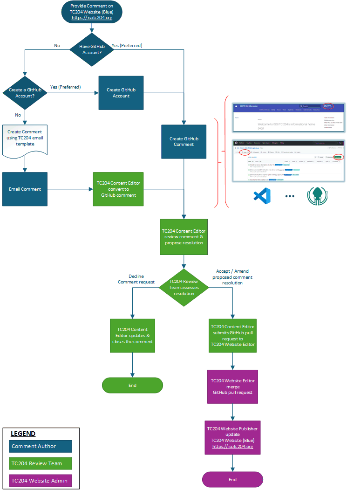

<!-- contributor.md -->

# Commenting and Contributing to ISO TC 204

## Key Terms

**_Commenting_** is usually a request to change something (e.g., adding, modifying or removing content or links) on a TC204 product. _Comments_ can also include more general feedback rather than a request for a specific change.

**_Contributing_** is proposing specific text to resolve a _Comment_.

## TC204 Pathways for Comments and Contributions

_Comments_ and _Contributions_ can be submitted via a number of pathways which are dependent upon the TC204 product, and whether a person is a member of TC204 or not.

### Comments and Contributions for formal ISO documents

_Comments_ concerning official TC204 documents are generally provided via participating ISO members (National Standards Bodies (NSB)) through [formal processes defined by ISO](https://www.iso.org/cms/%20render/live/en/sites/isoorg/home/developing-standards/get-involved.html). _Contributions_ to official TC204 documents can only be provided through this process.

Some TC204 documents have corresponding websites managed within GitHub that provide additional information about those standards, or where certain resources referenced by the standards are maintained. If such a site exists, the GitHub project may have its own Issues page where comments can be submitted as discussed below.

`How to discover the ISO member in your country`

You can find the National Standards Body (NSB) for your country in the [ISO members list](https://www.iso.org/about/members), where each ISO member is listed with contact details.

`What if my country is not an ISO member?`

If your country isn’t an ISO member, you can’t participate directly in ISO technical work through a NSB. However, you can contact ISO directly to explore other ways to get involved or learn more about membership options.

TC204 has developed a [Guide for Editors](https://github.com/ISO-TC204/ISO-TC204.github.io/wiki/Guide-for-Editors) to enhance the quality and efficiency of developing _Contributions_ to our documents.

### Comments and Contributions for TC204 websites

A number of pathways to _Comment_ or _Contribute_ to TC204 websites are shown in Figure 2.

**_via GitHub (recommended):_** this is the most efficient path and requires a free, personal GitHub account.

**_via email:_** direct email contact to the respective TC204 Working Group Convenor.

.

A number of templates are under development to further improve the quality and efficiency of _Comments_ and _Contributions_. Until then, you can use the associated [GitHub issues page](https://github.com/ISO-TC204/ISO-TC204.github.io/issues).
