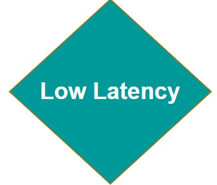
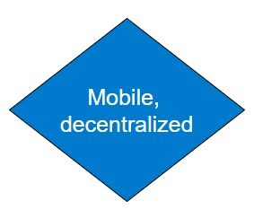
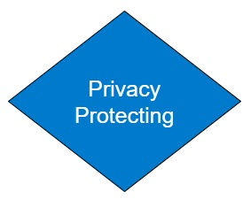
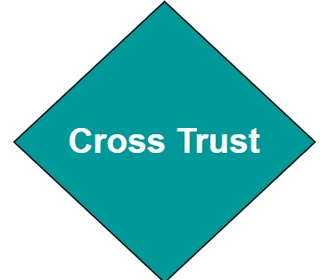
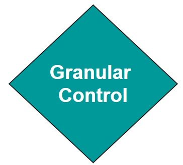
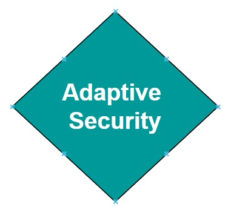
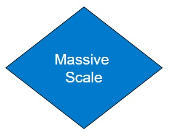

# A Beginner's Guide to Intelligent Transportation System (ITS) Cybersecurity 

## An Introduction to ITS and ITS Cybersecurity

### ITS Systems of Systems

Intelligent Transportation Systems (ITS) enhance mobility and safety through connected and automated technologies. ITS systems rely on near real-time data exchange between vehicles, infrastructure, and cloud services to optimize traffic flow and improve vehicular safety. Connected vehicles use vehicle-to-everything (V2X) communication to help prevent collisions, while roadside units (RSUs) relay information such as signal phase changes, work zone alerts, and dynamic speed limits. Mobile edge computing (MEC) enables rapid decision-making by processing data close to the roadway, reducing latency for safety-critical applications. The following diagram illustrates the key components of a typical ITS deployment and how they interact as a system of systems.

The complexity and interconnectedness of these systems create new operational benefits but also introduce new types of risk. Because vehicles and infrastructure often interact dynamically and at high speeds, reliability, precision, and trust in communications are important.

### Introduction to Cybersecurity

Cybersecurity is the protection of digital systems, communications, and data from unauthorized access, manipulation, or disruption. In critical infrastructure sectors such as transportation, cybersecurity controls directly affect physical safety. A cybersecurity failure could disrupt traffic signals, disable roadside infrastructure, or compromise the behavior of a connected vehicle on the road. Cybersecurity principles include confidentiality, integrity, and availability. 

Confidentiality ensures that data is protected from unauthorized access, preserving privacy and preventing misuse. Integrity guarantees that data and messages remain accurate and unaltered during transmission or storage. Availability ensures that systems and services remain operational and accessible when needed. In transportation, these principles apply to traffic control commands, vehicle messaging, digital road signage, and other systems. In such cases, timing, accuracy, and authentication of source or destination entities are critical. 

### ITS Cybersecurity

ITS cybersecurity ensures the integrity, confidentiality, and availability of data exchanged across an ITS system of systems. It protects against cyber threats that could disrupt traffic management, compromise vehicle behavior, or manipulate digital traffic controls. This includes securing communication between vehicles and infrastructure, ensuring that only trusted devices participate in ITS applications, and protecting sensitive data from misuse or exposure. In the context of V2X, data integrity and availability are critical requirements while confidentiality is not always required.  This is due to the latency-sensitive nature of V2X messages such as Basic Safety Messages (BSMs), where encryption processing and messaging overhead may reduce the ability to receive information in a timely manner. 

Modern ITS environments face a broad and evolving threat landscape. Communications between vehicles and infrastructure—known as Vehicle-to-Everything (V2X)—must be protected from interception, manipulation, and unauthorized injection of false data. Network infrastructure is vulnerable to denial-of-service (DoS) and malware-based attacks, which can disable roadside systems or overwhelm traffic management centers. IoT devices such as smart traffic signals, cameras, and sensors may be physically or remotely exploited due to weak default configurations or unpatched software. Location-based services can be compromised through GPS spoofing and jamming, causing vehicles to misreport their positions or lose navigation capability. As cyber-physical systems, ITS deployments must defend not just against digital exploits, but against threats that have direct safety consequences in the physical world—from manipulating emergency vehicle priority to triggering unsafe driving conditions. The following diagram provides a simplified view of the types of threats that can affect different components of the ITS environment.

Unlike traditional internet-based systems, ITS cybersecurity must function in highly mobile, latency-sensitive environments where anonymity of participants is often important. Vehicles must trust messages from other vehicles or roadside systems they have never encountered before—often with no direct internet connection or central authority available at the time of interaction. As a result, ITS requires specialized cybersecurity tools and protocols that go beyond traditional cybersecurity tools such as Transport Layer Security (TLS) and X.509 certificates. The sections that follow introduce the unique characteristics of ITS cybersecurity, explain why general-purpose cybersecurity tools are insufficient, and describe the standards and trust frameworks that support secure ITS deployments. 

## Why ITS Cybersecurity is Unique

Transportation systems integrate real-time cyber-physical operations with direct safety implications. Unlike traditional IT systems, which can often tolerate latency, centralized trust models, and identity-bound certificates, ITS requires decentralized, privacy-preserving, and low latency security models that operate across jurisdictions. These systems support millions of highly mobile vehicles and infrastructure components that must be able to securely interact often without continuous connectivity.

While ITS-specific security mechanism such as those defined in IEEE 1609.2 or ETSI TS 103 09 were developed to meet these needs, it is important to understand why traditional internet security certificate formats such as X.509 are often not appropriate. The characteristics below highlight the specific challenges that make ITS cybersecurity a distinct field of practice.

## 1. Real-Time, Safety-Critical Operations

<table>
  <tr>
    <td style="width: 170px; vertical-align: middle; text-align: center;">
      
    </td>
    <td>
      <strong>Real-Time, Safety-Critical Operations</strong> 
      ITS involve real-time interactions that directly affect safety. For example, vehicle-to-Road Side Unit (RSU) communication requires minimal latency so that vehicles can immediately process messages. Any delays that would be introduced through traditional internet security protocols, which are often optimized for less time-sensitive applications, could lead to safety hazards. ITS-specific mechanisms, such as IEEE Std. 1609.2 certificates, are designed to prioritize low-latency communication while maintaining security, making them better suited for safety-critical real-time operations.
    </td>
  </tr>
</table>

## 2. Mobility Requirements

<table>
  <tr>
    <td style="width: 170px; vertical-align: middle; text-align: center;">
      
    </td>
    <td>
      <strong>Mobility Requirements</strong> 
      Unlike stationary internet systems, transportation systems operate in highly dynamic environments where devices (e.g., vehicles, pedestrians, RSUs) continuously join and leave networks. IEEE Std. 1609.2 certificates are optimized for use in these dynamic environments, with support for example for short duration lifetimes. Traditional X.509 systems are less equipped to handle frequent certificate updates and revocations required for mobile, decentralized networks.
    </td>
  </tr>
</table>

## 3. Anonymity Requirements

<table>
  <tr>
    <td style="width: 170px; vertical-align: middle; text-align: center;">
      
    </td>
    <td>
      <strong>Anonymity Requirements</strong> 
  Cybersecurity systems such as the Security Credential Management System (SCMS) issue pseudonym certificates to vehicle OBUs, enabling trusted communication while preserving subscriber anonymity. X.509 certificates have no mechanism for preserving subscriber anonymity. 
    </td>
  </tr>
</table>

## 4. Multi-Entity Trust Management

<table>
  <tr>
    <td style="width: 170px; vertical-align: middle; text-align: center;">
      
    </td>
    <td>
      <strong>Multi-Entity Trust Management</strong> 
ITS environments involve a wide range of stakeholders, including vehicles from multiple Original Equipment Manufacturers (OEMs), infrastructure owned by various jurisdictions, and multiple communication providers. Establishing trust across these entities requires specialized structures, such as the Certificate Trust List (CTL) in North America or the European Certificate Trust List (ECTL). These mechanisms enable the extension of trust to differing policy domains and support the dynamic operation of vehicles with infrastructures owned and managed by differing entities. Generic systems like X.509 lack these built-in cross-trust mechanisms and require substantial planning and processes for trust extension, making them less suited for managing complex ITS trust requirements. 
    </td>
  </tr>
</table>

## 5. Finer-Grained Authorization Control

<table>
  <tr>
    <td style="width: 170px; vertical-align: middle; text-align: center;">
      
    </td>
    <td>
      <strong>Fine-Grained Authorization Control</strong> 
ITS applications often require more granular access control than X.509 structures can provide. For example, IEEE Std. 1609.2 enables the use of Provider Service Identifiers (PSID)/Service Specific Profiles (SSP) which define a subscribers privileges for specific ITS applications and roles. Assertion of specific PSID/SSP values in an IEEE 1609.2 certificate ensures that only authorized subscribers are able to perform specific actions, such as requesting traffic signal priority or accessing sensitive data. Well-defined PSID/SSP profiles allow an ITS to enforce fine-grained authorization and access control.  
    </td>
  </tr>
</table>

## 6. A Unique Threat Model

<table>
  <tr>
    <td style="width: 170px; vertical-align: middle; text-align: center;">
      
    </td>
    <td>
      <strong>Unique Threats</strong> 
ITS faces real-world cyber threats that impact traffic operations and safety. Researchers have shown that they can spoof GPS signals, causing vehicles to misinterpret their location, or hijack roadside units (RSUs) to broadcast false messages, creating congestion or dangerous driving conditions. In past incidents, ransomware attacks on transportation agencies have shut down traffic management centers, preventing operators from monitoring road conditions. Additionally, researchers have demonstrated remote exploits on vehicle-to-everything (V2X) communication, allowing attackers to inject false vehicle attributes into Basic Safety Messages (BSM). These threats require ITS-specific security measures, such as misbehavior detection and certificate-based authentication and privileging, that are not provided via X.509 certificates. 
    </td>
  </tr>
</table>

## 7. Scalability and Certificate Management

<table>
  <tr>
    <td style="width: 170px; vertical-align: middle; text-align: center;">
      
    </td>
    <td>
      <strong>Massive Scale</strong> 
The scale of ITS networks includes millions of vehicles, RSUs, and other devices that require efficient certificate issuance, rotation, and revocation processes. SCMS is designed for this scale, enabling seamless management of certificates. X.509-based Public Key Infrastructures (PKI) do not inherently address the scalability and frequency of certificate changes required in ITS.
    </td>
  </tr>
</table>

## ITS Cybersecurity Building Blocks

Now that we've established what makes ITS cybersecurity unique, it's useful to introduce the key mechanisms that have been developed to meet those needs. These mechanisms include secure certificate formats tailored for mobile use, frameworks for distributing and managing credentials across millions of devices, and systems for detecting and responding to misbehavior in the network. While specific implementations vary by region—for example, between North America’s SCMS and Europe’s CCMS—the core building blocks share common goals and are aligned with international standards.

The following section provides a high-level overview of these mechanisms, written for non-experts. More technical readers are encouraged to explore the [ITS Cybersecurity Mechanisms and Building Blocks](system-specific-security) section for deeper background. 

### Credential Management Systems

A Credential Management System (SCMS or CCMS) is a specialized type of public key infrastructure (PKI) designed for ITS. It provides the foundation of trust for communications between vehicles, infrastructure, and backend systems. Unlike traditional PKI systems that issue long-term identity certificates, SCMS and CCMS issue short-lived pseudonym certificates that protect user privacy while still enabling strong authentication and authorization. The diagram below introduces the core components of a credential management system used to enable trusted communication in ITS.

These systems include processes for certificate issuance, renewal, revocation, and trust distribution. They also support cross-jurisdictional trust, using structures like Certificate Trust Lists (CTLs) or European Certificate Trust Lists (ECTLs) to allow vehicles and devices from different organizations or countries to interoperate securely.

### ITS Certificate Standards

ITS uses certificate formats specifically tailored for the real-time, decentralized, and mobile nature of V2X communications. Two major standards are used globally: IEEE 1609.2, which is primarily deployed in North America, and ETSI TS 103 097, which is used in Europe. While developed in parallel, both standards share key features that address the specific challenges of ITS. They support privacy-preserving pseudonymity, allowing vehicles to authenticate messages without revealing long-term identities. They also include geolocation constraints and flexible permission structures that enable fine-grained control over what actions a device is authorized to perform. The image below depicts the fields of an IEEE Std. 1609.2 format certificate. 

### Entitlements

ITS certificates can carry embedded entitlements—policy assertions that define what a device is authorized to do in the context of specific ITS applications. These entitlements are expressed using certificate fields such as the Provider Service Identifier (PSID) and Service-Specific Permissions (SSP) in IEEE deployments, or the ITS Application Identifier (ITS-AID) and corresponding permissions in ETSI-based systems. The image below shows the appPermissions field of an IEEE 1609.2 certificate. AppPermissions carries a sequence of authorized PSID and SSP entries, representing the applications and roles that the device possessing the certificate is authorized to participate in. 

For example, a certificate may include an entitlement that authorizes a vehicle to request signal priority, while restricting that capability from others. A sending device, for example and OBU transmits a message as a signed secure protocol data unit (SPDU) and the receiving device validates message authenticity, followed by a check against the PSID and SSP permissions asserted in the message. These permissions are checked against the sending devices' certificate, using the appPermissions field. 

By supporting fine-grained entitlements, ITS certificates enable strong access control mechanisms that align with specific use cases, user roles, or organizational policies.

### Misbehavior Detection

Even in a well-secured system, trusted devices can malfunction or behave maliciously. In ITS, where safety depends on the accuracy and integrity of real-time data, it is important to continuously evaluate whether participants are acting in accordance with expected behaviors. Misbehavior detection systems are designed to identify faulty or deceptive behavior, for example  inconsistent vehicle position updates, spoofed GPS signals, or invalid safety alerts, and initiate a response that preserves trust in the network. These systems operate at both the edge and the backend. Local detection capabilities onboard vehicles or infrastructure can flag suspicious messages, while backend authorities analyze reported incidents, corroborate evidence, and determine whether a device's credentials should be suspended or revoked. The figure below illustrates a simplified view of how misbehavior is detected, validated, and responded to in a credential-based ITS environment.

---

# Comparing the Internet Cybersecurity Stack and the ITS Cybersecurity Stack 

Digital security architectures are typically built as layered stacks, with each layer addressing different types of threats and trust requirements. The traditional internet stack, built around protocols such as TLS and certificate formats like X.509, is well-suited for securing static web services, enterprise systems, and client-server communications. ITS, however, operates under fundamentally different constraints. It involves mobile actors, ephemeral trust relationships, and real-time decision-making in safety-critical contexts. These differences have led to the development of an ITS-specific cybersecurity stack—designed for decentralized communication, scalability, privacy, and performance in dynamic environments. The following comparison outlines where each stack is typically applied, and highlights why the ITS cybersecurity stack is better suited for securing V2X and transportation-specific use cases.

Many of the critical differences between traditional internet security and ITS cybersecurity come down to one key architectural choice: the certificate format. Digital certificates define how trust is established, how messages are authenticated, how privacy is preserved, and how permissions are assigned. Traditional internet systems rely on X.509 certificates, which are long-lived, identity-bound, and designed for centralized, session-based environments—such as browsers, enterprise servers, and backend applications. In contrast, ITS systems use specialized certificate formats, such as IEEE 1609.2 (North America) and ETSI TS 103 097 (Europe), which are tailored for real-time communication between mobile devices in safety-critical scenarios.

The table below is intended as a decision tool. It identifies common deployment considerations and helps clarify which certificate format is better suited to address each one. Readers should evaluate each row in the context of their deployment environment and use case.

| Deployment Consideration                                     | X.509 Certificates | ITS Certificates (IEEE 1609.2/TS 103 097) |
| ------------------------------------------------------------ | ------------------ | ----------------------------------------- |
| Is the environment latency-sensitive or safety-critical? For example, does the system require real-time processing of messages. | ✘                  | ✔                                         |
| Are devices mobile and frequently entering/leaving networks? | ✘                  | ✔                                         |
| Is user anonymity or pseudonymity required? For example, does the deployment need to preserve privacy while still verifying message authenticity? | ✘                  | ✔                                         |
| Is fine-grained access control required? For example, do you need to define what specific actions a device can take within a given application (e.g., request signal priority)? | ✘                  | ✔                                         |
| Are devices expected to send messages without a connection to a server? | ✘                  | ✔                                         |
| Is the environment bandwidth-constrained or using wireless links? | ✘                  | ✔                                         |
| Is the deployment centralized and session-based?             | ✔                  | ✘                                         |
| Will the deployment integrate with traditional IT infrastructure (e.g., TMC servers, cloud APIs)? | ✔                  | ✘                                         |

X.509 certificates are still a valid and widely used option for securing communications in backend systems, including data exchanges between traffic management centers, cloud platforms, and enterprise services. However, for on-road communication, safety-critical applications, and mobility-centric environments, X.509 lacks the necessary support for short-lived credentials, anonymity, decentralized trust, and application-specific permissions.

# Introduction to ITS Cybersecurity Guidance

Welcome to the ISO Guide to cybersecurity for Intelligent Transportation Systems (ITS). This site provides information on securing ITS deployments across all layers of a system of system (SoS), including interfaces, communication protocols, certificate and permission management, device security, and misbehavior detection and remediation. The site map is illustrated below: 

This site includes: 

- Guidance on cybersecurity standards relevant to ITS, such as [ISO 21177](https://www.iso.org/standard/87225.html), [IEEE 1609.2](https://standards.ieee.org/ieee/1609.2/10258/), [ETSI TS 102 940](https://www.etsi.org/deliver/etsi_ts/102900_102999/102940/02.01.01_60/ts_102940v020101p.pdf), and [ETSI TS 103 097](https://www.etsi.org/deliver/etsi_ts/103000_103099/103097/02.01.01_60/ts_103097v020101p.pdf)
- Regional cybersecurity systems such as the [Security Credential Management System](https://www.scmsmanager.org/) in North America and the Cooperative ITS Trust Model (C-ITS) in Europe. 
- Information on how to apply standards to protect Onboard Units (OBU), Roadside Units (RSU), and backend systems
- Explanations of certificate issuance, revocation, permissions (PSIDs and SSPs) and policy enforcement
- Design considerations for trust management, cross-border interoperability, and lifecycle governance

This site is intended for public agencies, standards bodies, system integrators, manufacturers, and other stakeholders responsible for secure design and operation of ITS technologies. 

---

## Start Here: [Introduction to ITS Cybersecurity – A Beginner's Guide](dummys-guide.md)

Begin with this introductory guide to understand why ITS-specific security mechanisms—such as IEEE 1609.2—are designed to meet the unique requirements of vehicular networks, and why conventional internet security frameworks like X.509 may not be sufficient.

## Regional Considerations: [Understand regional differences in regulation and approach](Regional-considerations.md) 

While ITS cybersecurity standards aim for global interoperability, implementation often varies across regions due to different legal frameworks, privacy expectations, governance models, and deployment architectures. These differences directly affect how trust is established, how permissions are granted, and how secure communications are managed. Understanding regional approaches, such as the SCMS model in North America and the C-ITS Trust Model in Europe is important for organizations deploying cross-border systems or designing interoperable ITS devices and services.  These differences must be taken into account when designing systems intended for multi-regional interoperability.

---

## Key Topics in ITS Cybersecurity

### 1. [ITS Security Architectures](its-security-architectures.md)

ITS cybersecurity architectures define how security protections are applied across devices, vehicles, communications networks, and backend systems. These architectures provide a structured approach to managing digital trust, securing data exchanges, and protecting infrastructure components. They incorporate regional models, such as the SCMS used in North America and the C-ITS Trust Model adopted in Europe, each of which applies different governance structures and cryptographic processes. Standards such as IEEE 1609.2, ISO 21177, and ETSI TS 103 097 form the foundation for securing V2X messaging and managing certificate-based trust. This section outlines how these components and standards are integrated to enable secure and interoperable ITS deployments.  A key focus is the use of public key infrastructures to support secure messaging. 

### 2. [Security Standards and Their Roles](security-standards.md)

This section outlines key international standards that enable ITS cybersecurity across different layers of the system. It explains how standards define certificate formats, secure message structures, revocation processes, and permission models used to control authorized behavior in ITS deployments. Regional implementations often profile or extend these standards to meet specific requirements. For example, the SCMS architecture in North America applies a profile of IEEE-based standards for certificate and permissions management, while the C-ITS model in Europe leverages ETSI-defined formats and uses the CPOC protocol for onboarding Root Certificate Authorities. Understanding the role of each standard helps implementers select the appropriate specifications for their technical and regional needs.

### 3. [Interoperability Strategies](trust-bridges.md)

Trust bridges are mechanisms that enable secure communication between independent security domains. They are used when two systems operate under separate certificate authorities, trust policies, or technical standards. Trust bridges help establish a common framework for validating credentials, enabling interoperability across domains that may use different cybersecurity models, bridging between systems based on [X.509](https://datatracker.ietf.org/doc/html/rfc5280) as defined in [Internet Engineering Task Force (IETF) Request For Comment (RFC) 5280](https://datatracker.ietf.org/doc/html/rfc5280), [IEEE 1609.2](https://standards.ieee.org/ieee/1609.2/10258/) or [ETSI TS 103 097](https://www.etsi.org/deliver/etsi_TS/103000_103099/103097/01.03.01_60/ts_103097v010301p.pdf) formats. This is especially important in cross-jurisdictional deployments, such as where regional ITS infrastructures must exchange authenticated messages despite using distinct certificate management systems. Trust bridges can also support selective trust, allowing one domain to recognize only specific permissions or roles from another domain. An example is shown below where a trust bridge translates messages signed using X.509 certificates to messages signed using IEEE Std. 1609.2 certificates. 

### 4. [ITS Cybersecurity Mechanisms and Building Blocks](system-specific-security.md)

Cybersecurity systems and components provide the building blocks that can be used to create a cybersecurity architecture for individual ITS systems.  These include core security services such as certificate issuance, revocation, and permissions management, which ensure that only authorized entities can participate in communications. Trust is anchored by entities like Electors in the SCMS model or Root Certificate Authorities in the C-ITS model, each governing certificate validation within their domain. Misbehavior detection capabilities support real-time monitoring and response, identifying suspicious activity such as implausible Basic Safety Messages (BSM) or message patterns that deviate from expected norms. Also, protections for OBUs, RSUs, and backend systems ensure that credentials remain secure and communications are authenticated. Together, these components enable a scalable and adaptable cybersecurity architecture for ITS.

### 5. [Stakeholder-Specific Guidance](stakeholder-guidance.md)

This section provides guidance tailored to different stakeholder perspectives, helping decision-makers, standards developers, and implementers identify processes, standards, and practices to secure ITS deployments while addressing regional variations in architecture and trust management. Guidance is included for:

- **Decision-makers**, who play a key role in enabling trust infrastructure. This may include supporting the deployment of a national SCMS in North America or participating in Root CA onboarding processes within the European C-ITS framework. Decision makers focus on defining secure operational priorities for ITS systems of systems. 
- **Standards developers**, who must ensure cross-border alignment with international specifications such as ISO 21177, while also addressing regional profiles and extensions, including IEEE 1609.2.1 in North America and ETSI TS 103 097 in Europe.
- **Implementers**, who are responsible for applying these standards during deployment. This includes tasks such as deploying RSUs, managing PSID and SSP entitlements, and enforcing security policies at the device and network level.

### 6. [Security Governance](security-policies.md)

This section addresses governance considerations that guide the secure operation of ITS systems throughout the device and certificate lifecycle. Topics include certificate enrollment, management, and revocation processes, along with mechanisms to ensure cross-jurisdictional interoperability and adherence to privacy regulations. Governance models vary by region but often include formal structures such as elector-based approval policies in North America’s SCMS and defined onboarding procedures for Root CAs in Europe’s C-ITS. Additional examples include end entity security requirements for OBUs and RSUs, and policy controls that govern how permissions (such as PSIDs and SSPs) are issued and enforced.

### 7. [Specialized Use Cases](specialized-use-cases.md)

This section presents targeted examples that illustrate how cybersecurity measures are applied to specific ITS technologies and message types. Use cases include emerging system architectures such as Cooperative Driving Automation (CDA) and Mobile Edge Computing (MEC), where secure communication and trust management are critical to safe and efficient operation. At the message level, the section highlights how protections are implemented for key V2X message types such as Basic Safety Messages (BSMs), Traveler Information Messages (TIMs), and Probe Data Messages. These examples help demonstrate how security standards and policies are tailored to meet the unique operational and trust requirements of different ITS functions.

# Regional Considerations in ITS Cybersecurity 

ITS cybersecurity is shaped by regional differences in legal frameworks, governance models, privacy expectations, and system architecture. These variations influence how trust is established, how anonymity is maintained, and how secure communications are established. The following subsections highlight key governance, trust, and compliance differences that influence regional ITS cybersecurity operations.

## Governance 

There are differences in regional trust models that influence cybersecurity policies and procedures. For example, certificate provisioning to ITS devices is handled differently in Europe vs. North America. These differences impact who can manage certificate policies, who can issue credentials, and how PKI system compliance is enforced.

Europe employs a centralized governance model under the [European Commission](https://commission.europa.eu/index_en). The Certificate Policy Authority (CPA) governs root-level decisions, including Root CA approvals and revocations, scheduling of the [European Certificate Trust List (ECTL)](https://cpoc.jrc.ec.europa.eu/ECTL.html) signing sessions, maintaining policy documents, and management enrollment requests. Roles such as the Trust List Manager (TLM) and [C-ITS point of Contact (CPOC)](https://cpoc.jrc.ec.europa.eu/index.html) operate in accordance with CPA decisions.

North America employs a multi-entity consensus model.  [SCMS Manager](https://www.scmsmanager.org/) for example relies on a group of Electors to establish trust by signing a Certificate Trust List (CTL). Electors follow criteria established through working groups and committees, such as the [Ecosystem Audit Committee (EAC)](https://www.scmsmanager.org/wp-content/uploads/2024/10/SCMS-Manager-EAC-Requirements-v1_0.pdf). In North America, each SCMS Provider is responsible for its own certificate issuance processes, subject to periodic compliance review. 

### Privacy and Anonymity

ITS systems are designed to prevent long-term tracking and identity exposure by using pseudonym certificates, which are short-term certificates that anonymize the link between individual messages and their originating OBUs. The use of short-lived pseudonym certificates is governed by policy. In Europe, privacy is tightly regulated by the [General Data Protection Regulation (GDPR)](https://gdpr-info.eu/). As a result, European C-ITS deployments emphasize strict data minimization and correlation to identity. Pseudonym certificates are issued and used in a manner that intentionally prevents backend correlation. 

In North America, privacy protections are implemented through pseudonymity as well. Certificate are rotated frequently and linkages to vehicle identifies are restricted. 

## Compliance and Audit

In Europe, accredited Root CAs must pass technical and organizational audits  prior to inclusion in the ECTL. 

In North America, each SCMS Provider selects an independent PKI auditor to validate conformance with SCMS Manager’s Provider Requirements. Providers must maintain certifications (e.g., [ISO 27001](https://www.iso.org/standard/27001) or [TISAX](https://www.enx.com/en-US/tisax/)), and all Certificate Policy (CP) and Certificate Practices Statement (CPS) documents must reflect the approved policy set. 

# Learn More

https://cpoc.jrc.ec.europa.eu/data/documents/E01941_EU%20CCMS_CPA_ToR_Proc_Release-1.1_20241015.pdf

[SCMS-Manager-EAC-Requirements-v1_0.pdf](https://www.scmsmanager.org/wp-content/uploads/2024/10/SCMS-Manager-EAC-Requirements-v1_0.pdf)

[SCMS Manager -  Elector Policy v1.0.docx](https://www.scmsmanager.org/wp-content/uploads/2020/01/Elector-Policy-v1.0.pdf)

[SCMS-Manager-Provider-Requirements-v1_1.pdf](https://www.scmsmanager.org/wp-content/uploads/2024/10/SCMS-Manager-Provider-Requirements-v1_1.pdf)

[Elector-Technical-Specifications-v1.1.pdf](https://www.scmsmanager.org/wp-content/uploads/2020/01/Elector-Technical-Specifications-v1.1.pdf)

[Welcome to TISAX · ENX Portal](https://www.enx.com/en-US/tisax/)

https://www.iso.org/standard/27001

# ITS Security Architectures

This section describes a multi-layered ITS cybersecurity architecture aligned to the ITS-S reference model. Each layer supports specific security capabilities that address risks across applications, communication, and device infrastructure. The architecture below illustrates how these layers combine to support secure and trusted ITS operations.

## Application Layer

The Application Layer is responsible for enabling defined transportation functions, such as signal priority, lane coordination or incident warning. Applications are standardized, certificate-bound services identified by globally or regionally assigned IDs (AAID or PSID) implemented according to strict message structures and access policies. Applications exchange information with other ITS components using standardized message types from standards like SAE J2735 and ETSI EN 302 637-x, and are identified and authorized via Provider Service Identifiers (PSIDs) and Service-Specific Permissions (SSPs). For example, a transit vehicle’s Onboard Unit (OBU) may have a certificate that includes the PSID for the Signal Request Message (SRM) application and an SSP indicating it is authorized to request transit signal priority at intersections. Permissions should be enforced by both transmitting and receiving ITS-S components. Applications should only initiate communication for services they are explicitly authorized for, and roadside infrastructure (e.g., RSUs) must validate both PSID and SSP on incoming messages.

In addition to certificate-based permissions, many ITS applications operate under local or regional policies configured by ITS Station Operators (SO) that define where, when, and by whom an application may be used. These rules complement certificate-bound permissions and are defined through deployment policy frameworks implemented by jurisdictions, infrastructure owners, or certificate authorities. Polices may be enforced at multiple points in a system and may be implemented through mechanisms such as geofencing, SSP-encoding, infrastructure logic, and credential life-cycle controls. These mechanisms ensure that applications are not only cryptographically authorized, but also contextually constrained to operate within their intended scope.

### Threats to the Application Layer

The table below outlines example threats relevant to this layer.

| Threat Example                              | Security Objectives                                          |
| ------------------------------------------- | ------------------------------------------------------------ |
| Unauthorized access to service functions    | Ensure only authenticated and authorized applications are executed |
| Malicious or unauthorized application code  | Enforce code integrity and secure update processes           |
| Cross-application data leakage              | Isolate applications and enforce secure inter-process communication |
| Exposure of user or operational data        | Apply privacy rules and enforce user consent                 |
| Unauthorized message injection              | A non-authorized OBU transmits Signal Request Messages (SRMs) to manipulate traffic signals. |
| Role escalation                             | A vehicle with general-use permissions reuses or fabricates SSP fields to impersonate an emergency responder. |
| Tampered application logic                  | Malware or modified code causes an ITS device to transmit false warnings or suppress valid messages. |
| Improper deployment (jurisdictions)         | A certified application is installed outside its permitted geographic zone or agency scope. |
| Unauthorized third-party software execution | A device runs unapproved or unsigned applications due to weak software controls or side-loading. |

### Cybersecurity Objectives

The following objectives describe the intended cybersecurity outcomes for this layer and support the mitigation of the threats identified above.

- Restrict application use to authorized roles, based on device certificates and SSP constraints

- Prevent unauthorized message injection or misuse of safety-critical applications
- Ensure software integrity through code signing and runtime validation
- Protect applications from unauthorized modification or execution of unapproved third-party code
- Enforce deployment-specific constraints such as geofencing, jurisdictional scope, and time-based usage

## Facilities Layer

The Facilities layer provides support services for message handling, data management, and inter-application coordination. Security measures here focus on privacy and controlled exposure of message content and services.

### Threats to the Facilities Layer

The table below outlines example threats relevant to this layer.

| Threat Example | Security Objectives                                          |
| -------------- | ------------------------------------------------------------ |
| Message replay | Replay attacks shift time context to mislead behavior        |
| API misuse     | Untrusted entities exploit facility-layer APIs to access or influence protected data |
| Tracking       | Overcollection or linking of contextual data enables re-identification of pseudonymous users |

#### Cybersecurity Objectives

The following objectives describe the intended cybersecurity outcomes for this layer and support the mitigation of the threats identified above.

- Preserve user anonymity and reduce data traceability
- Validate message origin, freshness, and plausibility
- Provide access-controlled APIs for data exchange

### Network and Transport

The Network and Transport Layer secures the communication channels that carry ITS and V2X data across both wireless and wired infrastructures. This includes direct V2X communications between vehicles and RSUs, as well as data exchanged between field devices and backend systems. The primary cybersecurity function of this layer is to ensure that data in transit is protected against tampering, interception, and unauthorized injection, while also enforcing device authentication and maintaining service availability under a variety of environmental and adversarial conditions.

Standards such as IEEE 1609.3 define network and transport protocols for Wireless Access in Vehicular Environments (WAVE), while IEEE 1609.2, IEEE 1609.2.1, and ETSI TS 103 097 provide cryptographic protections, including digital signatures and encryption for V2X messages. Backend communications are typically secured using TLS 1.3 with mutual authentication to protect sensitive data flows between RSUs, TMCs, and service providers.

All V2X messages must be digitally signed to ensure authenticity and integrity. Secure message headers defined by IEEE 1609.2.1 and ETSI TS 103 097 include fields for certificate linkage, timestamps, and replay protection. Devices that cannot validate message signatures must discard the message and may report verification failures to backend systems for further analysis.

While most V2X safety messages are signed but not encrypted, some sensitive data exchanges, such as traveler information or backend configuration files do require encryption. In these cases, protocols such as TLS 1.3 are used to secure communications and ensure confidentiality. 

Pseudonymity protections are also enforced at this layer to prevent persistent tracking of vehicles and infrastructure. Rather than transmitting static identities, devices are issued short-term, unlinkable pseudonym certificates that are rotated regularly. This prevents passive observers from correlating message patterns or locations to reconstruct vehicle trajectories, profile driver behavior, or infer organizational operations. Without effective pseudonym rotation, even properly signed messages could expose operational privacy risks.

### Threats to Network and Transport Layer

The table below outlines example threats relevant to this layer.

| Threat Example                        | Security Objectives                                          |
| ------------------------------------- | ------------------------------------------------------------ |
| Message interception or modification  | Authenticate and encrypt transmitted data                    |
| Replay of valid but outdated messages | Enforce message expiration and sequence validation           |
| Geographic misuse of services         | Apply geographic scope controls to message origin and forwarding |
| Flooding or DoS attacks               | Implement rate limiting, prioritization, and load protections |
| Message injection                     | Attackers send spoofed or malformed messages.                |
| Eavesdropping                         | Passive attackers intercept V2X or backend messages to obtain sensitive information or gain situational awareness. |
| Man-in-the-middle (MITM)              | An attacker inserts themselves between devices to relay or modify communications while impersonating trusted parties. |
| Denial-of-Service (DoS)               | Flooding of wireless or wired interfaces disrupts availability of critical ITS messages. |
| Certificate spoofing                  | Attackers present forged credentials or reuse compromised certificates to authenticate malicious devices. |
| Vehicle tracking                      | Passive observers collect and correlate V2X messages (e.g., BSMs) to track vehicles over time or infer personal behaviors. |

### Cybersecurity Objectives

The following objectives describe the intended cybersecurity outcomes for this layer and support the mitigation of the threats identified above.

- Assure message integrity and authenticity using cryptographic signatures
- Protect confidentiality of sensitive data in transit (e.g., Basic Safety Message (BSMs), certificate requests)
- Authenticate devices and services to prevent spoofing or impersonation
- Prevent unauthorized message injection or modification
- Maintain availability of communication channels

## Access Layer

The Access Layer encompasses the physical and logical interfaces that support communication between ITS devices and external networks. This includes radio interfaces such as V2X as well as wired interfaces such as Ethernet. This layer serves as the point of ingress and egress for V2X messages and operational data, and plays an important role in enforcing message timing, interface-level authentication, and protection against unauthorized access.

Security at the Access Layer is concerned with ensuring that messages originate from trusted hardware components, that unauthorized interfaces are not used to inject or modify data, and that time synchronization is accurate and protected from spoofing or degradation. Compromise at this layer may undermine higher-layer security controls by allowing adversaries to manipulate traffic before cryptographic protections are applied. 

### Threats to the Access Layer

The table below outlines example threats relevant to this layer.

| Threat Example                     | Security Objectives                                          |
| ---------------------------------- | ------------------------------------------------------------ |
| Interface spoofing or hijacking    | Bind device identity to specific hardware interfaces         |
| Degraded timing or synchronization | Validate time source integrity and enforce bounds            |
| Link-layer injection or jamming    | Protect wireless protocols and use hardened media access control |

#### Cybersecurity Objectives

The following objectives describe the intended cybersecurity outcomes for this layer and support the mitigation of the threats identified above.

- Authenticate hardware interfaces and prevent spoofing
- Protect link-layer integrity and timing synchronization
- Prevent unauthorized wireless or physical interface use

## Management Layer

The Management Layer provides the foundation for trust, governance, and policy enforcement across all layers of an ITS security architecture. It encompasses the systems, policies, and controls that establish and maintain trust relationships between devices, infrastructure, and backend services. This layer is responsible for managing cryptographic credentials, coordinating enrollment and authorization processes, and enabling consistent decision-making across administrative domains.

This layer also supports real-time detection and response mechanisms that identify and remediate malicious or anomalous behavior. These include mechanisms for evaluating message content, tracking behavioral consistency, and executing revocation or suspension workflows. 

Key cybersecurity objectives for this layer include establishing a root of trust, controlling enrollment into certificate management systems, enforcing lifecycle rules for certificate issuance and revocation, validating compliance with technical standards, supporting scalable governance structures such as Electors or CPAs, and enabling real-time misbehavior detection and response. These objectives are addressed through a combination of policy-based enforcement, cryptographic controls, behavioral analytics, and coordinated trust administration.

In distributed systems like SCMS, trust is managed by Electors. They sign a multi-party Certificate Trust List (CTL) to prevent unilateral changes. In CCMS, trust is coordinated by a central policy authority and published through the European C-ITS Trust List (ECTL). Before devices can operate, they must be enrolled. Enrollment policies verify security capabilities like key protection, firmware integrity, and standards compliance. Once approved, devices receive an enrollment certificate. This allows them to request operational credentials, such as pseudonym or authorization certificates. Certificate lifecycle controls define how credentials are issued, rotated, and revoked. These processes are governed by system-specific certificate policies and practice statements. Pseudonym certificates are rotated frequently to support privacy. Longer-term credentials like ECs or Root CAs follow stricter auditing and renewal schedules.

The Management Layer also monitors behavior. Devices and infrastructure evaluate message content for consistency and plausibility. If suspicious activity is detected, a Misbehavior Report (MBR) is generated. It includes supporting evidence like signed data, timestamps, and location history. Reports follow standardized formats to support interoperability. They are reviewed by a Misbehavior Authority for validation. Confirmed misbehavior can trigger certificate revocation or temporary suspension. This ensures only trustworthy devices remain active in the ecosystem.

### Threats to the Management Layer

The table below outlines example threats relevant to this layer.

| Threat Example                      | Security Objectives                                          |
| ----------------------------------- | ------------------------------------------------------------ |
| Invalid or unverified certificates  | Verify authenticity and policy conformance of credentials    |
| Inadequate revocation response      | Support timely revocation and trust list updates             |
| Poor misbehavior detection coverage | Enable multi-source reporting and evidence-based evaluation  |
| Unauthorized enrollment             | A device is enrolled into a certificate management system without meeting security or compliance requirements. |
| Key compromise                      | The private key associated with a trusted certificate is extracted or duplicated, allowing impersonation of a legitimate device. |
| Improper trust anchor update        | A CTL update is manipulated and distributed without proper signatures. |
| Stale or missing revocation data    | Devices fail to download updated CRLs or CTLs and continue to trust revoked or expired entities. |
| Enrollment policy evasion           | An attacker submits a non-compliant device for enrollment.   |
| Role escalation using certificate   | A certificate is issued with overly broad SSPs, granting the device capabilities beyond its operational role. |
| Falsified BSMs                      | A vehicle transmits location data inconsistent with plausible movement, affecting other vehicles' path planning. |
| Unauthorized signal requests        | A device sends SRMs without entitlement or in implausible patterns. |
| Replay attacks                      | A recorded V2X message is retransmitted to mislead infrastructure or vehicles. |

#### Cybersecurity Objectives

The following objectives describe the intended cybersecurity outcomes for this layer and support the mitigation of the threats identified above.

- Establish a root of trust for all participants in the ITS environment.
- Control enrollment into certificate management systems through device validation. 
- Manage certificate issuance and revocation according to strict lifecycle rules.
- Ensure compliance with technical standards and operational policies. 
- Enable governance structures (e.g., Electors) to manage trust at scale.
- Support secure multi-jurisdictional interoperability. 
- Detect falsified or anomalous message content in real-time to identify compromised or malfunctioning devices.
- Validate behavioral consistency across space and time, such as physical plausibility of location, speed, and trajectory data.
- Enable revocation or remediation workflows tied to validated misbehavior events. 

## Physical Layer

The Physical Layer provides protections for field-deployed and centralized ITS assets. It addresses threats arising from direct physical access, such as device manipulation, cryptographic key theft, and sabotage. Components like RSUs, OBUs, signal controllers, and cabinet-based systems often operate in exposed environments and must be physically secured to prevent tampering. Devices should be enclosed in tamper-resistant housings with sealed entry points, monitored access controls, and environmental sensors. Access must be logged and managed under formal procedures. Backend infrastructure such as TMCs requires similar safeguards, including badge-controlled entry, monitored access points, and facility intrusion detection.

Cryptographic material must be protected using secure hardware such as secure elements, TPMs, or HSMs that perform operations in isolated environments. Keys must be non-exportable and protected by tamper-response mechanisms that erase sensitive material upon physical compromise. All firmware must be cryptographically signed, with secure boot enabled and unauthorized interfaces disabled before deployment. Updates must be authenticated, signed, and version-controlled, including over-the-air update workflows.

ITS devices should also be hardened and validated against environmental and signal manipulation. Shielding, anomaly detection, and redundant communications can help ensure operational resilience in harsh or adversarial environments.

The table below outlines example threats relevant to this layer.

| Threat Example                    | Security Objectives                                          |
| --------------------------------- | ------------------------------------------------------------ |
| Hardware tampering or replacement | Detect physical intrusion and validate firmware state        |
| Unauthorized physical port access | Enforce access control at all service interfaces             |
| Extraction of cryptographic keys  | Store keys in tamper-resistant secure elements               |
| Unauthorized cabinet access       | Attackers gain access to RSU or controller enclosures to manipulate configurations, install rogue devices, or extract sensitive data. |
| Cryptographic key extraction      | Attackers extract private keys from unsecured OBUs or RSUs using exposed memory or interfaces. |
| Device cloning or hardware swaps  | Physical removal of trusted units and replacement with malicious devices impersonating the original identiy. |
| Unauthorized firmware upload      | Use of USB, serial, or debug ports to install unsigned or malicious firmware. |
| Sensor spoofing or blinding       | Attackers interfere with radar, video, or Global Positioning System (GPS) sensors using external signals. |
| Sabotage                          | RSUs or cabinets are damaged or degraded through vandalism or non-adversarial means. |

#### Cybersecurity Objectives

The following objectives describe the intended cybersecurity outcomes for this layer and support the mitigation of the threats identified above.

- Prevent unauthorized physical access to devices and infrastructure
- Protect cryptographic materials (e.g., private keys, firmware signatures) from extraction or tampering
- Ensure authenticity and integrity of firmware and hardware configurations
- Deter and detect tampering or sabotage
- Support traceability and accountability through access logging and auditability
- Provide secure boundaries to ensure devices operate only in authorized physical and network contexts (e.g., school bus OBU must only be installed in a school bus)

# Security Standards

ITS systems of systems rely on a layered cybersecurity architecture to ensure safe and trusted operation across vehicles, infrastructure, and backend systems. Each layer of this architecture is supported by internationally recognized standards that help protect against cyber threats and maintain system integrity, confidentiality, availability, and trust. The standards shown below are organized according to the key layers of the ITS security architecture:

- Physical Layer
- Access Layer
- Network and Transport Layer
- Facilities Layer
- Application Layer
- Management Layer

---

## Physical Layer

| Standard                                                     | Description                                                  |
| ------------------------------------------------------------ | ------------------------------------------------------------ |
| IEEE 802.3                                                   | Ethernet standard supporting wired communications among traffic infrastructure, including support for secure physical connections. |
| IEEE 802.1X                                                  | Network access control protocol often used in Ethernet-based ITS backhaul networks to authenticate RSUs and field devices. |
| SAE J3101                                                    | Defines hardware security requirements for ground vehicles, including secure boot, key storage, and hardware protections against tampering. |
| SAE J2945/1 On-Board System Requirement for V2V Safety Communications | Specifies foundational requirements for V2V safety applications including secure communications, key provisioning, secure storage, and revocation handling. |
| ISO/IEC 19790:2025                                           | Provides requirements for cryptographic modules used to protect sensitive data, applicable to both software and hardware modules. |
| NIST FIPS 140-3                                              | U.S. Federal standard for certifying cryptographic modules. Commonly used to evaluate tamper-resistant secure elements in OBUs and RSUs. |
| Trusted Platform Module (TPM) / ISO/IEC 11889                | Guidance for secure boot and hardware-based trust anchors in automotive ECUs. |
| [Protection Profile V2X Hardware Security Module](https://www.car-2-car.org/fileadmin/documents/Basic_System_Profile/Release_1.3.0/C2CCC_PP_2056_HSM.pdf) | Outlines the functional and assurance requirements for HSMs used in V2X systems, with focus on secure key lifecycle and resistance to physical attacks. |
| European Commission's V-ITS-S Base Protection Profile (SAFERTEC) Project | Evaluates the trustworthiness of V2X and V2I devices through structured security assessment criteria. |
| UNECE R155                                                   | Regulation that mandates cybersecurity management systems for vehicle manufacturers, including hardware risk mitigation. |

## Access Layer

| Standard                        | Description                                                  |
| ------------------------------- | ------------------------------------------------------------ |
| IEEE 802.11p / IEEE 802.11-2016 | Specifies DSRC/WAVE radio communications at 5.9 GHz for vehicular networking. Enables low-latency broadcast but without link encryption, requiring secure message signing at higher layers. |
| 3GPP LTE-V2X / NR-V2X           | Specifies cellular V2X radio interfaces for sidelink communication. Security depends on higher-layer protections using certificates. |
| NTCIP / SNMPv3 (RFC 3410)       | Management protocols with authentication and encryption for ITS field device communications. |

## Network and Transport Layer

| Standard                                                     | Description                                                  |
| ------------------------------------------------------------ | ------------------------------------------------------------ |
| [IEEE Std. 1609.3](https://standards.ieee.org/ieee/1609.3/10360/) | Defines networking services including IPv6, WAVE short message protocol, and service advertisement for WAVE communications. |
| ISO 15118                                                    | Provides secure protocols for EV charging including Plug & Charge, with a PKI for mutual authentication and encrypted sessions. |
| TLS 1.3 (RFC 8446)                                           | Modern cryptographic protocol used to secure communications between ITS backend systems, RSUs, and cloud services. |
| ISO 21186-3                                                  | Gives guidelines for secure data exchange in C-ITS environments including interface protection and message authenticity. |
| ISO 21177                                                    | Establishes session security services and trust mechanisms for ITS stations including mutual authentication and session key establishment. |
| ETSI TS 102 940                                              | Specifies the security architecture and management of the ITS trust domain, including message security for C-ITS applications. |
| ETSI TS 103 248                                              | Defines privacy and identity protection in C-ITS networks and supports pseudonym management in the transport layer. |
| DTLS                                                         | Datagram version of TLS for UDP-based secure transport.      |
| ISO 21217                                                    | ITS Station reference architecture defining the networking stack within ITS stations. |
| ISO 21210 / ETSI EN 302 636-6-1                              | Profile for IPv6 communication in ITS networks, over GeoNetworking or other media. |
| ETSI EN 302 636-4-1 / -4-2                                   | GeoNetworking protocols for position-based message forwarding in C-ITS. |
| NTCIP Secure Profiles (TLS, SSH)                             | NTCIP profiles updated to endorse secure transport and management of center-to-field device communications. |

## Facilities Layer

| Standard                    | Description                                                  |
| --------------------------- | ------------------------------------------------------------ |
| ISO/TS 21184 / ISO/TS 21185 | Specify global transport data management and comms profiles for trusted device communication. |
| ETSI TS 102 894-2           | Defines a common ITS data dictionary across messages.        |
| ISO 19091                   | Harmonized SPaT/MAP message format (based on SAE, for international use). |
| ISO 16460                   | Harmonized framework for V2X messages across regions.        |
| ETSI EN 302 637-2 / -3      | Defines CAM and DENM message formats used in European C-ITS. |

## Application Layer

| Standard                                                     | Description                                                  |
| ------------------------------------------------------------ | ------------------------------------------------------------ |
| SAE J2735                                                    | Defines message formats like BSM, SPaT, MAP used in V2X; foundational for all V2X applications. |
| SAE J2945/x series                                           | Profiles message behavior and security use (e.g., signing, permissions) for different V2X applications. |
| ISO/TR 21186-1                                               | Describes use cases and application profiles for secure data exchange in cooperative systems, supplementing ISO 21186-3. |
| SAE J2945/4 Road Safety Applications                         | Specifies security requirements for road safety messages like RSZW and LCW, including digital signature enforcement via IEEE 1609.2. |
| ISO 24089                                                    | Provides post-production software update requirements, including update security and verification mechanisms for ITS applications. |
| UNECE R156                                                   | Mandates secure software update management systems for vehicles, including integrity checks and update logging. |
| SAE J3161/1 Onboard System Requirements for LTE-V2X V2V Safety Communications | Defines requirements for LTE-V2X systems in light-duty and public safety vehicles including performance and security aspects. |
| SAE J3161/1B Onboard System Requirements for LTE-V2X V2V Safety Communications by Non-Light-Duty Vehicles and Motorcycles | Extends J3161/1 requirements to non-light-duty vehicles and motorcycles, ensuring consistent V2V communication and security. |
| SAE J3161/1C Onboard System Requirements for LTE-V2X V2V Safety Communications by School Buses | Covers system requirements and adaptations for V2V communications specific to school buses, including security and safety mandates. |
| ISO/TR 23786                                                 | Offers security and risk assessment methods for remote access to automotive systems, especially for diagnostics and updates. |
| ISO 22320                                                    | Specifies incident management processes and coordination structures applicable to ITS emergency scenarios. |
| SAE J3061 / ISO/SAE 21434                                    | Cybersecurity lifecycle engineering guidelines for automotive systems (development, maintenance, incident response). |

## Management Layer

| Standard                                                     | Description                                                  |
| ------------------------------------------------------------ | ------------------------------------------------------------ |
| IEEE 1609.2                                                  | Defines the format and processing of secure messages and digital certificates in V2X systems including signing and verification mechanisms. |
| IEEE 1609.2.1-2022                                           | Specifies certificate lifecycle processes, message permissions, and enrollment protocols for end-entity credential management. |
| C-ITS Point of Contact Protocol                              | Facilitates inter-trust domain communications, including rules for certificate authority cross-certification in Europe. |
| [ETSI TS 103 097](https://www.etsi.org/deliver/etsi_ts/103000_103099/103097/02.01.01_60/ts_103097v020101p.pdf) | Specifies secure message formats and certificate structures used in European C-ITS deployments, enabling message authentication and trust validation. |
| ETSI TS 102 940                                              | Defines high-level C-ITS security architecture and entities. |
| ETSI TS 102 941                                              | Defines trust and certificate policies for ITS stations, including CA management and public key infrastructure governance. |
| ETSI TS 102 942                                              | Access control rules and certificate-based permissions enforcement. |
| ETSI TS 102 943                                              | Confidentiality services and guidelines for encrypting C-ITS messages. |
| ETSI EN 319 411-1                                            | Defines trust service provider requirements for qualified and non-qualified certificate issuance. |
| NIST FIPS 186-5, SP 800-186                                  | Specifications for elliptic curve cryptography used in ITS certificates. |
| SAE J3287                                                    | Standardizes formats for V2X misbehavior reports and procedures for detecting and documenting anomalous or malicious behaviors. |
| SCMS Manager: ASN.1 Specification for Misbehavior Reports    | Defines ASN.1-based encoding for misbehavior reports to ensure interoperability across trust |
| SCMS Manager: Misbehavior Report and Application Specification | Describes data structure and adjudication rules for processing internal and peer-generated misbehavior reports within SCMS. |
| ETSI TS 102 941-2                                            | Specifies procedures for misbehavior reporting and detection in C-ITS deployments. |
| ETSI TR 103 460                                              | Survey of misbehavior detection techniques; guidance on methods. |
| ETSI TS 103 759                                              | Standardized service and message format for reporting misbehavior in European C-ITS. |
| ETSI TS 102 941 (Trust List Management)                      | Defines CTL/CRL processes and procedures in EU PKI trust framework. |

# Interoperability Strategies

## Introduction to Trust Bridges  

Trust bridges are mechanisms that enable the secure sharing of information between two independent trust domains. They can facilitate sharing between trust domains with differing security and operating policies, and support bridging between trust domains that rely on different frameworks, such as X.509 and IEEE 1609.2.

The concept of a trust bridge is to enable secure sharing of information across independent trust domains. A trust bridge ensures that data integrity, confidentiality, and authenticity are preserved throughout the transfer, even when bridging involves proprietary systems.

## What a Trust Bridge Can Support

1. **Bridges Security Frameworks**  
   Trust bridges allow secure communication between trust domains that rely on disparate security frameworks.  
   - A trust bridge can validate message content using one framework and re-sign the content using a different framework.

2. Facilitate Secure Interoperability: Trust bridges can act as intermediaries between different policy domains, ensuring secure and consistent communication.  

3. End-to-End Security: Trust bridges support end-to-end authentication by ensuring messages remain tamper-proof and verifiable from source to destination.  

4. Support Interactions with Proprietary Systems: Trust bridges enable integration of proprietary systems by securely forwarding communications from a public domain to a proprietary domain.

## Attributes of a Trust Bridge

A trust bridge should be designed and developed to mitigate the cybersecurity risks faced by all domains it interacts with. Without these safeguards, the trust bridge risks becoming a weak link in the system's security. Key attributes of a trust bridge include:

1. Tamper Resistance: Trust bridges should be resistant to both physical and electronic tampering.

2. An ITS Station configured with an X.509 certificate may need to communicate with a vehicle configured with IEEE Std. 1609.2 certificates.  

3. End-to-End Authentication Preservation: Trust bridges must maintain message authenticity across bridged domains, ensuring data integrity and trust.  

4. Auditable: Trust bridges should maintain detailed event logs for tracking and auditing communication events.

# ITS Cybersecurity Mechanisms and Building Blocks 

ITS cybersecurity architectures are composed of modular security mechanisms that collectively protect communications, devices, and operational processes. This section identifies key building blocks used with an ITS cybersecurity architecture, including cryptographic tools, secure communications protocols and misbehavior detection mechanisms. 

## Digital Certificates

Digital certificates bind a public key to a set of attributes and permissions, enabling authentication, access control, and trust establishment.  Certificates are defined by international standards such as IEEE 1609.2 (predominantly used in North America) and ETSI TS 103 097 (used in Europe). 

### Certificate Types and Purposes

In Europe, ETSI defines a suite of certificates such as Authorization Tickets (ATs) and Enrolment Credentials (ECs) used within the CCMS. In North America, the SCMS uses similar certificate types but with implementation-specific differences.

| Certificate Type              | Purpose                           | Description                                                  | Region        |
| ----------------------------- | --------------------------------- | ------------------------------------------------------------ | ------------- |
| **Root CA Certificate**       | Root of trust                     | Trust anchor for verifying other certificates; manually installed in devices | Global        |
| **Intermediate CA**           | Delegation of signing authority   | Issues certificates to Enrollment and Authorization Authorities | Global        |
| **Enrolment Credential (EC)** | Device identity proof             | Long-term credential proving a device's legitimacy; used to request operational certificates | Europe        |
| **Authorization Ticket (AT)** | Application-level message signing | Short-lived pseudonym certificate used to sign V2X messages (e.g., CAM, DENM, BSM) | Europe (ETSI) |
| **Pseudonym Certificate**     | Equivalent to AT in SCMS          | Privacy-preserving certificate for real-time message signing | North America |
| **Trust List Manager Cert**   | Management of trusted authorities | Used to sign and distribute Certificate Trust Lists (CTLs or ECTLs) |               |

Each certificate includes varying fields depending on its type and role. For example, Authorization Tickets (in ETSI) and pseudonym certificates (in SCMS) include permissions that define which messages a device may sign, and the region in which the certificate is valid. A certificate can be explicit, meaning it includes the full public key, or implicit, where only a reconstruction value is stored and the recipient computes the public key. Implicit certificates are smaller. 

## Misbehavior Detection Systems

Misbehavior detection systems evaluate messages for plausibility, consistency, and alignment with expected behavior. Misbehavior detection operates both locally, within vehicles and roadside units, and centrally, through backend authorities that assess incoming reports and take appropriate action. In North America, the SCMS includes a dedicated Misbehavior Detection and Reporting System designed to identify and manage malicious or faulty behavior in V2X communications. 

### Local Misbehavior Detection and Reporting

Each ITS device integrates a Local Misbehavior Detection Service. This service evaluates incoming V2X messages against a set of detectors to identify inconsistencies or anomalies. When suspicious behavior is detected, it is categorized and forwarded to a Misbehavior Authority (MA). 

### Backend Processing and Certificate Revocation

Once received, misbehavior reports are processed by the MA. This entity assesses whether the reported behavior warrants certificate revocation, suspension, or other remediation actions. 

## **Stakeholder Groups and Their Cybersecurity Focus Areas**

ITS Cybersecurity requires collaboration across international bodies, national policymakers, standards developers, and deployment implementers. Because ITS systems involve mobile, decentralized, and real-time communication between vehicles, infrastructure, and backend systems, a shared approach to cybersecurity is essential. This page introduces guidance for three key stakeholder groups: decision-makers, standards developers, and implementers—each of whom plays a unique role in shaping and sustaining cybersecurity for ITS deployments.

To understand how different responsibilities and policy frameworks interact, it's important to recognize the multi-tiered governance structure that supports secure and interoperable ITS systems:

This layered model shows how global interoperability frameworks provide the foundation for secure cross-border ITS operations. These are supported by global standards developed by international organizations like ISO, ETSI, IEEE, SAE, and IETF. Finally, national and local policies tailor these standards for regional needs and legal contexts. Each stakeholder group contributes to the development or implementation of one or more of these layers.

### [**1. Decision-Makers**](decision-makers.md)

Who they are: Government officials, regulatory agencies, and executives shaping ITS strategies and prioritizing security investment and procurements.

**ITS Cybersecurity responsibilities:**

- Establishing national / regional ITS cybersecurity policies and governance models. 
- Aligning legislation with global interoperability requirements. 
- Mandating compliance with international standards (ISO, IEEE, ETSI, etc)

[Click here for more details](decision-makers.md)

### **2. Standards Developers**

Who they are: Organizations, industry consortia, and research institutions that define technical ITS cybersecurity standards. 

ITS Cybersecurity responsibilities: 

- Ensuring global interoperability and alignment across regional systems  

- Harmonizing regional and international security standards and technologies

- Maintaining and advancing standards like IEEE 1609.2 and ETSI TS 103 097  
- Addressing evolving threat models, cryptographic agility, and system lifecycles

- Developing security controls for future ITS applications. 

[Click here for more details](standards-developers.md)

### **3. [Implementers](implementers.md)**

Who they are: Vehicle OEMs, infrastructure operators, service providers, and ITS vendors.

ITS Cybersecurity Requirements: 

- Securing ITS components such as OBUs and RSUs, and ensuring compatability with the security of the backend infrastructure, operations centers, and field devices. Interests also include how to incorporate new data sources from outside of transportation and thus leveraging the emerging IoT opportunities.  

- Deploying certificates and keys based on IEEE 1609.2 or X.509 formats  
- Implementing countermeasures for spoofing, DoS, and unauthorized access  
- Ensuring conformance with deployment policies and trust frameworks
- Leverage ARC-IT to identify applicable security classifications, select relevant NIST-aligned controls, and reference standardized security profiles tailored to ITS subsystems and communications interfaces.

[Click here for more details](implementers.md)

Note: While the pages above are tailored to each group, effective ITS cybersecurity requires shared responsibility. Stakeholders must align on architecture, policies, and operational practices to ensure safety, privacy, and trust at every level of the transportation system.

# Decision-Makers

Decision makers—including transportation authorities, regulatory agencies, and public-sector executives—play a critical role in shaping ITS cybersecurity posture. Their decisions influence national policy, funding priorities, legal frameworks, and the overall resilience of public transportation infrastructure. Decision makers are responsible for ensuring public safety, mitigating systemic risk, enabling secure cross-border interoperability, and maintaining public trust in connected mobility.

## Strategic Priorities for Decision Makers

### Adopt a Risk-Based Policy Framework

Cybersecurity policy should be driven by a clear understanding of risk: vehicles, roadside infrastructure, and backend systems are all potential targets for cyberattacks that could result in harm. A risk-based approach enables policies to address the most critical threats—such as spoofed messages, denial-of-service attacks on traffic management centers, or the misuse of digital certificates. ITS executives should ensure that risk assessments are performed regularly, international standards are adopted with a focus on interoperability, and tailored mitigation strategies are put in place to safeguard their specific ITS deployments. 

#### **Regional Considerations**

- European Union: Policies should align with **tbd**
- North America: Agencies such as the U.S. National Institute of Standards and Technology (NIST) and Transport Canada provide guidelines for cybersecurity risk management in transportation. For example, in the United States, NIST SP 800-30 provides a guide for conducting risk assessments that can be applied to ITS systems.  

#### **Recommended Actions**

- Incorporate threat modeling to understand attack vectors and mitigate risks.
- Implement and enforce cybersecurity reporting obligations for transportation operators to share key cybersecurity event information across stakeholders. 

---

## Balancing Security with Usability and Operational Continuity

Cybersecurity measures should have limited impact on the usability, efficiency, and reliability of transportation systems. This is often difficult and requires balancing security with usability. Key challenges include: 

- Security controls that slow down V2X message exchanges may introduce unacceptable latency issues.
- Security processes must balance driver privacy.
- Incident response mechanisms must be designed to minimize service disruptions.

#### **Regional Considerations**

- EU: The General Data Protection Regulation (GDPR) imposes strict privacy requirements on data collection and storage.
- North America: The Cybersecurity and Infrastructure Security Agency (CISA) promotes best practices for secure and resilient ITS deployments.

#### **Recommended Actions**

- Implement privacy-preserving security mechanisms, such as pseudonym certificates.
- Ensure that systems are resilient to ensure continuity in the event of a cyberattack.

---

## **Learn More**

- [ISO 31000](https://www.iso.org/standard/65694.html)

- [NIST SP 800-30](https://csrc.nist.gov/pubs/sp/800/30/r1/final)

- [GDPR](https://gdpr-info.eu/)

- [CISA](https://www.cisa.gov/resources-tools/resources/transportation-systems-sector-cybersecurity-framework-implementation-guide)

# **Implementer Guidance** 

ITS implementers include engineers, system integrators, and field technicians responsible for deploying and maintaining secure infrastructure components. This page provides practical guidance for ensuring that key cybersecurity requirements are met during deployment and operation.  

## Configure and Maintain a Secure Environment

Devices such as OBUs and RSUs must be correctly set up before they can securely communicate within a certificate-based trust system. This setup includes installing issued certificates, enabling secure message protocols, and protecting private keys using secure storage.

### Recommended Actions

- Install valid certificates issued by the appropriate PKI authority (e.g., SCMS, CCMS) using approved enrollment processes.

- Enable secure communication protocols, such as IEEE 1609.2 for signed V2X messages, and TLS for infrastructure and back-office connections.
- Apply secure defaults to networked devices: disable unused interfaces, require mutual authentication, and configure firewall rules.
- Support certificate lifecycle processes, including revocation and renewal, in accordance with policy from the PKI provider.

Tools like the [Mobile ITS Security Application](https://github.com/usdot-fhwa-OPS/ITS-Secure-Prototype-Backend) and the [ITS Cybersecurity Framework Profile](https://rosap.ntl.bts.gov/view/dot/72769) provide deployment checklists and configuration templates.

---

## Deploy Hardened Devices

ITS hardware must include safeguards against both physical and logical attacks. This includes protection of cryptographic keys and enforcement of secure startup and update processes.

### Recommended Actions

- Use tamper-resistant hardware: OBUs and RSUs should include secure elements or hardware security modules (HSMs) for key protection.
- Support secure boot: Devices must verify firmware signatures during startup.
- Enforce signed software updates: Over-the-air (OTA) updates should include cryptographic verification and rollback protection.
- Apply role-based access control (RBAC): Limit administrative interfaces to authenticated and authorized users only.
- Enable system logging and monitoring: Support detection of unauthorized changes or unexpected behavior.

Security requirements can be guided by Protection Profiles such as the (EU) [C2C-CC V2X HSM PP](https://www.car-2-car.org/fileadmin/documents/Basic_System_Profile/Release_1.3.0/C2CCC_PP_2056_HSM.pdf) or national regulatory frameworks such as UNECE R155.

## Secure Software and Firmware Updates  

Unpatched systems are a common attack vector. Implementers should verify that every device supports a secure update mechanism and that procedures are in place for scheduled updates.

### Recommended Actions

- Verify authenticity of all updates before installation (e.g., digital signature checks).
- Apply secure OTA updates using approved channels and tools.
- Restrict update privileges to trusted administrators using authentication and access control.

---

## **Learn More**  

- [IEEE 1609.2](https://standards.ieee.org/standard/1609_2-2016.html)  

- [ETSI TS 102 941](https://www.etsi.org/deliver/etsi_ts/102900_102999/102941/)  

- [NIST Cybersecurity Framework](https://www.nist.gov/cyberframework)  

- [Mobile ITS Security Application](https://github.com/usdot-fhwa-OPS/ITS-Secure-Prototype-Backend)

- [ITS Cybersecurity Framework Profile](https://rosap.ntl.bts.gov/view/dot/72769).  

# Security Governance

ITS certificate management is governed by policy that ensures secure enrollment, use, and revocation of digital certificates.  Most PKI systems perform similar functions: trust management, entitlement enrollment, certificate lifecycle management, and misbehavior response. Each PKI Root Certificate Authority is required to define and enforce specific policies that affect the security and management of OBUs, RSUs and other equipment within an ITS environment. These policies are far reaching and impact enrollment processes, device technical security controls, certificiate management processes, incident handleing processes and overall audit and evaluation processes associated with both the PKI system and the devices being provisioned certificates by the PKI system.  The graphic below illustrates the many policy considerations that must be documented for secure certificate management. 

## Trust Management

Trust anchor management defines how Root Certificate Authorities  are authorized and monitored. This process includes approving new trust anchors, auditing existing ones, and distributing updated trust lists to relying parties.  A  distributed trust model may involve Electors who are trusted entitles that vote to approve or revoke RCAs. RCAs then certify intermediate authorities (e.g., Enrollment or Pseudonym CAs). 

In the European model, a central policy authority defines certificate policies and oversees Root CA conformance. A designated TLM maintains the trust list, which is distributed to participating entities. Root CA inclusion or removal is based on defined policy and audit compliance. Example roles that may play a part in the overall governance for trust anchor management may include: 

| Example Role | Role Description                                             |
| ------------ | ------------------------------------------------------------ |
| Root CA      | Serves as the top-level trust anchor, issuing certificates to subordinate CAs and enforcing strict policies to ensure the security and integrity of the entire certificate chain. |
| TLM          | Responsible for maintaining and updating the list of trusted root certificates, ensuring that only valid and compliant Root Certification Authorities are recognized by relying parties. |
| CPA          | Responsible for establishing and maintaining the overarching policies and standards that govern certificate issuance, usage, and management throughout the system. |
| CPOC         | Acts a the technical interface to a TLM, validates certificate submissions and ensures compliance with operational policies. |

### SCMS Trust Management

In the SCMS model, trust anchor management is handled by a distributed group of entities known as Electors. Electors collectively maintain the CTL, which identifies the Root CAs trusted by the system. Changes to the CTL, such as adding or removing a Root CA require approval through an Elector voting process. A quorum of Electors must digitally sign the CTL update before it is accepted by relying components. This mechanism ensures that no single authority can unilaterally alter the trust anchor set.

### CCMS Trust Management

In the CCMS model, trust anchor management is coordinated by a centralized governance structure. The CPA defines certificate policies and evaluates Root CAs for inclusion in the ECTL. Following a positive audit or policy evaluation, the CPA transmits its endorsement to the C-POC, which acts as the technical liaison. The C-POC validates submitted Root CA certificates and forwards them to the TLM, a designated entity responsible for maintaining and distributing the signed ECTL. Updates to the ECTL are based exclusively on CPA directives and are digitally signed to ensure authenticity. Devices use the signed ECTL to determine which Root CAs are trusted for secure communication.

## Entitlement Enrollment

Entitlement enrollment refers to the policy-governed process of assigning specific permissions to end entities. These permissions define what V2X services a device is authorized to access and what actions it may perform. Common mechanisms for expressing entitlements include the use of PSID and SSP.  Governance frameworks define how these entitlements are granted and validated. 

### Examples - SCMS Entitlement Enrollment 

In the SCMS model, entitlement enrollment begins with identifying the type and intended function of the device (e.g., safety messaging for an OBU). The system assigns appropriate PSIDs and SSPs in accordance with defined policy. These values are included in the Certificate Signing Request (CSR), which is validated by the Registration Authority (RA) prior to certificate issuance. Entitlements are not managed directly by certificate authorities. They are governed by operational policies that define authorized roles and service access.

### Example: CCMS Entitlements

In the CCMS model, entitlement information is reviewed and enforced by subordinate CAs operating under a Root CA listed in the ECTL. The CPA that defines entitlement policy and ensures consistency across jurisdictions. 

## Certificate Lifecycle

The certificate lifecycle defines processes through which certificates are issued, renewed, and revoked.  Enrollment establishes initial device trust , followed by the issuance of role-specific operational certificates. Governance frameworks must define eligibility criteria and certificate lifecycle requirements. 

#### Example - SCMS Certificate Lifecyle

- Enrollment: Devices are provisioned with an Enrollment Certificate , which authorizes them to participate in SCMS-managed services. A CSR is generated and validated by the Registration Authority (RA). The Enrollment Certificate Authority (ECA) issues the certificate, which serves as a bootstrap credential for requesting role-specific certificates. 

- Issuance: Operational certificates (e.g., pseudonym certificates) are issued based on defined policy. Devices submit requests containing their assigned PSID/SSP entitlements. The issuing CA validates these requests and issues the corresponding certificates based on an approved CP. 

- Revocation: Revocation policies support the removal of certificates due to misbehavior, compromise, or expiration. Pseudonym certificate revocation is managed through CRLs. Root CA revocations require Elector approval and result in CTL updates. 

