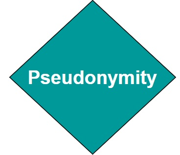
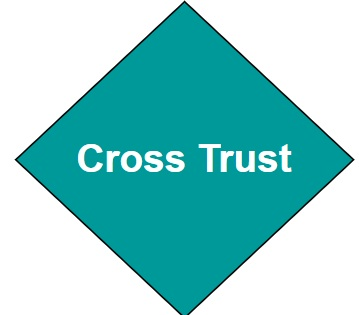
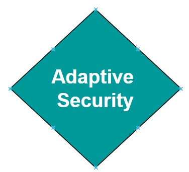
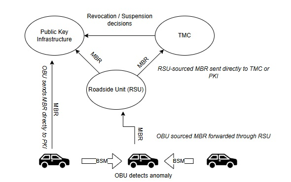
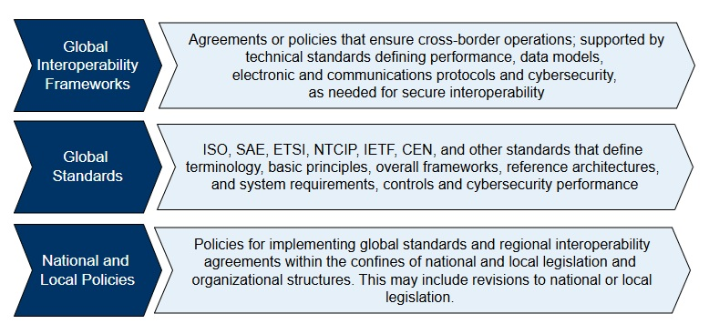

# Introduction to ITS Cybersecurity Guidance

Welcome to the ISO Guide to Cybersecurity for Intelligent Transportation Systems (ITS). 

ITS operates as a System of Systems (SoS), connecting independently managed devices and services (e.g.,  roadside units (RSUs), On Board Units (OBUs), traffic signal controllers, backend systems) that may be owned and maintained by different organizations. Each is responsible for its own software updates, certificate handling, and operational policies. To ensure secure, coordinated behavior across the ITS, operators must implement shared standards, interoperable trust mechanisms, and consistent communication policies. This site supports public agencies, standards bodies, integrators, manufacturers, and others responsible for the secure design and operation of ITS environments. You may view the [site glossary here](Glossary.md).

## Start Here: Introduction to ITS Cybersecurity – A Beginner's Guide

Begin with this [introductory guide](beginners-guide.md) to understand the basics of ITS Cybersecurity. 

## Key Topics in ITS Cybersecurity

This site outlines how to secure ITS systems across all layers of design and operation. Key topics include:

### 1. [ITS Security Architectures](its-security-architectures.md)

An ITS security architecture defines how to apply protections across vehicles, infrastructure, networks, and backend systems. It ensures trusted communications, enforces policy, and enables response to security events. Use this architecture to assign responsibilities, align systems under a common trust model, and enforce security at each layer. For example, North American deployments often rely on SCMS for certificate management, while European systems use the CCMS. While these models differ in governance, both support similar PKI-based protections. This page outlines the layered security architecture and helps implementers select the right controls and standards based on operational risk and deployment environment.

### 2. [Security Standards and Their Roles](security-standards.md)

ITS cybersecurity depends on standards that define how to implement trust, secure communications, and system protections. Use this page to identify which standards support core cybersecurity functions, such as certificate management, authenticated messaging, or permission enforcement. For example, implementing secure V2X requires applying standards like [ISO 21177](https://www.iso.org/standard/87225.html), [IEEE 1609.2](https://standards.ieee.org/ieee/1609.2/10258/), and/or [ETSI TS 103 097](https://www.etsi.org/deliver/etsi_ts/103000_103099/103097/02.01.01_60/ts_103097v020101p.pdf) to handle certificate validation and message protection. Regional deployments may profile these differently: North America’s SCMS architecture relies on IEEE-based standards, while Europe’s C-ITS model uses ETSI protocols and centralized onboarding through the CPOC. 

### [3. Performing an ITS Threat Analysis](ITS-Threat-Analysis.md)

The selection of cybersecurity controls to protect the ITS confidentiality, integrity and availability should be risk-informed, meaning that organizations that operate (e.g,. Infrastructure Owner Operators (IOOs)) an ITS should conduct a comprehensive threat analysis in order to understand the ITS's  risk profile. This threat analysis should be methodical, guided by a standard approach to performing threat and risk assessments.  Threat analysis often involves development of a profile of the ITS system assets, communication data flows, trust boundaries, and communication interfaces. Once this information is well understood and documented, threats and vulnerabilities can be identified for each asset or data flow. From there, an estimate of the likelihood and impact of different risks to the system can be calculated and appropriate mitigations can be identified. This allows [cybersecurity executives](policy-makers.md) within an ITS organization to prioritize the most appropriate cybersecurity controls given the risk profile and operational context of the system. 

Several frameworks exist to guide the threat analysis process, depending on regional context. For example: 

- In Europe, threat analysis activities are often shaped by [ETSI TR 102 893](https://www.etsi.org/deliver/etsi_tr/102800_102899/102893/01.02.01_60/tr_102893v010201p.pdf), a technical report that provides a structured approach for assessing risks in cooperative ITS environments. European station operators and manufacturers are also expected to conduct and maintain operational risk assessments in alignment with [ISO/IEC 27005](ISO/IEC 27005), as outlined in the CCMS Security Policy. 

- In North America, threat analysis is typically informed by the [NIST Cybersecurity Framework](https://www.nist.gov/cyberframework) and the [ITS Cybersecurity Profile](https://transportationops.org/publications/usdot-resource-intelligent-transportation-systems-its-cybersecurity-framework-0), which together provide a foundation for identifying risks and applying controls across systems such as Dynamic Message Signs, Closed-Circuit Television cameras, RSUs and other systems. 

### 4. [Interoperability Strategies](interoperability-strategies.md)

ITS devices must often interoperate across different policy jurisdictions. These jurisdictions may be based on local, regional, national or international borders. ITS components must be able to be configured to trust peer devices that may have been issued digital certificates that align with these different jurisdictions' policies and regulations. ITS Standards Developers, Policy-Makers, and Implementers have options for enabling seamless trusted interoperability. For example, at a national level policy-makers may choose to harmonize policies across multiple jurisdictions. There are technical options available as well. For example,  IEEE Std. 1609.2.2 provides a mechanism whereby specific trust permissions can be allocated to Root Certificate Authorities (Root CAs) using a PKI's Certificate Trust List (CTL). Other examples of interoperability enablers may include the use of trust bridges, that bridge trust between different domains. 

### 5. [ITS Cybersecurity Controls](its-cybersecurity-controls.md)

ITS cybersecurity controls define the protections that must be implemented across system components, stakeholders, and environments. Use this page to identify the specific technical and operational safeguards needed to mitigate identified threats. Controls are organized by function such as certificate lifecycle management, access enforcement, software integrity, secure configuration, logging and auditing, misbehavior response, and physical protections. 

Responsibility for implementing controls is shared. Device manufacturers must embed protections into hardware and firmware. IOOs and operators are responsible for enforcing organizational policies, assigning roles and entitlements, and ensuring secure deployment and operation. Select controls based on your system's threat profile, architecture, and operational context.

### 6. [Stakeholder-Specific Guidance](stakeholder-guidance.md)

This section provides guidance tailored to different stakeholder perspectives, helping policy-makers, standards developers, and implementers understand their role in ITS development and deployment and their responsibilities related to ITS cybersecurity.  Guidance is included for:

- **Policy Makers**, who play a key role in defining the high-level frameworks for secure ITS system operations. Policy-makers must be able to understand and mitigate the risks associated with their ITS, provide guidance on harmonization across trust boundaries, and define minimum requirements to ensure trusted communication across an ITS. 
- **Standards developers**, who must envision and document technologies and processes that enable ITS operations, while maintaining confidentiality, integrity, availability and resilience. Standards developers should keep in mind the need for cross-jurisdictional interoperability. SDOs may define standards applicable to ITS internationally, which then requires national and regional profiles of those standards to be created that meet appropriate policies and regulations. 
- **Implementers**, who are responsible for identifying appropriate cybersecurity controls based on the given risk profile and operational context of the ITS. Implementers are deploying technology such as RSUs, managing certificate lifelcycles, and enforcing security polciies at the device and netowrk levels. Implementers are responsible for the full lifecycle of the cybersecurity process, including incident response and forensic analysis. 

### 7. [Security Policies](security-policies.md)

ITS cybersecurity policies define how protections are implemented, enforced, and maintained across devices, communications, and backend systems. These policies support secure deployment and operations by setting expectations for trust management, certificate handling, secure software updates, misbehavior response, and audit enforcement. ITS operators must define clear policy rules for how trust anchors are approved and revoked, how device entitlements are assigned and validated, and how software is signed and verified. Policies must also require standardized incident handling procedures and governance models that ensure oversight across all roles and systems. This page outlines policy suggestions across key ITS security areas. 

### 8. [Specialized Use Cases](specialized-use-cases.md)

As described above, the design of an ITS cybersecurity architecture should be based on an understanding of the risks, including residual risks, associated with the system, given the systems' operational context. As ITS technologies and concepts continue to evolve, new threats and risks are potentially introduced. This section describes some leading-edge use cases and system concepts and explores how each may introduce new sets of risks that must be mitigated within a cybersecurity architecture. 

Use cases include emerging system CONOPS such as Cooperative Driving Automation (CDA) and Mobile Edge Computing (MEC), where secure communication and trust management are critical to safe and efficient operation. 

# A Beginner's Guide to Intelligent Transportation System (ITS) Cybersecurity

## An Introduction to ITS and ITS Cybersecurity

### ITS Systems of Systems

Intelligent Transportation Systems (ITS) enhance mobility, safety and efficiency through connected and automated technologies. ITS systems rely on near real-time data exchange between vehicles, infrastructure, and cloud services to optimize traffic flow and improve vehicular safety as well as the safety of the integrated transportation system more broadly.. Connected vehicles use vehicle-to-everything (V2X) communication to help prevent collisions, while roadside units (RSUs) relay information such as signal phase changes, work zone alerts, and dynamic speed limits. The figure below illustrates the key components of a typical ITS deployment and how they interact as a system of systems.

The complexity and interconnectedness of these systems create new operational benefits but also introduce new types of risk. Because vehicles and infrastructure often interact dynamically and at high speeds, reliability, precision, and trust in communications are important.

### Introduction to Cybersecurity

Cybersecurity is the protection of digital systems, communications, and data from unauthorized access, manipulation, or disruption. In critical infrastructure sectors such as transportation, controls enabled through cybersecurity directly affect directly affect physical safety. A cybersecurity failure could disrupt traffic signals, disable roadside infrastructure, or compromise the information provided to a connected vehicle which could impact vehicle operator decision making. Cybersecurity principles include confidentiality, integrity, and availability. 

Confidentiality ensures that data is protected from unauthorized access, preserving privacy and preventing misuse. Integrity guarantees that data and messages remain accurate and unaltered during transmission or storage. Sender authentication ensures that whomever transmits a message was authorized by a trusted entity to send the information. Availability ensures that systems and services remain operational and accessible when needed. In transportation, these principles apply to traffic control commands, vehicle messaging, digital road signage, and other systems. In systems where timing is important, accuracy, and authentication of source or destination entities are critical. 

### ITS Cybersecurity

ITS cybersecurity ensures the integrity, confidentiality, and availability of data exchanged across an ITS system. It protects against cyber threats that could disrupt traffic management, compromise vehicle behavior, or manipulate digital traffic controls. This includes securing communication between vehicles and infrastructure, ensuring that only trusted devices participate in ITS applications, and protecting sensitive data from misuse or exposure. In the context of V2X, although confidentiality is not always required, data integrity and availability remain critical requirements at all times. This is due to the latency-sensitive nature of V2X messages such as Basic Safety Messages (BSMs), where encryption processing and messaging overhead may reduce the ability to receive information in a timely manner. 

Modern ITS environments face a broad and evolving threat landscape. Communications between vehicles and infrastructure—known as Vehicle-to-Everything (V2X)—must be protected from interception, manipulation, and unauthorized injection of false data. Network infrastructure is vulnerable to denial-of-service (DoS) and malware-based attacks, which can disable roadside systems or overwhelm traffic management centers. IoT devices such as smart traffic signals, cameras, and sensors may be physically or remotely exploited due to weak default configurations or unpatched software. Location-based services can be compromised through GPS spoofing and jamming, causing vehicles to misreport their positions or lose navigation capability. As cyber-physical systems, ITS deployments must defend not just against digital exploits, but against threats that have direct safety consequences in the physical world—from manipulating emergency vehicle priority to triggering unsafe driving conditions. The following diagram provides a simplified view of the types of threats that can affect different components of the ITS environment.

Unlike traditional internet-based systems, ITS cybersecurity must function in highly mobile, latency-sensitive environments where anonymity of participants is often important. Vehicles must trust messages from other vehicles or roadside systems they have never encountered before—often with no direct internet connection or central authority available at the time of interaction. As a result, ITS requires specialized cybersecurity tools and protocols that go beyond traditional cybersecurity tools such as Transport Layer Security (TLS) and X.509 certificates. 

In the sections that follow we will further explore these challenges. First, we will introduce the unique characteristics of ITS cybersecurity. Next, we will explain why general-purpose cybersecurity tools are insufficient. Finally, we will describe the unique characteristics of ITS cybersecurity, explain why general-purpose cybersecurity tools are insufficient, and describe the standards and trust frameworks that support secure ITS deployments.

## Why ITS Cybersecurity is Unique

Transportation systems integrate real-time cyber-physical operations with direct safety implications. Unlike traditional IT systems, which can often tolerate centralized trust models, identity-bound certificates, and latency, ITS requires decentralized, privacy-preserving, and low latency security models that operate across jurisdictions. These systems support millions of highly mobile vehicles and infrastructure components that must be able to securely interact often without continuous connectivity.

ITS relies on the use of Public Key Infrastructure (PKI) which provides proven best practices including scalability and affordability. ITS-specific certificate structures have been introduced to overcome specific challenges associated with ITS operations, for example IEEE 1609.2 and ETSI TS 103 09. The characteristics below highlight specific ITS characteristics. 

## 1. Real-Time, Safety-Critical Operations

<table>
  <tr>
    <td style="width: 170px; vertical-align: middle; text-align: center;">
      
    </td>
    <td>
      <strong>Real-Time, Safety-Critical Operations</strong> 
      ITS involve real-time interactions that directly affect safety. For example, vehicle-to-roadside unit (RSU) communication requires minimal latency so that vehicles can immediately process messages. Any delays that would be introduced through traditional internet security protocols, which are often optimized for less time-sensitive applications, could lead to safety hazards. ITS-specific mechanisms, such as IEEE Std. 1609.2 certificates, are designed to prioritize low-latency communication while maintaining security, making them better suited to the unique considerations associated with ITS real-time operations. 
    </td>
  </tr>
</table>

## 2. Mobility Requirements

<table>
  <tr>
    <td style="width: 170px; vertical-align: middle; text-align: center;">
      
    </td>
    <td>
      <strong>Mobility Requirements</strong> 
      Unlike stationary internet systems, transportation systems operate in highly dynamic environments where devices (e.g., vehicles, pedestrians, RSUs) continuously join and leave networks. IEEE Std. 1609.2 certificates are optimized for use in these dynamic environments, with support for example for short duration lifetimes. Traditional X.509 systems are less equipped to handle frequent certificate updates and revocations required for mobile, decentralized networks.
    </td>
  </tr>
</table>

## 3. Anonymity Requirements

<table>
  <tr>
    <td style="width: 170px; vertical-align: middle; text-align: center;">
      
    </td>
    <td>
      <strong>Anonymity Requirements</strong> 
  PKI systems such as the Cooperative Intelligent Transportation Systems Credential Management System (CCMS) and Security Credential Management System (SCMS) issue pseudonym certificates to vehicle OBUs, enabling trusted communication while preserving subscriber anonymity. X.509 certificates have no mechanism for preserving subscriber anonymity. 
    </td>
  </tr>
</table>

## 4. Multi-Entity Trust Management

<table>
  <tr>
    <td style="width: 170px; vertical-align: middle; text-align: center;">
      
    </td>
    <td>
      <strong>Multi-Entity Trust Management</strong> 
ITS environments involve a wide range of stakeholders, including vehicles from multiple Original Equipment Manufacturers (OEMs), infrastructure owned by various jurisdictions, and multiple communication providers. Establishing trust across these entities requires specialized structures, such as the Certificate Trust List (CTL) in North America or the European Certificate Trust List (ECTL). These mechanisms enable the extension of trust to differing policy domains and support the dynamic operation of vehicles with infrastructures owned and managed by differing entities. Generic systems like X.509 lack these built-in cross-trust mechanisms and require substantial planning and processes for trust extension, making them less suited for managing complex ITS trust requirements.
    </td>
  </tr>
</table>

## 5. Embedded Permissions within Certificates

<table>
  <tr>
    <td style="width: 170px; vertical-align: middle; text-align: center;">
      
    </td>
    <td>
      <strong>Embedded Permissions within Certificates</strong> 
Traditional network security controls who can join a system and provides fine-grained access through user accounts and roles. In ITS, however, devices often share the same network infrastructure, so connecting alone does not grant any special rights. Instead, each device must present a cryptographic certificate that embeds explicit permissions, defining exactly which applications and roles it is allowed to use. For example, IEEE Std. 1609.2 certificates contain Intelligent Transport System Application Identifiers (ITS-AID), Provider Service Identifiers (PSID), and Service Specific Permissions (SSP) that control which messages a participant may send and what actions it may request. This ensures that only properly authorized vehicles can request signal priority or transmit safety-critical data, even on a shared network.

## 6. Continuous Adaptation to Evolving Threats in Dynamic Environment

<table>
  <tr>
    <td style="width: 170px; vertical-align: middle; text-align: center;">
      
    </td>
    <td>
      <strong>Dynamic Threats in Highly Mobile Environment</strong> 
        ITS cybersecurity requires a continuous risk assessment process that adapts to the evolving technologies and attacker capabilities within this large-scale, dynamic, and safety-critical domain. The vast scale increases the attack surface (millions of vehicles/devices) and means that a widespread attack could have massive impact. Managing trust and detecting anomalies across so many entities is challenging especially given the dynamic environment where network topologies change rapdily and communication is characterized by intermittent connectivity and high mobility. This make establishment of persistent trust relationships and the identification of malicious nodes more difficult.</td> 
    </tr>
</table>

## 7. Velocity of Change

<table>
  <tr>
    <td style="width: 170px; vertical-align: middle; text-align: center;">
      
    </td>
    <td>
      <strong> Psuedonimity at Scale</strong> 
The scalability and certificate management challenge in V2X ITS comes from the extremely high frequency of change and sheer volume of short-lived pseudonym certificates required for privacy.  The velocity of change in V2X pseudonymity (e.g., a vehicle might use dozens of certificates per week or even per day of driving) creates unique operational loads on the SCMS for issuance, and on vehicles for storage and selection. In addition, ITS devices are expected to encounter previously unknown ITS devices regularly, requiring that ITS certificates be shared regularly. 
    </td>
  </tr>
</table>

## ITS Cybersecurity Building Blocks

Now that we've established what makes ITS cybersecurity unique, it's useful to introduce the key mechanisms that have been developed to meet those needs. These mechanisms include secure certificate formats tailored for mobile use, frameworks for distributing and managing credentials across millions of devices, and systems for detecting and responding to misbehavior in the network. While specific implementations vary by region—for example, between North America’s SCMS and Europe’s CCMS—the core building blocks share common goals and are aligned with international standards.

The following section provides a high-level overview of these mechanisms, written for non-experts. More technical readers are encouraged to explore the [ITS Cybersecurity Mechanisms and Building Blocks](system-specific-security.md) section for deeper background.

### Credential Management Systems

A Credential Management System (SCMS or CCMS) is a specialized type of public key infrastructure (PKI) designed for ITS. It provides the foundation of trust for communications between vehicles, infrastructure, and backend systems. Unlike traditional PKI systems that issue long-term identity certificates, SCMS and CCMS issue short-lived pseudonym certificates that protect user privacy while still enabling strong authentication and authorization. The diagram below introduces the core components of a credential management system used to enable trusted communication in ITS, based on an SCMS architecture.

The credential management system shown here includes key roles that work together to provide trusted V2X communication. Electors approve or revoke Root Certificate Authorities (CAs) and maintain the Certificate Trust List (CTL). The PKI Manager oversees policy enforcement and trust anchor updates. The Root CA is a top-level trust anchor, while Subordinate CAs handle certificate issuance for specific purposes or regions. Registration Authorities (RAs) process enrollment requests from end entities like OBUs and RSUs. The Distribution Center (DC) provides an API for devices to download current trust lists and revocation lists. The Misbehavior Authority (MA) collects reports about suspected misbehavior and coordinates with the PKI Manager to revoke trust when necessary. This structure ensures vehicles and infrastructure can authenticate each other’s messages while preserving privacy through short-lived certificates.

### ITS Certificate Standards

ITS uses certificate formats specifically tailored for the real-time, decentralized, and mobile nature of V2X communications. Two major standards are used globally: IEEE 1609.2, which is primarily deployed in North America, and ETSI TS 103 097, which is used in Europe. While developed in parallel, both standards share key features that address the specific challenges of ITS. They support privacy-preserving pseudonymity, allowing vehicles to authenticate messages without revealing long-term vehicle or personal identities. They also include geolocation constraints and flexible permission structures that enable fine-grained control over what actions a device is authorized to perform. 

### Entitlements

ITS certificates can carry embedded entitlements—policy assertions that define what a device is authorized to do in the context of specific ITS applications. These entitlements are expressed using certificate fields such as the ITS-AID/PSID and Service-Specific Permissions (SSP) in IEEE deployments, or the ITS Application Identifier (ITS-AID) and corresponding permissions in ETSI-based systems. For example, in an IEEE 1609.2 certificate, AppPermissions carries a sequence of authorized ITS-AID/PSID and SSP entries, representing the applications and roles that the device possessing the certificate is authorized to participate in. 

For example, a certificate may include an entitlement that authorizes a vehicle to request signal priority, while restricting that capability from others. A sending device, for example an OBU transmits a message as a signed secure protocol data unit (SPDU), and the receiving device validates message authenticity, followed by a check against the ITS-AID/PSID and SSP permissions asserted in the message. These permissions are checked against the sending devices' certificates, using the appPermissions field. 

By supporting fine-grained entitlements, ITS certificates enable strong access control mechanisms that align with specific use cases, user roles, or organizational policies.

### Misbehavior Detection

Even in a well-secured system, trusted devices can malfunction or behave maliciously. In ITS, where safety depends on the accuracy and integrity of real-time data, it is important to continuously evaluate whether participants are acting in accordance with expected behaviors. Misbehavior detection systems are designed to identify faulty or deceptive behavior; for example  inconsistent vehicle position updates, spoofed GPS signals, or invalid safety alerts, and initiate a response that preserves trust in the network. These systems operate at both the edge and the backend. Local detection capabilities onboard vehicles or infrastructure can flag suspicious messages, while backend authorities analyze reported incidents, corroborate evidence, and determine whether a device's credentials should be suspended or revoked. The figure below illustrates a simplified view of how misbehavior is detected, validated, and responded to in a credential-based ITS environment.

This diagram shows how misbehavior reports (MBRs) flow through an ITS security environment. An OBU detects an anomaly in a received Basic Safety Message (BSM) and generates an MBR. This report can be sent directly to the Public Key Infrastructure (PKI) or passed through a RSU. RSUs themselves may detect misbehavior and send reports directly to a Traffic Management Center (TMC) or the PKI. The PKI analyzes reports, and decides whether revocation or suspension is necessary, then update revocation lists or takes other action as necessary. 

---

## Internet vs. ITS Cybersecurity

Digital security architectures are typically built as layered stacks, with each layer addressing different types of threats and trust requirements. The traditional internet stack, built around protocols such as TLS and certificate formats like X.509, is well-suited for securing static web services, enterprise systems, and client-server communications. ITS involves mobile actors, short-lived trust relationships, and real-time decision-making in safety-critical contexts. These differences have led to the development of an ITS-specific cybersecurity stack, designed for decentralized communication, scalability, privacy, and performance in dynamic environments. 

It's crucial to recognize that these certificate types are not mutually exclusive; X.509 and IEEE 1609.2 certificates can and often do co-exist on a single ITS device (e.g., a vehicle or RSU). A vehicle might use an IEEE 1609.2 certificate for broadcasting its position via BSMs, while simultaneously using an X.509 certificate to establish a secure TLS session with a backend service provider for a non-safety application (e.g., infotainment update, diagnostics upload).

- X.509 Certificates for Conventional IT/Enterprise Communications: X.509 certificates, the backbone of web security (SSL/TLS), are typically used in ITS for securing Backend Communications:  Connections between ITS centers (e.g., METR Regulation System, METR Distribution Centre, SCMS components) and Secure Device Provisioning/Management: Potentially for initial bootstrapping or secure software updates to ITS stations (vehicles, RSUs) where a traditional client-server secure channel is appropriate.

- IEEE 1609.2 Certificates for V2X Communications:  IEEE 1609.2 standard defines certificates and security services specifically tailored for Vehicle-to-Everything (V2X) direct communications. This includes: (a) Securing Safety Messages e.g BSMs, CAMs, (b) Enabling Pseudonymity: Using short-lived, frequently changing pseudonym certificates to protect vehicle location privacy.

The following comparison outlines where each stack is typically applied. It is intended as a decision tool. It identifies common deployment considerations and helps clarify which certificate format is better suited to address each one. Readers should evaluate each row in the context of their deployment environment and use case. A key takeaway is that in ITS there is a role for X.509 certs next to 1609.2 certs as they cover different operational requirements. 

| Deployment Consideration                                     | X.509 Certificates | ITS Certificates (IEEE 1609.2/TS 103 097) |
| ------------------------------------------------------------ | ------------------ | ----------------------------------------- |
| Is the environment latency-sensitive or safety-critical? For example, does the system require real-time processing of messages. | ✘                  | ✔                                         |
| Are devices mobile and frequently entering/leaving networks? | ✘                  | ✔                                         |
| Is user anonymity or pseudonymity required? For example, does the deployment need to preserve privacy while still verifying message authenticity? | ✘                  | ✔                                         |
| Is fine-grained access control required? For example, do you need to define what specific actions a device can take within a given application (e.g., request signal priority)? | ✘                  | ✔                                         |
| Are devices expected to send messages without a connection to a server? | ✘                  | ✔                                         |
| Is the environment bandwidth-constrained or using wireless links? | ✘                  | ✔                                         |
| Is the deployment centralized and session-based?             | ✔                  | ✘                                         |
| Will the deployment integrate with traditional IT infrastructure (e.g., TMC servers, cloud APIs)? | ✔                  | ✘                                         |

X.509 certificates are still a valid and widely used option for securing communications in backend systems, including data exchanges between traffic management centers, cloud platforms, and enterprise services. However, for on-road communication, safety-critical applications, and mobility-centric environments, X.509 lacks the necessary support for short-lived credentials, anonymity, decentralized trust, and application-specific permissions.

# ITS Security Architecture

## The Purpose of an ITS Cybersecurity Architecture

ITS environments are highly distributed and composed of independently managed systems that must collaborate in real time across jurisdictional and policy boundaries. This reference ITS cybersecurity architecture is layered into groupings that map to stakeholder roles, and a set of high level cybersecurity requirements. After reviewing a layer's requirements, navigate to [cybersecurity controls](its-cybersecurity-controls) for guidance on specific implementation recommendations and [standards](security-standards) for pointers to the relevant standards that can be used to implement those controls. Each layer in this reference cybersecurity architecture identifies a set of high level requirements that stakeholders should consider implementing within their ITS deployment. 

## ITS as a System of Systems

ITS should be treated as a system of systems (SoS). Many devices and services will likely be developed, operated, and maintained independently, often within different jurisdictions. This decentralization introduces specific cybersecurity challenges. Expect each device or service to follow its own software lifecycle, potentially rely on distinct certificate authorities, and operate under separate governance and compliance models. To achieve secure interoperability, focus not only on securing each individual system, but also on managing trust relationships and aligning policies across the broader environment.

An ITS cybersecurity architecture should be designed to support flexible trust models, account for asynchronous software and certificate lifecycles, and clearly define how security responsibilities are distributed. Keep in mind that network access alone does not imply trust. Instead, enforce explicit permissions, validate credentials, and apply security policies to ensure each device is authorized to perform its intended functions securely.

## Core Security Principles for an ITS

Use the following principles to guide the development of a resilient, scalable, and standards-aligned ITS architecture

**Defense in Depth**: An ITS must be secured at multiple layers. Relying on a single type of control, such as perimeter firewalls or certificate validation alone, is insufficient. Layered protections ensure that failures or compromises in one area do not expose the entire system.

**Minimum Trust by Default**:  ITS participants should not be granted default privileges solely by virtue of connecting to the network. Instead, authorization is explicitly granted through mechanisms like certificate-based permissions, policy-driven entitlements, and controlled onboarding processes.

**Federated Trust Management**: Because ITS involves many independently managed systems, trust must be managed across organizational and jurisdictional boundaries. This is achieved through coordinated certificate policies, cross-certification mechanisms, and service entitlements that define what certificates are accepted and under what conditions.

**Scalability and Flexibility**:  The architecture must scale to accommodate millions of devices and evolving services. It should be modular, standards-aligned, and capable of integrating with new applications, certificate authorities, or regional deployments without requiring a full redesign.

**Anonymity Protection**:  Anonymity and privacy are important in ITS communications, particularly for users and vehicles transmitting location or user data. Architectures should support mechanisms such as pseudonym certificates, regular certificate rotation, and data minimization techniques. 

**Resilience and Recovery**:  The architecture must be resilient to both accidental failures and malicious attacks. It should support detection of misbehavior, revocation of compromised certificates, and defined processes for auditing PKI systems. 

## Roles and Responsibilities in the ITS Cybersecurity Ecosystem

ITS cybersecurity relies on the coordinated actions of diverse stakeholders, each responsible for securing a portion of the broader system. A clear understanding of these roles ensures accountability, facilitates coordination, and supports end-to-end trust and resilience.

**Standards Development Organizations (SDOs)**: Organizations such as ISO, IEEE, and ETSI define the technical frameworks and specifications that guide secure communication, certificate formats, permissions models, and interoperability. Their work enables regional and global consistency while allowing for tailored implementation.

**Certificate Management Authorities**: PKI Providers of systems such as the SCMS and CCMS manage the lifecycle of digital certificates. Their responsibilities include issuing, renewing, and revoking credentials, maintaining CTL'S, and enforcing policy constraints.

**Infrastructure Owners and Operators**: Public agencies, departments of transportation, and infrastructure providers are responsible for securing roadside units, traffic controllers, and other field equipment. This includes enforcing hardware protections, managing software updates, and coordinating with certificate authorities to onboard or revoke devices as needed.

**Vehicle Manufacturers and OEMs**: Automakers and equipment vendors play a key role in integrating security capabilities within OBUs. They ensure secure certificate storage, implement local misbehavior detection logic, and align with applicable standards and trust frameworks.

**Application and Service Providers**: Organizations that provide V2X-enabled applications or services, such as navigation, traffic signal priority, or fleet management must validate their services against authorization policies, obtain appropriate credentials, and ensure responsible data use and protection.

**Cybersecurity Oversight and Policy Bodies**: Governance authorities, including national cybersecurity agencies and regional coordinating groups, develop cybersecurity policies, perform audits, and establish incident response processes. These bodies help ensure that security implementations align with risk management goals and regulatory expectations.

**End Users and Deployers**: Those deploying and maintaining ITS components, whether technicians, engineers, or integrators, must follow best practices, enforce operational policies, and ensure device integrity during installation and lifecycle transitions.

## Architectural Layer of an ITS Cybersecurity Architecture

[ISO 21217](https://www.iso.org/standard/80257.html) describes an ITS-S reference model that can be used as a framework for developing and deploying secure ITS communication systems. The ISO 21217 reference model has been extended below to identify and allocate specific cybersecurity functions and capabilities to discrete areas within the model. This page discusses the cybersecurity controls that should be considered by both developers and implementers of an ITS. For more detailed discussion of the threats associated with each of these architectural layers, visit the [ITS Threat Analysis](its-threat-analysis) page. For more detailed descriptions of each of the individual building blocks within the security architecture, see the [ITS Cybersecurity Controls](its-cybersecurity-controls) page. 

## Reference Cybersecurity Architecture

The reference architecture illustrated below maps directly to the ISO 21217 ITS-S reference model, in order to maintain consistency with existing well-known ITS concepts. The architecture is broken out into:

- **Management functions**: The core cybersecurity processes and services that govern trust, monitoring, response, and coordination across an ITS deployment. This includes managing certificate lifecycles, enforcing interoperability rules, auditing systems, handling incidents, and supporting misbehavior adjudication.
- **Application functions:** Define how applications enforce secure behaviors, such as message authentication, service-specific authorization, and secure configuration practices, to maintain system integrity and protect sensitive functions.
- **Facilities functions:** Focuses on privacy protection, trust evaluation, and event-level security. Supports pseudonymity, localized misbehavior detection, anomaly logging, and enforcement of interoperability policies across message exchanges.
- **Network and Transport functions:** Provides the mechanisms to secure data in transit using authenticated, optionally encrypted communications. Ensures transport protocols are resistant to network-layer threats and aligned with trust and policy requirements.
- **Access functions:** Manages how devices establish secure sessions, validate software authenticity, and authenticate themselves to peers or networks. Supports session security, secure boot, and credential-based access enforcement.
- **Physical functions:** Covers the protection of hardware, cryptographic material, and interfaces from physical compromise. Includes secure storage, physical access controls, tamper detection, and secure key generation practices.

## Application Layer

ISO 21217 positions the Application Layer at the top of the ITS Station (ITS-S) architecture, responsible for invoking and managing the communication flows that support ITS services. This layer defines the behavior and security policies of each ITS application and determines how they interact with the rest of the system. In a cybersecurity context, the Application Layer must ensure that data flows are authorized, authenticated, and protected according to both global and local policies.

ITS applications are standardized, certificate-bound services identified by globally or regionally assigned identifiers—known as ITS Application Identifiers (ITS-AIDs) or Provider Service Identifiers (PSIDs). These identifiers are embedded in digital certificates and define the types of messages an application may transmit or process. Additional constraints are expressed through SSPs, which enable fine-grained role definitions. For example, a public transit vehicle’s OBU may be authorized to send a Signal Request Message (SRM) to request priority at intersections, but only if its certificate contains the correct PSID and SSP combination.

These permissions are enforced on both ends of the transaction: a sender must possess a valid certificate with the necessary authorizations, and the recipient must verify the certificate’s attributes before acting on the message. This model ensures that simply joining an ITS-aware network does not grant implicit trust or functionality. Instead, application behavior is tightly scoped to what has been explicitly authorized.

In addition to certificate-bound constraints, ITS applications are subject to deployment-specific policies managed by Station Operators or infrastructure owners. These policies define who may run an application, under what conditions, and in which geographic or operational context. Enforcement can occur through mechanisms such as geofencing, jurisdiction-specific logic in infrastructure, SSP-based filters, or lifecycle controls that determine when and where credentials may be used.

Applications typically use standardized message formats such as SAE J2735 or ETSI EN 302 637-x. These formats define not only the structure of the data but also the associated security requirements for signing, encryption, and validation. Adherence to these standards ensures interoperability and reduces risk from malformed or unauthorized messages.

Implementers should ensure that the following cybersecurity objectives are met at the Application Layer:

- **ITS_APP_1: Enforce permission-based access to ITS services.** All application actions must be tied to valid digital certificates issued through a recognized SCMS or CCMS. Certificates must include the correct PSID/ITS-AID and SSP fields for the intended function.
- **ITS_APP_2: Prevent unauthorized message injection.** All outgoing application messages must be signed, and all incoming messages must be validated against trusted certificate authorities. Message rejection should occur if permissions do not match the expected application profile.
- **ITS_APP_3: Apply policy-aware access rules.** Local rules regarding geographic, jurisdictional, and temporal use of applications should be encoded and enforced through certificate attributes or infrastructure logic. Deployment-specific policies define who may operate devices, under what conditions, and within which jurisdiction. These policies are enforced through mechanisms such as geofencing, time-of-day restrictions, certificate constraints, and service-specific permissions. 

## Facilities Layer

In a cybersecurity context, this layer enables ITS devices to detect misbehavior, log anomalous events, maintain privacy through pseudonymity, and operate securely across jurisdictional boundaries. Facilities functions help ensure that data received from other ITS participants is plausible. This includes real-time plausibility checks, such as verifying that vehicle locations are within valid map bounds or that reported speeds are physically possible, and local misbehavior detection based on defined rules.

To preserve privacy, the Facilities Layer manages pseudonym certificate use. Messages are signed using short-lived, unlinkable identifiers, which prevent long-term tracking of a vehicle or device across sessions.

Facilities components also support structured anomaly logging and reporting. Devices record abnormal or policy-violating behavior and forward relevant information to backend systems for further analysis and adjudication. This process enables scalable misbehavior response while minimizing bandwidth and processing overhead at the edge. When deployed across jurisdictions, ITS devices must interoperate securely. The Facilities Layer contributes to this by ensuring that locally detected anomalies, pseudonym management routines, and trust validation behaviors conform to overarching interoperability policies and system expectations.

Implementers should ensure the following security outcomes at the Facilities Layer:

- **ITS_FAC_1: Maintain user anonymity and protect privacy** through regular pseudonym certificate rotation and suppression of unnecessary identifying information.
- **ITS_FAC_2: Perform local misbehavior detection** by evaluating incoming message data for policy violations or implausible claims.
- **ITS_FAC_3: Log and report anomalous behavior** for further review and potential action by backend misbehavior authorities.
- **ITS_FAC_4: Support secure interoperability** by ensuring facilities-layer logic accommodates regional or jurisdictional trust settings.

### Network and Transport

The Network and Transport Layer in the ISO 21217 ITS-S reference model is responsible for securing communication flows between ITS devices. It ensures that data exchanges are protected against tampering, spoofing, and unauthorized access. This layer enables both transport security, which protects individual message flows, and network security, which protects the communication infrastructure as a whole. Secure session establishment and message validation are core responsibilities, helping to preserve message integrity, authenticate sources, and prevent misuse. 

Standards such as IEEE 1609.3 define network and transport protocols used in vehicular communications, while ISO 21177 provides the mechanism for secure session management between ITS Stations. When backend or control system traffic is exchanged over TCP/IP networks, TLS 1.3 with mutual authentication should be used. DTLS is appropriate when UDP transport is required, such as for latency-sensitive data.

All messages must be verified for structural integrity, origin, and freshness. Anti-replay protections such as timestamps should be enforced to ensure that messages cannot be reused to trigger unintended behaviors.

Implementers should ensure the following cybersecurity outcomes at the Network and Transport Layer:

- **ITS_NET_1: Establish authenticated sessions using ISO 21177.** Use ISO 21177 to negotiate, establish, and manage secure sessions between ITS devices, including session key exchange and validity checks.
- **ITS_NET_2: Implement TLS 1.3 or DTLS with mutual authentication.** Use certificate-based authentication to secure all backend or infrastructure-facing sessions.
- **ITS_NET_3: Validate message integrity and authenticity.** All messages should be checked for proper digital signature and expected structure before use.
- **ITS_NET_4: Reject replayed or expired messages.** Timestamp inspection and session freshness checks should be used to prevent replay attacks.
- **ITS_NET_5: Preserve communication reliability during stress.** Use congestion control, prioritization, and network hardening techniques to maintain service availability during high load or attack conditions.

## Access Layer

Cybersecurity functions at this layer focus on enforcing local policy rules, verifying the authenticity of installed software, and confirming the permissions of connected ITS devices, using local policy checks. For example, an ITS Station may be configured to validate OpOrgIds embedded within a message against a list of authorized OpOrgIds within the locally configured policy. 

Implementers should ensure the following cybersecurity outcomes are met at the Access Layer:

- **ITS_ACC_1: Define and enforce local access policies.** Configure each device to restrict interface use, data access, or operational behavior based on predefined local rules. These policies may be informed by certificate-based entitlements.
- **ITS_ACC_2: Authenticate software before execution.** Ensure that only software with verified provenance is installed and permitted to run. Use digital signatures or other mechanisms to detect unauthorized changes or tampering.
- **ITS_ACC_3: Verify device identity.** Implement controls that authenticate devices before allowing them to initiate communication or participate in ITS operations. This ensures that only authorized hardware can access or influence the system.

## Management Layer

The Management Layer defines cybersecurity functions that operate across the ITS architecture to maintain trust, enforce policies, and support operational oversight. It supports secure onboarding, continuous oversight, and system-wide interoperability through centralized and distributed security services. Management functions govern how devices are credentialed, monitored, and maintained within the ITS environment. They ensure that all participants adhere to defined security policies and that the system can adapt to changes, respond to incidents, and preserve trust over time. These functions span multiple domains and jurisdictions, enabling ITS deployments to interoperate securely even under varying operational policies.

Cybersecurity functions that should be implemented at the Management Layer include:

- **ITS_MGT_1: Certificate Lifecycle Management.** Devices must be enrolled using secure procedures and issued credentials appropriate to their role. Credential issuance, renewal, revocation, and rotation must be governed by strict lifecycle policies.
- **ITS_MGT_2: Audit and Logging.** Security events must be logged in a tamper-resistant, time-synchronized format to support compliance validation and forensic investigation.
- **ITS_MGT_3: Interoperability Enforcement.** Devices must verify that remote systems adhere to policy constraints and CTLs, especially in cross-domain or cross-jurisdiction scenarios.
- **ITS_MGT_4: Secure Time Coordination.** All time-sensitive functions, including certificate validation and anomaly detection, rely on synchronized secure time sources.
- **ITS_MGT_5: Incident Management.** Devices and infrastructure must support structured detection, classification, and remediation of cybersecurity incidents.
- **ITS_MGT_6: Misbehavior Processing and Adjudication.** Anomalous behavior must be detected and reported via structured formats. A Misbehavior Authority evaluates such reports and takes appropriate actions such as revocation or suspension.

## Physical Layer

The Physical Layer includes protections that prevent unauthorized access to or manipulation of ITS hardware. These safeguards apply to both field-deployed devices and centralized systems (e.g., data centers, TMCs). Cybersecurity functions at this layer include securing storage, enforcing physical access controls, implementing tamper detection and response mechanisms, and protecting cryptographic key generation. These controls reduce the risk of physical tampering, unauthorized data extraction, hardware modification, or insertion of malicious components.

To align with the architecture, implementers should focus on the following cybersecurity outcomes:

- **ITS_PHY_1: Secure Storage.** Use tamper-resistant hardware modules such as TPMs, secure elements, or HSMs to protect cryptographic keys and sensitive data. Ensure these components support secure erase and integrity verification functions.
- **ITS_PHY_2: Physical Access Controls.** Restrict access to devices and facilities using strong physical controls such as locking enclosures, badge-based entry, and authorized maintenance procedures.
- **ITS_PHY_3: Tamper Detection and Response.** Employ mechanisms that detect physical intrusion or component replacement. Devices should log tampering events and trigger protective actions, such as key erasure or device lockdown.
- **ITS_PHY_4: Cryptographic Key Generation.** Keys must be generated using hardware-based entropy sources that meet recognized standards. Generation should occur in secure environments to prevent key exposure or duplication.

# Security Standards and Guidance Documents

This page identifies standards that support implementation of cybersecurity functions aligned with the [ITS Security Architecture](its-security-architectures) and [ITS Cybersecurity Controls](its-cybersecurity-controls). Use this page to identify standards that support implementation of cybersecurity controls. 

## Secure Hardware and Physical Protection 

Use these standards to select, evaluate, or require hardware that supports key storage, secure boot, tamper detection, and cryptographic processing. This supports trusted execution and resilience at the component level.

| Standard                                         | Document Type | Description                                                  | Architectural Layer(s) | Stakeholder Role(s)                 |
| ------------------------------------------------ | ------------- | ------------------------------------------------------------ | ---------------------- | ----------------------------------- |
| IEEE 802.3                                       | Standard      | Ethernet standard supporting wired communications among traffic  infrastructure, including support for secure physical connections. | Physical Layer         | Infrastructure Owners and Operators |
| IEEE 802.1X                                      | Standard      | Network access control protocol often used in Ethernet-based ITS backhaul  networks to authenticate RSUs and field devices. | Physical Layer         | Infrastructure Owners and Operators |
| SAE J3101                                        | Standard      | Defines hardware security requirements for ground vehicles, including  secure boot, key storage, and hardware protections against tampering. | Physical Layer         | Vehicle Manufacturers and OEMs      |
| ISO/IEC 19790:2025                               | Standard      | Requirements for cryptographic modules used to protect sensitive data,  applicable to both software and hardware modules. | Physical Layer         | Credential Management Authorities   |
| NIST FIPS 140-3                                  | Standard      | Federal standard for certifying cryptographic modules, used to evaluate  tamper-resistant secure elements. | Physical Layer         | Credential Management Authorities   |
| Trusted Platform Module (TPM) / ISO/IEC  11889   | Standard      | Guidance for secure boot and hardware-based trust anchors in automotive  ECUs. | Physical Layer         | Vehicle Manufacturers and OEMs      |
| Protection Profile V2X Hardware Security  Module | Guidance      | Requirements for HSMs in V2X systems with secure key lifecycle and  resistance to physical attacks. | Physical Layer         | Credential Management Authorities   |
| Vehicle C-ITS station profile                    | Guidance      | Technical and operational requirements for C-ITS vehicle stations in  Europe. | Physical Layer         | Vehicle Manufacturers and OEMs      |
| UNECE R155                                       | Standard      | Regulation that mandates cybersecurity management systems for vehicle  manufacturers, including hardware risk mitigation. | Physical Layer         | Vehicle Manufacturers and OEMs      |

### Network and Transport Security

Apply these standards to enforce confidentiality, integrity, and authentication of data in transit. They define secure sessions for V2X, center-to-field, and backend communications using IP and non-IP protocols.

| Standard           | Document Type | Description                                                  | Architectural Layer | Primary Role(s)                     |
| ------------------ | ------------- | ------------------------------------------------------------ | ------------------- | ----------------------------------- |
| IEEE 1609.3        | Standard      | Defines networking services for WAVE including IPv6 and WSM. | Network Layer       | Infrastructure Owners and Operators |
| ISO 15118          | Standard      | Secure protocols for EV charging with mutual authentication. | Network Layer       | Application and Service Providers   |
| TLS 1.3 (RFC 8446) | Standard      | Modern cryptographic protocol for secure backend communications. | Network Layer       | Infrastructure Owners and Operators |
| DTLS               | Standard      | Datagram version of TLS for UDP-based secure transport.      | Network Layer       | Application and Service Providers   |
| ISO 21217          | Standard      | ITS Station architecture defining network stack.             | Network Layer       | Application and Service Providers   |
| ETSI TS 102 940    | Standard      | Specifies high-level C-ITS security architecture.            | Network Layer       | Credential Management Authorities   |
| ISO 21186-3        | Standard      | Secure data exchange guidelines in C-ITS.                    | Network Layer       | Application and Service Providers   |

### Secure Access 

Use these standards to control access across radio, wired, and management interfaces. They help ensure only authorized devices and users can connect to ITS infrastructure and services.

| Standard                                                     | Document Type | Description                                                  | Architectural Layer         | Primary Role(s)                                              |
| ------------------------------------------------------------ | ------------- | ------------------------------------------------------------ | --------------------------- | ------------------------------------------------------------ |
| IEEE 802.11p / IEEE 802.11-2016                              | Standard      | Specifies DSRC/WAVE radio communications at 5.9 GHz for vehicular  networking. | Access Layer                | Infrastructure Owners and Operators                          |
| 3GPP LTE-V2X / NR-V2X                                        | Standard      | Specifies cellular V2X radio interfaces for sidelink communication. | Access Layer                | Infrastructure Owners and Operators                          |
| IEEE 802.1X                                                  | Standard      | Network access control protocol used in Ethernet-based ITS backhaul  networks. | Access Layer                | Infrastructure Owners and Operators                          |
| NTCIP / SNMPv3 (RFC 3410)                                    | Standard      | Management protocols with authentication and encryption for ITS field  device communications. | Access Layer                | Infrastructure Owners and Operators                          |
| Standard                                                     | Document Type | Description                                                  | Architectural Layer         | Stakeholder  Roles                                           |
| IEEE 802.3                                                   | Standard      | Ethernet standard supporting wired communications among traffic  infrastructure. | Physical Layer              | Infrastructure Owner Operators, End  Users and Deployers     |
| IEEE Std. 1609.3                                             | Standard      | Defines IPv6, WAVE short message protocol and service advertisement. | Network and Transport Layer | Infrastructure Owner Operators,  Application and Service Providers |
| Vehicle C-ITS station profile                                | Guidance      | Outlines technical and operational requirements for European vehicle ITS  stations. | Physical Layer              | Application and Service Providers                            |
| Protection Profile V2X Hardware Security  Module             | Guidance      | Requirements for HSMs with secure key lifecycle and physical attack  resistance. | Physical Layer              | Credential Management Authorities,  Application and Service Providers |
| SAE J2945/1 On-Board System Requirement  for V2V Safety Communications | Standard      | Security requirements for V2V including key provisioning and secure  storage. | Physical Layer              | Application and Service Providers                            |

### Authenticated Messaging and Data Exchange

These standards define how ITS messages are structured, signed, and validated. They enable cross-vendor and cross-jurisdiction interoperability and ensure message trustworthiness during exchange.

| Standard                             | Document Type | Description                                                  | Architectural Layer | Primary Role(s)                                              |
| ------------------------------------ | ------------- | ------------------------------------------------------------ | ------------------- | ------------------------------------------------------------ |
| SAE J2735                            | Standard      | Defines message formats like BSM, SPaT, MAP.                 | Facilities Layer    | Application and Service Providers                            |
| SAE J2945/x series                   | Standard      | Profiles for message behavior and signing for V2X.           | Application Layer   | Application and Service Providers                            |
| ETSI EN 302 637-2 / -3               | Standard      | Defines CAM and DENM message formats.                        | Facilities Layer    | Application and Service Providers                            |
| ISO 16460                            | Standard      | Harmonized framework for V2X messages.                       | Facilities Layer    | Standards Development Organizations                          |
| ETSI TS 102 894-2                    | Standard      | Common ITS data dictionary.                                  | Facilities Layer    | Application and Service Providers                            |
| ETSI TS 103 097                      | Standard      | European message authentication and trust validation.        | Facilities Layer    | Credential Management Authorities                            |
| ISO 19091                            | Standard      | Harmonized SPaT/MAP message format  (internationalized SAE). | Facilities Layer    | Application  and Service Providers, End Users and Deployers  |
| ISO/TR 21186-1                       | Standard      | Use cases and profiles for secure data exchange.             | Application Layer   | Application and Service Providers                            |
| ISO/TS 21184 / ISO/TS 21185          | Standard      | Data and communication profiles for trusted ITS exchange.    | Facilities Layer    | Application and Service Providers,  Credential Management Authorities |
| SAE J2945/4 Road Safety Applications | Standard      | Security requirements for RSZW, LCW messages and digital signature  enforcement. | Application Layer   | Application and Service Providers                            |
| SAE J3161/1                          | Standard      | Security for LTE-V2X in light-duty and public safety vehicles. | Application Layer   | Application and Service Providers,  Infrastructure Owner Operators |
| SAE J3161/1B                         | Standard      | Extends J3161/1 to non-light-duty vehicles and motorcycles.  | Application Layer   | Application and Service Providers                            |
| SAE J3161/1C                         | Standard      | Covers school bus-specific V2V security and safety requirements. | Application Layer   | Application and Service Providers                            |
| ISO 19091                            | Standard      | Harmonized SPaT/MAP message format (internationalized SAE)   | Facilities Layer    | Application and Service Providers,  End Users and Deployers  |
|                                      |               |                                                              |                     |                                                              |

### Credential Management and Trust Establishment

Implement these standards to issue, validate, and revoke certificates and to manage permissions. They define how trust anchors and policies are enforced across ITS ecosystems and SCMS/CCMS deployments.

| Standard                                 | Document Type | Description                                           | Architectural Layer         | Primary Role(s)                                              |
| ---------------------------------------- | ------------- | ----------------------------------------------------- | --------------------------- | ------------------------------------------------------------ |
| IEEE 1609.2                              | Standard      | Defines secure message format and certificates.       | Management Layer            | Credential Management Authorities                            |
| IEEE 1609.2.1-2022                       | Standard      | Certificate lifecycle and permissions enforcement.    | Management Layer            | Credential Management Authorities                            |
| ETSI TS 102 941                          | Standard      | Trust and privacy management for C-ITS.               | Management Layer            | Credential Management Authorities                            |
| ETSI EN 319 411-1                        | Standard      | Trust service provider requirements for certs.        | Management Layer            | Cybersecurity Oversight and Policy Bodies                    |
| C-ITS Point of Contact Protocol          | Guidance      | CA cross-certification protocol in Europe.            | Management Layer            | Credential Management Authorities                            |
| ETSI TS 102 941  (Trust List Management) | Standard      | CTL/CRL processes for European PKI trust  frameworks. | Management Layer            | Credential  Management Authorities                           |
| ETSI TS 102 942                          | Standard      | Access control rules and cert-based enforcement.      | Management Layer            | Credential Management Authorities,  Infrastructure Owner Operators |
| ETSI TS 102 943                          | Standard      | Encryption and confidentiality services.              | Management Layer            | Credential Management Authorities                            |
| ETSI TS 103 248                          | Standard      | Pseudonym management and privacy protection in C-ITS. | Network and Transport Layer | Credential Management Authorities,  Application and Service Providers |
|                                          |               |                                                       |                             |                                                              |

### Misbehavior Detection and Revocation

Use these standards to structure misbehavior reports, share them across SCMS entities, and apply adjudication processes. They support coordinated response to compromised or malicious actors in the ecosystem.

| Standard                                                     | Document Type | Description                                     | Architectural Layer | Primary Role(s)                                              |
| ------------------------------------------------------------ | ------------- | ----------------------------------------------- | ------------------- | ------------------------------------------------------------ |
| SAE J3287                                                    | Standard      | Standard for V2X misbehavior reports.           | Management Layer    | Credential Management Authorities                            |
| ETSI TS 102 941-2                                            | Standard      | European misbehavior reporting procedures.      | Management Layer    | Credential Management Authorities                            |
| ETSI TS 103 759                                              | Standard      | Standardized misbehavior message format.        | Management Layer    | Credential Management Authorities                            |
| SCMS ASN.1 Misbehavior Reports                               | Standard      | Misbehavior report encoding for SCMS.           | Management Layer    | Credential Management Authorities                            |
| SCMS Misbehavior Application Spec                            | Standard      | SCMS adjudication and report format.            | Management Layer    | Credential Management Authorities                            |
| SCMS Manager: ASN.1  Specification for Misbehavior Reports   | Standard      | Defines interoperable ASN.1 encoding for  MBRs. | Management Layer    | Credential  Management Authorities, Infrastructure Owner Operators |
| SCMS Manager: Misbehavior Report and  Application Specification | Standard      | MBR data format and adjudication rules.         | Management Layer    | Credential Management Authorities,  Infrastructure Owner Operators |
| ETSI TR 103 460                                              | Standard      | Survey of misbehavior detection techniques.     | Management Layer    | Cybersecurity  Oversight and Policy Bodies, Credential Management Authorities |

### Software Integrity and Update Security

Apply these standards to verify firmware and software authenticity, support secure updates, and monitor software state. They enable secure lifecycle management of fielded systems and components.

| Standard                      | Document Type | Description                                                  | Architectural Layer | Primary Role(s)                                              |
| ----------------------------- | ------------- | ------------------------------------------------------------ | ------------------- | ------------------------------------------------------------ |
| ISO 24089                     | Standard      | Post-production update requirements.                         | Application Layer   | Vehicle Manufacturers and OEMs                               |
| UNECE R156                    | Regulation    | Mandates secure update systems for vehicles.                 | Application Layer   | Vehicle Manufacturers and OEMs                               |
| SAE J3101                     | Standard      | Hardware trust anchors and secure boot.                      | Physical Layer      | Vehicle Manufacturers and OEMs                               |
| Trusted Platform Module (TPM) | Standard      | Hardware-based trust and boot integrity.                     | Physical Layer      | Vehicle Manufacturers and OEMs                               |
| ISO/IEC 19790:2025            | Standard      | Cryptographic module security requirements.                  | Physical Layer      | Application  and Service Providers, Cybersecurity Oversight and Policy Bodies |
| ISO/TR 23786                  | Standard      | Security and risk methods for remote access to vehicle systems. | Application Layer   | Infrastructure Owner Operators,  Application and Service Providers |
|                               |               |                                                              |                     |                                                              |

### Incident Management and Operational Oversight 

These standards guide incident coordination, event logging, and audit practices. Use them to establish oversight processes that detect, document, and respond to cybersecurity events across stakeholders.

| Standard                         | Document Type | Description                                    | Architectural Layer | Primary Role(s)                     |
| -------------------------------- | ------------- | ---------------------------------------------- | ------------------- | ----------------------------------- |
| ISO 22320                        | Standard      | Incident management processes and protocols.   | Management Layer    | Infrastructure Owners and Operators |
| SAE J3061 / ISO/SAE 21434        | Standard      | Cybersecurity lifecycle and incident response. | Management Layer    | Vehicle Manufacturers and OEMs      |
| NTCIP Secure Profiles (TLS, SSH) | Guidance      | Secure management for center-to-field devices. | Network Layer       | Infrastructure Owners and Operators |
|                                  |               |                                                |                     |                                     |

# Performing an ITS Threat Analysis

ITS operators should conduct threat analysis by evaluating how adversaries could compromise specific functions across the system. Begin by identifying each system component and  for each, assess the types of data it handles, the services it provides, and the interfaces it exposes. Use that information to define the threat surface and determine which attack scenarios are most relevant. Map each identified threat to a [cybersecurity control](its-cybersecurity-controls.md) that can be implemented at the appropriate layer of the [ITS cybersecurity reference architecture](its-cybersecurity-architectures.md). As the system evolves, repeat the threat analysis to validate that protections remain effective and aligned to real-world risks.

## High-Level Process for Conducting an ITS Threat Analysis

While specific methodologies may vary, most ITS threat analysis efforts follow a common structure. The following high-level steps apply broadly across both European and North American contexts:

1. **Define Scope and Boundaries**
   Identify which ITS devices are within scope for the threat analysis. This should include field devices, communications links, backend systems, cloud applications applications, etc). Document external interfaces. 
2. **Identify Assets, Data Flows and Security Objectives** Determine what needs protection within the system. This would include for example cryptographic keys, GNSS data, video feeds, V2X messages, etc. For each asset, define the associated data flows to other assets and for each data flow define security objectives such as ensuring integrity, availability, confidentiality, or non-repudiation.
3. **Identify Threats**  Once assets and data flows are known, consider how they could be targeted. Threats may include unauthorized access, spoofing, message manipulation, denial-of-service, physical tampering, among others. Leverage tools such as the MITRE ATT&CK Framework for a better understanding of attack types, and understand that attacks are often strung together in order to achieve greater effect.  
4. **Evaluate Risk**:  Assess the likelihood and potential impact of each threat materializing, taking into account the environment in which the system operates. This assessment may be qualitative or quantitative. It helps prioritize which risks require mitigation and which may be accepted based on  operational context.
5. **Select and Align Controls**:  For threats requiring mitigation, identify suitable security controls which may be technical, procedural, or administrative. These may include for example message authentication, physical protections, redundancy, or personnel training. Control selection should reflect both the risk profile and the system’s functional requirements. Review the [ITS Cybersecurity Controls](its-cybersecurity-controls.md) page for more information on possible control selection. 
6. **Document and Reassess**:  Maintain records of the analysis, including identified threats, rationale for control selection, and residual risks. Threat analysis should be revisited periodically or when significant changes are made to system architecture, configuration, or usage patterns.

### European Threat Analysis Guidance

In European Cooperative ITS deployments, threat analysis practices are well-established through a combination of technical reports and policy mandates:

- ETSI TR 102 893 outlines a Threat, Vulnerability, and Risk Analysis (TVRA) methodology tailored to ITS environments. It provides a structured approach for identifying assets, categorizing threats, and evaluating risk based on likelihood and impact.
- The CCMS Security Policy requires station operators and manufacturers to conduct and maintain operational risk analyses. These are typically carried out using ISO/IEC 27005, which offers a repeatable process for risk management and ties directly to broader information security standards.

### North American Threat Analysis Guidance

In North America, threat analysis activities are often embedded within more general cybersecurity and risk management frameworks:

- The NIST Cybersecurity Framework (CSF) is widely adopted across critical infrastructure sectors, including transportation. It provides a functional model for cybersecurity organized around the lifecycle of identify, protect, detect, respond, and recover.
- The ITS Cybersecurity Profile adapts the NIST CSF for transportation environments, offering detailed guidance tailored to ITS deployments. It outlines cybersecurity activities for stakeholders managing devices like Dynamic Message Signs, Closed-Circuit Television cameras, and Roadside Units.
- Additional resources from the U.S. Department of Transportation, including procedural guidance and control set templates, support risk-informed decision-making for public agencies and infrastructure operators.

## ITS Threat Catalogue

The following threats may be applicable to an ITS. You may use these threats as references when developing your system-specific threat analysis and risk profile. See the Recommended Cybersecurity Controls column to identify controls that can be used to mitigate these threats in part or in whole. 

| Threat ID | Threat Example                                               | [Recommended Cybersecurity Controls](its-cybersecurity-controls.md) |
| --------- | ------------------------------------------------------------ | ------------------------------------------------------------ |
| T_0001    | Unauthorized ITS device or application access.               | Secure Device Configuration                                  |
| T_0002    | Malware or modified code causes an ITS device to transmit false warnings or suppress valid messages. | Authenticated Software                                       |
| T_0003    | Exposure of driver identity information.                     | Pseudonymity                                                 |
| T_0004    | Unauthorized message injection                               | Authenticated Messaging                                      |
| T_0005    | A vehicle with general-use permissions reuses or fabricates SSP fields to impersonate an emergency responder. | Service Authorization                                        |
| T_0006    | A device runs unapproved or unsigned applications due to weak software controls or side-loading. | Secure Device Configuration                                  |
| T_0007    | Replay attacks re-use messages to impersonate legitimate messaging. | Session Security                                             |
| T_0008    | Overcollection or linking of contextual data enables re-identification of pseudonymous users | Pseudonymity                                                 |
| T_0009    | Message interception or modification                         | Authenticated Messaging                                      |
| T_0010    | Geographic misuse of services                                | Service Authorization; Local Policy Definition and Enforcement |
| T_0011    | Attackers send spoofed or malformed messages.                | Network Security; Transport Security                         |
| T_0012    | Passive attackers intercept V2X or backend messages to obtain sensitive information or gain situational awareness. | Network Security, Transport Security, Session Security       |
| T_0013    | An attacker inserts themselves between devices (man-in-the-middle) to relay or modify communications while impersonating trusted parties. | Network Security, Transport Security, Session Security       |
| T_0014    | Attackers present forged credentials or reuse compromised certificates to authenticate malicious devices. | Certificate Lifecycle Management                             |
| T_0015    | Timing or synchronization failures due to misconfigured or denied Network Time Protocol | Secure Time                                                  |
| T_0016    | Link-layer injection or jamming                              | Transport Security; Network Security                         |
| T_0017    | Invalid or expired certificates used to attempt to gain access | Certificate Lifecycle Management                             |
| T_0018    | Inadequate revocation response                               | Certificate Lifecycle Management                             |
| T_0019    | Poor misbehavior detection coverage                          | Misbehavior Detection; Misbehavior Reporting; Misbehavior Processing and Adjudication |
| T_0020    | ITS devices with revoked certificates are still trusted within the ITS. | Certificate Lifecycle Management                             |
| T_0021    | Misbehaviors go undetected within the ITS                    | Misbehavior Detection; Misbehavior Reporting                 |
| T_0022    | An ITS device is enrolled into a certificate management system without meeting security or compliance requirements. | Certificate Lifecycle Management                             |
| T_0023    | The private key associated with a trusted certificate is extracted or duplicated, allowing impersonation of a legitimate device. | Cryptographic Key Generation                                 |
| T_0024    | A CTL update is manipulated and distributed without proper signatures. | Interoperability; Certificate Lifecycle Management           |
| T_0025    | Devices fail to download updated CRLs or CTLs and continue to trust revoked or expired entities. | Secure Device Configuration; Certificate Lifecycle Management |
| T_0026    | An attacker submits a non-compliant device for enrollment.   | Certificate Lifecycle Management                             |
| T_0027    | A certificate is issued with overly broad SSPs, granting the device capabilities beyond its operational role. | Service Authorization; Certificate Lifecycle Management      |
| T_0028    | A vehicle transmits location data inconsistent with plausible movement, affecting other vehicles' path planning | Misbehavior Detection; Misbehavior Reporting; Misbehavior Processing and Adjudication |
| T_0029    | A device sends SRMs without entitlement or in implausible patterns. | Service Authorization; Misbehavior Detection; Misbehavior Reporting; Misbehavior Processing and Adjudication |
| T_0030    | A recorded V2X message is retransmitted to mislead infrastructure or vehicles. | Network Security; Transport Security; Session Security       |
| T_0031    | An ITS device is tampered with.                              | Physical Access Controls; Tamper Detection and Response      |
| T_0032    | An attacker gains unauthorized physical port access.         | Physical Access Controls; Tamper Detection and Response      |
| T_0033    | Attackers gain access to RSU or controller enclosures to manipulate configurations, install rogue devices, or extract sensitive data. | Physical Access Controls; Tamper Detection and Response      |
| T_0034    | Use of USB, serial, or debug ports to install unsigned or malicious firmware. | Authenticated Software                                       |

# Interoperability Strategies for ITS Security 

## Regional Considerations: Understand regional differences in regulation and approach 

While ITS cybersecurity standards aim for global interoperability, implementation often varies across regions due to different legal frameworks, privacy expectations, governance models, and deployment architectures. These differences directly affect how trust is established, how permissions are granted, and how secure communications are managed. Understanding regional approaches, such as the SCMS model in North America and the C-ITS Trust Model in Europe is important for organizations deploying cross-border systems or designing interoperable ITS devices and services.  These differences must be taken into account when designing systems intended for multi-regional interoperability.

### Governance 

There are differences in regional trust models that influence cybersecurity policies and procedures. For example, certificate provisioning to ITS devices is handled differently in Europe vs. North America. These differences impact who can manage certificate policies, who can issue credentials, and how PKI system compliance is enforced.

Europe employs a centralized governance model under the [European Commission](https://commission.europa.eu/index_en). The Certificate Policy Authority (CPA) governs root-level decisions, including Root CA approvals and revocations, scheduling of the [European Certificate Trust List (ECTL)](https://cpoc.jrc.ec.europa.eu/ECTL.html) signing sessions, maintaining policy documents, and management enrollment requests. Roles such as the Trust List Manager (TLM) and [C-ITS point of Contact (CPOC)](https://cpoc.jrc.ec.europa.eu/index.html) operate in accordance with CPA decisions.

North America employs a multi-entity consensus model.  [SCMS Manager](https://www.scmsmanager.org/) for example relies on a group of Electors to establish trust by signing a Certificate Trust List (CTL). Electors follow criteria established through working groups and committees, such as the [Ecosystem Audit Committee (EAC)](https://www.scmsmanager.org/wp-content/uploads/2024/10/SCMS-Manager-EAC-Requirements-v1_0.pdf). In North America, each SCMS Provider is responsible for its own certificate issuance processes, subject to periodic compliance review. 

### Privacy and Anonymity

ITS systems are designed to prevent long-term tracking and identity exposure by using pseudonym certificates, which are short-term certificates that anonymize the link between individual messages and their originating OBUs. The use of short-lived pseudonym certificates is governed by policy. In Europe, privacy is tightly regulated by the [General Data Protection Regulation (GDPR)](https://gdpr-info.eu/). As a result, European C-ITS deployments emphasize strict data minimization and correlation to identity. The use of pseudonym certificates is regulated in the C-ITS Certificate Policy for the CCMS.

In North America, privacy protections are implemented through pseudonymity as well. Certificate are rotated frequently and linkages to vehicle identifies are restricted. 

### Compliance and Audit

In Europe, accredited Root CAs must pass technical and organizational audits  prior to inclusion in the ECTL, as required by the C-ITS Security Policy for CCMS.

In North America, each SCMS Provider selects an independent PKI auditor to validate conformance with SCMS Manager’s Provider Requirements. Providers must maintain certifications (e.g., [ISO 27001](https://www.iso.org/standard/27001) or [TISAX](https://www.enx.com/en-US/tisax/)), and all Certificate Policy (CP) and Certificate Practices Statement (CPS) documents must reflect the approved policy set. 

## The Need for ITS Interoperability

ITS interoperability refers to the ability of systems that use different certificate authorities or policy frameworks to securely validate and exchange messages. As connected vehicles and infrastructure begin to operate across jurisdictions and trust domains, enabling interoperability becomes essential for safe and reliable communication. 

As ITS are increasingly deployed across cities, regions, and national borders, secure communication between vehicles and infrastructure must be maintained even when those systems operate under different governance models and trust frameworks. Interoperability ensures that connected devices, for example vehicles crossing jurisdictional lines or roadside units supporting multiple jurisdictions, can recognize and validate each other’s messages reliably.

Interoperability becomes especially important in contexts where operational coordination spans multiple entities. This includes for example metropolitan planning organizations managing smart intersections, regional agencies operating roadside units, or national governments deploying connected vehicle credentials. Each may have its own policies, security credentials, and trust authorities, but their systems must work together seamlessly. Without an interoperability framework, safety-critical messages, such as vehicle warnings or signal phase and timing information may go unrecognized or untrusted. 

Effective strategies for achieving interoperability include establishing mutual trust relationships, using common message standards, aligning policy enforcement, and supporting devices that can operate within multiple trust domains. The goal is to ensure that messages originating from one domain can be validated and trusted by another without sacrificing security or requiring proprietary solutions. The following sections outline technical and policy-based approaches that support interoperability in the real world, including the role of standards like IEEE 1609.2.2 and the harmonization of certificate policies across trust domains.

## Multi-Jurisdictional Trust with IEEE 1609.2.2

IEEE 1609.2.2 introduces a framework for establishing trust across security domains that operate under different policies, using the Certificate Trust List (CTL). The CTL enumerates Root Certificate Authorities (Root CAs) that the local system recognizes as trusted. Trust is extended by placing the hashed identifier of a Root CA (HashedId32) onto the CTL. This signals to end entities in the local domain that certificates chaining back to the listed Root CA are recognized and valid for use, as long as the trust conditions associated with that Root CA are met. 

IEEE 1609.2.2 adds the ability to assign trust permissions to each Root CA listed on the CTL. These permissions define exactly what a receiving end entity should trust when it encounters a certificate from an external domain. Permissions can be specified in several ways:

- By listing which ITS-AID/PSID are trusted or untrusted.

- By stating whether fields like opOrgId or encryptionKey in the certificate should be used.

These permissions provide fine-grained control. For example, an SCMS Manager can trust a foreign Root CA for the purpose of receiving basic safety messages but indicate that it does not trust the opOrgId field due to differences in organizational vetting procedures. This model allows a system operator to define exactly what it accepts from each external trust domain. The receiving entity uses these trust permissions to evaluate messages and ensure that certificates are only accepted for the purposes explicitly permitted by the local CTL. 

IEEE 1609.2.2 enables interoperability between policy domains without requiring them to adopt identical certificate enrollment and other policies. It provides a mechanism for trust to be extended in a controlled and explicit way, supporting cross-border or cross-organizational communication while respecting local assurance requirements.

# ITS Cybersecurity Controls

ITS cybersecurity architectures require implementers to configure devices, systems, and services using modular security capabilities. Each capability outlined in this section provides specific instructions to ensure communications are authenticated, devices are trusted, and operations remain secure over time.

Use these capability descriptions to guide the setup of secure components, enforce certificate and message policies, implement misbehavior detection, and maintain operational trust.

## Cryptographic Key Generation (Physical Layer)

Configure each ITS device to generate and store cryptographic key pairs used for digital signatures. These keys enable message receivers to validate the identity of the sender and confirm the integrity of the message content. Key generation should occur on the device to reduce the risk of key exposure. Each key pair includes a private key, which must be kept secure, and a public key, which can be shared freely.

Do not allow the private key to be exported from the device. If compromised, it can be used to impersonate the device in any V2X transaction. The public key, in contrast, is designed for distribution and is shared through digital certificates issued by a Public Key Infrastructure (PKI). Other devices and services use the public key to authenticate signed messages or encrypt data sent to the device.

## Certificate Lifecycle Management (Management Layer)

When selecting a PKI provider, confirm that the provider adheres to clearly defined operational policies and procedures. These must be documented in a Certificate Policy (CP) and Certificate Practices Statement (CPS), which govern how certificates are issued, renewed, and revoked. Review these documents in detail to ensure alignment with your deployment region’s requirements. For example, in North America, providers should implement the Security Credential Management System (SCMS) architecture. In Europe, they must follow the Cooperative Credential Management System (CCMS) model.

Ensure the PKI provider supports robust certificate revocation mechanisms. Certificates may need to be revoked due to device misbehavior, key compromise, or violations of policy. The PKI must publish Certificate Revocation Lists (CRLs), and devices under your management must be configured to download and enforce them. Understand how the provider handles revocation for both long-term and short-lived certificates, for example ETSI-based CCMS systems rely on short certificate lifetimes to minimize revocation needs, while SCMS-based deployments use CRLs more actively to revoke pseudonym or enrollment credentials.

Before authorizing a PKI to issue credentials to your devices, confirm that it enforces strict eligibility criteria. Devices must support secure key storage, perform firmware validation, and may need to undergo operational testing to verify compliance with relevant policies. Only devices that meet these conditions should receive credentials.

Work with PKI providers that undergo routine audits to validate compliance with their CP and CPS. Be aware that failure to meet regulatory expectations, cybersecurity incidents, or deviation from published practices may lead to the PKI being removed from Certificate Trust Lists (CTLs), which could disrupt trust in the ITS. Maintain active oversight to ensure the PKI continues to operate securely and transparently across the full lifecycle of its services.

The figure below illustrates some primary functions of a PKI. 

These functions are enabled through a system architecture composed of Root Certificate Authorities (Root CAs) and Intermediate CAs that collectively form a trust chain. 

#### Certificate Types and Structure

Devices are issued long-term identity credentials (e.g., Enrollment Credentials) and short-lived operational certificates (e.g., pseudonym certificates or Authorization Tickets). Each certificate is bound to a device’s public key and defines its permissible actions. In Europe, ETSI defines a suite of certificates such as Authorization Tickets (ATs) and Enrolment Credentials (ECs) used within the CCMS. In North America, the SCMS uses similar certificate types but with implementation-specific differences. Certificate structures are defined by international standards such as IEEE 1609.2 (predominantly used in North America) and ETSI TS 103 097 (used in Europe). The table below provides information on the types of certificates found across both North America and Europe. 

| Certificate Type              | Purpose                           | Description                                                  | Region        |
| ----------------------------- | --------------------------------- | ------------------------------------------------------------ | ------------- |
| **Root CA Certificate**       | Root of trust                     | Trust anchor for verifying other certificates; manually installed in devices | Global        |
| **Intermediate CA**           | Delegation of signing authority   | Issues certificates to Enrollment and Authorization Authorities | Global        |
| **Enrolment Credential (EC)** | Device identity proof             | Long-term credential proving a device's legitimacy; used to request operational certificates | Global        |
| **Authorization Ticket (AT)** | Application-level message signing | Short-lived pseudonym certificate used to sign V2X messages (e.g., CAM, DENM, BSM) | Europe (ETSI) |
| **Pseudonym Certificate**     | Equivalent to AT in SCMS          | Privacy-preserving certificate for real-time message signing for any data exchanges between parties with no pre-existing relationship (e,g.., RSU and OBU communications). | North America |
| **Trust List Manager Cert**   | Management of trusted authorities | Used to sign and distribute Certificate Trust Lists (CTLs or ECTLs) | Global        |

## Authenticated Message Validation (Application Layer)

To validate incoming messages, configure each ITS device to verify that messages are digitally signed by a trusted Certificate Authority (CA). This involves checking the sender’s certificate and ensuring that the issuing CA is included in the device’s list of trusted authorities. The certificate itself embeds the identity of the issuing CA, which the device uses to build a trust chain from the sender to a known Root CA.

To complete this process, deploy and maintain a Certificate Trust List (CTL) within each device. The CTL defines which Root CAs are trusted for a specific deployment or jurisdiction. Devices should reject any certificate not chaining to a trusted Root CA listed in the CTL. This ensures that only approved certificates, issued according to policy are accepted in the ITS environment.

## Transport Security (Network and Transport Layer)

Configure ITS devices and services to support authenticated and, when required, encrypted communications. Use standardized security protocols suited to the specific communication interface. For TCP-based connections to backend systems, implement Transport Layer Security (TLS) 1.3 with approved cipher suites. For latency-sensitive or UDP-based communication, apply Datagram Transport Layer Security (DTLS). Choose the appropriate transport protocol (TCP or UDP) based on the operational needs of the message flow—for example, use UDP with DTLS for high-frequency telemetry data.

Enable mutual authentication using PKI-issued certificates whenever possible. Both parties in a secure session should authenticate each other to ensure trust. Validate that ITS device vendors support these features and provide configuration options for enabling TLS 1.3, DTLS, and relevant ITS protocols such as IEEE 1609.2 and 1609.3.

## Session Security (Network and Transport Layer)

ITS stations often require persistent, authenticated communication sessions. These sessions must be established in a secure and standards-based way to ensure that only authorized and trusted components participate. Agencies and implementers should use ISO 21177 to manage these secure sessions between ITS stations. ISO 21177 specifies how ITS stations establish a secure session, exchange certificates, and manage session lifetimes. During session establishment, each station must present a valid certificate issued by a trusted Certificate Authority (CA), and the session should be rejected if this verification fails.

ITS operators should verify that device vendors support ISO 21177 and confirm that devices can perform secure session negotiation in accordance with ISO 21177, including the need to renegotiate sessions regularly.  This includes validating device handling of outlier conditions, such as when a peer certificate expires, revokes or is otherwise invalid. 

## Network Security (Network and Transport Layer)

Use secure network protocols to protect message exchange between dynamic sets of ITS participants. OBUs, RSUs, and backend systems may connect over wireless and wired links, each requiring interface-specific security configurations at the network layer. Devices should not be able to transmit or accept unauthorized messages solely because they are connected.  Apply authentication and integrity checks to all network traffic, especially for safety-critical and control messages. For V2X broadcasts like BSM, MAP, and SPaT, use message formats that include digital signatures. In North America, use IEEE 1609.2.1. In Europe, use ETSI TS 103 097. Configure receiving devices to validate these signatures in real time and check permissions using ITS-AID, PSID, or SSP values.

Encrypt traffic containing PII, credentials, or commands. If transport encryption is not feasible, apply message-level encryption using IEEE 1609.2.1 or ETSI TS 102 943 to ensure confidentiality across untrusted or routed links. Include IEEE 1609.3 to support ITS-specific service discovery and message delivery over IPv6. When implementing, configure routing components and service layers with strict access controls and traffic filtering. Avoid bridging ITS networks with general-purpose enterprise networks unless protections are clearly defined and enforced.

## ITS Station Access Control (Access Layer)

Control which devices and messages are allowed to interact with ITS stations by enforcing strict access policies. Each incoming message or session must include valid permissions, such as ITS-AIDs or PSIDs, that match the station’s expected service profile. Reject messages with missing attributes, expired certificates, or unauthorized scopes.

Apply filtering rules to network interfaces to block unused ports, unsupported protocols, and unexpected traffic sources. Configure devices to verify application-layer permissions before processing data, ensuring only authorized functions are executed.

### Local Misbehavior Detection (Facilities Layer)

Equip each ITS device with a Local Misbehavior Detection Service to evaluate incoming V2X messages in real time. Use rule-based or context-aware detectors to assess message plausibility, such as whether reported positions fall within mapped boundaries or claimed speeds exceed physical limits.

Apply these checks to all relevant message types, (e.g,. BSM, SPaT, MAP, CAM), and flag any data that violates operational expectations. Log findings locally and transmit significant anomalies to a backend authority for further review or revocation processing.

### Misbehavior Reporting (Facilities Layer)

When suspicious activity is detected, the ITS device should generate a Misbehavior Report (MBR) containing a clear description of the anomaly, supporting evidence, and contextual metadata such as time and GPS location. The report must be digitally signed using the device’s authorization certificate and transmitted securely to the designated Misbehavior Authority (MA).

Ensure each device enforces rate limits or backoff mechanisms to prevent report flooding or abuse. Maintain integrity and authenticity by requiring authenticated transport channels and policy-compliant reporter identification.

### Misbehavior Processing and Adjudication (Management Layer)

Misbehavior Authorities (MAs) must aggregate and analyze incoming reports to identify patterns of malicious or non-compliant behavior. Reports from multiple sources should be correlated to improve confidence before action is taken. Remediation actions include certificate revocation, service suspension, or triggering policy-based responses.

Revocation decisions must comply with the governing certificate policy and be authorized by the appropriate trust authority. In SCMS deployments, this includes generating and distributing a CRL that reflects updated trust status.

## Authenticated Software (Access Layer)

ITS devices must only execute software that is authentic, verified, and untampered. Each device should validate the integrity of its firmware and application software at boot and before execution. Validation is performed using cryptographic signatures issued by trusted authorities.

Software updates must be delivered over secure, authenticated channels. Each update package must be signed and version-controlled. Devices should reject unsigned or improperly signed updates, and log all update events for audit.

Implementers must provide secure boot capabilities, enforce rollback protections, and require re-verification after update installation. Update infrastructure should include mechanisms to revoke compromised versions and distribute critical patches rapidly across the deployment.

## Anomaly Detection and Logging (Facilities Layer)

ITS deployments must actively detect and investigate unusual system behavior that may indicate misconfiguration, malfunction, or cyberattack. Devices must be capable of logging security-relevant events locally and forwarding alerts to backend monitoring systems.

Device vendors must configure their products to log key security events, including certificate validation failures, unauthorized access attempts, unexpected configuration changes, or abnormal message patterns. Logs must include sufficient context (e.g., timestamps, message type, origin, and action taken) and be cryptographically protected to prevent tampering. Devices should also support configurable alert thresholds to reduce noise while capturing meaningful deviations.

ITS operators (IOOs) must establish centralized monitoring processes to collect and review logs from connected components. These systems should aggregate alerts, detect trends across the network, and prioritize events that require response. Operators must implement procedures for triage, escalation, and correlation of events across time and geography.

Systems should also be configured to flag unexpected traffic patterns, abnormal certificate usage, or operational anomalies. This supports both reactive incident response and proactive system hardening. Operators should ensure that logs are retained, reviewed regularly, and protected according to policy.

## Incident Management (Management Layer)

ITS operators must establish a structured incident response capability that enables them to detect, respond to, and recover from cybersecurity events. This begins with developing an incident response plan that clearly defines roles, escalation paths, communication procedures, and recovery steps. The plan should be tailored to the operational environment and account for the types of incidents likely to affect ITS systems, such as certificate misuse, misbehavior reports, or backend system intrusions.

To operationalize this capability, operators should implement procedures for continuously monitoring systems, receiving alerts from local devices or backend services, and triaging incoming reports. Designated staff must be trained to investigate anomalies, determine impact, and take immediate actions such as isolating devices or revoking credentials. These actions must follow predefined policies and certificate management procedures to ensure that only authorized entities can initiate trust changes.

Operators must ensure that every incident is logged in detail and supported by evidence from logs, misbehavior reports, or message traces. These records enable accountability and support post-incident analysis. Communication protocols should be in place to notify affected stakeholders and, when appropriate, provide public disclosure consistent with regional policy or legal obligations.

Vendors play a critical role by ensuring their devices support incident containment. Devices must include interfaces that allow operators to remotely disable or restrict functionality, support credential revocation workflows, and provide diagnostics that help validate current device status. Documentation must be clear and accessible so that IOOs can act quickly during active incidents.

To maintain readiness, operators should conduct regular incident response exercises. These tests help verify that the team understands their responsibilities and that technical processes work as expected. After any incident, operators must perform a full review, identify gaps in detection or response, and update their policies and systems to prevent recurrence.

### Device Authentication (Access Layer)

Provision each ITS device with valid set of certificates from a trusted PKI. Use enrollment credentials to establish the device’s identity during provisioning, and assign pseudonym or authorization certificates for operational messaging.

Configure devices to authenticate all incoming V2X messages using attached certificates. Require that certificates chain to a trusted root listed in CTL and that they include valid permissions for the message type and context (e.g., correct ITS-AID, PSID, SSP, or region). Reject messages with expired, revoked, or improperly scoped certificates. Apply strict validation on every message, including checking geographic and validity fields.

For session-based interfaces, enforce mutual authentication using device certificates during TLS or DTLS handshakes. Require both ends to present valid certificates and validate the full trust chain before establishing a session.

### Anonymity and Pseudonymity (Facilities Layer)

Provision each vehicle or device with a set of short-term pseudonym certificates issued by a trusted PKI. Configure devices to rotate among these certificates frequently and unpredictably to prevent long-term tracking.

Ensure all routine V2X messages, such as BSM and SPaT are signed using pseudonym certificates, not long-term identity credentials. Do not allow devices to reuse a pseudonym certificate outside its designated lifetime or geographic scope. For backend reporting or data uploads, require that devices continue to use pseudonym credentials unless a specific function mandates identity resolution. Enforce access controls that limit which backend systems can request identity linkage, and ensure that linkage is only performed under strict policy conditions (e.g., misbehavior adjudication).

Validate that vendors have implemented proper certificate switching logic and that identifiers exposed in message fields are cryptographically unlinkable across time and context.

## Service Authorization (Application Layer)

Configure each ITS device to validate that it holds the correct entitlements before transmitting messages or requesting services. These entitlements are encoded in the device’s certificate and define what types of messages it is authorized to sign, the services it can access, and the geographic or temporal limits of its operation.

For North American deployments, use Provider Service Identifiers (PSIDs) and Service-Specific Permissions (SSPs) to encode application-level access rights. Ensure the device enforces these permissions at runtime, rejecting attempts to send or act on messages outside its authorized scope. In Europe, configure devices to interpret and enforce ITS Application Identifiers (ITS-AIDs) as defined in ETSI standards.

When issuing pseudonym or authorization certificates, ensure the PKI restricts each certificate’s entitlements to the minimum necessary for the device’s role. Devices must not be allowed to bypass or override the restrictions defined by their entitlements.

Validate during integration testing that vendors correctly map application functions to entitlement fields and deny operations not explicitly permitted by the certificate.

Each certificate includes varying fields depending on its type and role. For example, Authorization Tickets (in ETSI) and pseudonym certificates (in SCMS) include permissions that define which messages a device may sign, and the region in which the certificate is valid. A certificate can be explicit, meaning it includes the full public key, or implicit, where only a reconstruction value is stored and the recipient computes the public key. Implicit certificates are smaller. 

## Secure Time Synchronization (Management Layer)

Configure all ITS devices to obtain time from authenticated, trusted sources. Accurate time is required to validate certificate lifetimes, enforce expiration policies, and detect replayed messages. If a device’s clock is out of sync, it may accept expired messages, reject valid communications, or fail to enforce certificate validity windows.

Use secure time synchronization protocols such as NTP with authentication or GNSS signals verified through cryptographic means. Devices that rely on GNSS for time must implement safeguards to detect spoofing. As an operator, confirm that every device regularly synchronizes its clock and includes safeguards to reject time updates from untrusted or unauthenticated sources. 

## Secure (Device) Storage (Physical Layer)

Configure ITS devices with tamper-resistant storage mechanisms to protect cryptographic materials and sensitive data. Private keys, cryptographic seeds, and other critical primitives must be stored in secure elements or hardware security modules (HSMs) that meet appropriate assurance levels, such as FIPS 140-3 or equivalent. Ensure that private keys are generated and stored within the secure boundary of the device and are never exportable. Devices should support key isolation, cryptographic operations within hardware, and protections against physical and logical attacks.

In addition to key material, configure secure storage for Personally Identifiable Information (PII), configuration settings, and operational commands. Enforce access controls and integrity verification for all data stored within secure areas. When possible, segment sensitive storage from general-purpose memory to prevent unintended exposure.

When evaluating or procuring devices, confirm vendor implementation of secure storage architectures and request documentation demonstrating compliance with relevant security standards.

## Secure (Device) Configuration (Application Layer)

Establish secure configuration baselines for all ITS devices before deployment. Disable unused physical ports, wireless interfaces, and network services to minimize the attack surface. Only enable the specific protocols and ports required for operational functionality. Replace all default usernames and passwords with unique, strong credentials. Enforce role-based access control for administrative interfaces, and require multifactor authentication where supported. Ensure that devices support secure boot and that only validated firmware can be loaded.

Implement configuration management processes that include audit logging of changes and regular compliance checks to confirm that devices remain securely configured over time. Document and enforce procedures for hardening devices during provisioning and revalidating configurations during maintenance cycles. 

Operators should work with vendors to verify support for secure configuration features and ensure that secure defaults are applied before devices are placed into the field. 

## Tamper Detection and Response (Physical Layer)

Design ITS devices with hardware protections that detect, resist, and respond to tampering. Protect cryptographic keys and credentials using secure elements or hardware security modules (HSMs). These components must isolate keys from general-purpose software and execute cryptographic operations in a protected environment. Integrate physical tamper detection features into each device. Use sensors or enclosures that detect opening attempts, voltage irregularities, or physical probing. Configure devices to erase sensitive data, such as private keys when tamper conditions are triggered.

As an operator, confirm through procurement and validation processes that deployed ITS equipment includes tamper resistance and hardware-based key protection. Require documentation or test results showing compliance with relevant security standards for physical protection and key isolation.

### Audit and Compliance Checks (Management Layer)

Regular audits verify that devices and systems follow approved security practices. Compliance checks confirm that configurations, certificates, and software versions meet policy requirements.

### Interoperability (Facilities Layer)

Configure ITS devices to accept certificates from external CAs only when those authorities are explicitly trusted through a CTL. When a device crosses into a new jurisdiction, it must validate that incoming messages are signed by certificates permitted for use in that region.

Use IEEE 1609.2.2 to define trust permissions for each external CA. These permissions specify which message types or roles are allowed for example whether a foreign certificate can be used to sign specific message types. Devices must be configured to enforce these trust permissions at runtime.

For deployments that span multiple jurisdictions, operators should establish CTL management procedures. When onboarding a new trust authority, update the CTL and push the update to all relevant ITS devices. Ensure devices verify the CTL signature and refresh their trust configurations automatically or on a scheduled basis. If a trust relationship is revoked, remove the corresponding CA from the CTL and distribute an updated list. Devices must reject certificates that no longer appear in the active trust list.

## **Stakeholder Groups and Their Cybersecurity Focus Areas**

To build and maintain a secure and trusted ITS ecosystem, every stakeholder must work in a coordination with other stakeholders. This page helps different stakeholder groups understand the specific responsibilities they hold and how their decisions impact system-wide trust, safety, and interoperability.

The diagram below illustrates the relationship between international standards, national/regional policies, and deployment-level implementations. This layered model is not just informative—it reflects your real-world responsibility as a contributor to secure transportation.

### Use This Page to Guide Your Action

- **If you're a [standards developer](standards-developers.md)**, focus on ensuring cryptographic interoperability, aligning with evolving threat models, and updating certificate formats and trust frameworks for global coordination.
- **If you're a [policy maker](policy-makers.md)**, prioritize mandates that enforce consistent use of proven standards, require conformance to trust frameworks, and define governance models that support long-term certificate and key lifecycle management.
- **If you're an [implementer](implementers.md)**, ensure your systems and devices enforce trust boundaries, install appropriate credentials, and detect and react to misbehavior. Make sure your deployments conform to architecture-layer expectations and your vendors meet lifecycle and revocation requirements.

Each stakeholder’s actions directly influence the cybersecurity maturity of the ecosystem. While the pages above are tailored to each group, effective ITS cybersecurity requires shared responsibility. Stakeholders must align on architecture, policies, and operational practices to ensure safety, privacy, and trust at every level of the transportation system.

# Standards Developer Guidance

Standards development Organizations (SDOs) and Standards Developers are responsible for defining interoperable, secure, and reusable protocols that enable an interoperable ITS ecosystem. Your role is to ensure that cybersecurity capabilities (e.g., trust management, authenticated messaging, secure transport) are consistently defined and supported across the ITS vendor community. 

### Responsibilities

To meet the needs of implementers and policy bodies, you must:

- Specify security protocols with implementation detail sufficient for conformance testing, certification, and cross-vendor interoperability.
- Align standards across international SDOs (e.g., IEEE, ETSI, ISO, SAE) to support cross-jurisdictional trust models and certificate exchange.
- Avoid redefining existing security mechanisms; instead, adopt and profile protocols (e.g., TLS, DTLS, IEEE 1609.2, X.509) from other mature standards bodies.
- Map your standards to system capability roadmaps such as credential management, secure transport, or misbehavior detection, ensuring that each cybersecurity function is covered.
- Support layering and modularity so that capabilities can evolve independently and integrate with evolving architectures like MEC, ATC, and cloud-hosted services.
- Define and maintain cryptographic agility to support migration to post-quantum algorithms, strong key lifecycles, and forward secrecy where appropriate.
- Enable testability and certification by including test vectors, profile constraints, and unambiguous processing rules.

### How You Do This

- Coordinate through cross-SDO working groups to align message structures, certificate formats, and protocol flows (e.g., IEEE/SAE with ETSI/ISO).
- Profile existing protocols using constrained and well-defined parameter sets appropriate for ITS resource limits and latency constraints.
- Contribute to lifecycle documentation, to define versioning, update procedures, and guidance for end-of-life transitions for algorithms and formats.
- Ensure all security-relevant objects have unambiguous encoding and validation logic, including edge cases and malformed inputs.
- Document threat models and show how your specifications mitigate or assume responsibility for threats (e.g., replay, spoofing, denial of service).

# Policy Makers

Policy makers define the regulatory and governance environment for ITS cybersecurity. They are responsible for setting cybersecurity priorities, enabling secure interoperability, and ensuring national and regional resilience across ITS deployments.

### Responsibilities

- Define and enforce cybersecurity regulations for ITS operators, ensuring alignment with international standards such as ISO 31000, NIST SP 800-30, and EU CCMS requirements.
- Mandate the use of risk-based security frameworks that assess threats to vehicles, infrastructure, and backend systems and prioritize mitigation of the most critical risks (e.g., spoofed messages, DoS attacks, certificate misuse).
- Require implementation of security management systems, as established in frameworks like the EU NIS2 Directive and CCMS policy, to support ongoing cybersecurity governance for all ITS stakeholders.
- Promote secure interoperability between jurisdictions, particularly in cross-border environments, by encouraging common trust models and the adoption of standards that support certificate and identity validation.
- Ensure privacy requirements (such as GDPR in the EU) are embedded in ITS cybersecurity programs and balanced with public safety and operational needs.

### Actions

- Require all ITS deployments to conduct regular threat modeling and risk assessments, following frameworks such as NIST SP 800-30 (U.S.) and the CCMS security policy (EU).
- Enforce cybersecurity event reporting obligations to improve shared visibility and response coordination across agencies and operators.
- Apply the Cyber Resilience Act (CRA) and equivalent regulations to ensure that all ICT and ITS systems meet baseline security requirements before deployment.
- Ensure that privacy-preserving techniques such as pseudonym certificates are used to protect driver identity while maintaining system traceability for authorized investigations.
- Ensure that security controls are designed to avoid introducing unacceptable delays into V2X communications, especially for time-sensitive safety messages.
- Require that all cybersecurity mechanisms, including authentication, incident response, and key management, are designed to preserve system availability and limit service disruptions during a cyberattack.
- Adopt CISA and other national guidance (e.g., Transport Canada cybersecurity strategies) to promote a culture of resilience and continuous improvement in ITS cybersecurity policy.

# Implementers

As an ITS implementer, you are challenged to deploy secure, resilient systems that operate in compliance with standardized trust models. That means installing, configuring, and maintaining devices and software that support multiple security services, including cryptographic validation, secure networking, and reliable logging. This page provides recommended actions on that can assist with installing and maintaining a secure ITS deployment.

## Provision Devices with Valid Credentials

Every device must have a digital identity. Start by enrolling RSUs, OBUs, signal controllers, and back-office systems with the chosen PKI (SCMS or CCMS). Devices must store private keys securely and use certificates issued by trusted Certificate Authorities.

- Use the approved enrollment and certificate request workflows from your PKI provider.
- Confirm that each device includes secure hardware for private key protection (e.g., HSM or secure element).
- Validate that all issued certificates include correct identifiers, permissions (e.g., PSID/SSP), and expiration periods.
- Configure devices and services to reject untrusted or expired certificates.

## Configure Secure Communications

Configure communication security across the ITS. 

- Enable IEEE 1609.2 signing on V2X components.
- Enforce TLS or DTLS for backend and management interfaces.
- Disable unused ports and services. Only expose the interfaces needed for operation.
- Require mutual authentication where applicable (e.g., RSU ↔ TMC).

## Support Certificate Lifecycle Operations

Devices must be able to replace expiring certificates and process revocation information.

- Automate certificate renewal processes to avoid lapses in coverage.
- Install and establish processes for regular updates of Certificate Trust Lists (CTLs). 
- Configure devices to download and process Certificate Revocation Lists (CRLs). 
- Confirm device behavior when encountering revoked or unknown certificates.

## Deploy Only Hardened Devices

Never deploy a device with insecure firmware, open debug ports, or default credentials. Verify that hardware and software meet modern cybersecurity expectations.

- Require secure boot with cryptographic firmware validation.
- Enforce cryptographically signed software and OTA updates.
- Lock down administrative interfaces. Use role-based access control (RBAC) and secure authentication.
- Log all access and configuration changes, and store logs in a tamper-evident way.

## Embed Cybersecurity in Procurement

Don’t wait until installation to care about security. Ensure every ITS component you acquire includes cybersecurity functionality, documentation, and vendor support.

- Include cybersecurity requirements in all RFIs and RFPs.
- Evaluate vendor supply chains for transparency and security certifications.
- Require proof of secure software development and incident response readiness.
- Validate that vendor equipment complies with standards such as IEEE 1609.2 or ETSI TS 103 097

## Maintain a Field-Ready Update Process

Outdated software introduces unacceptable risk. Make sure your operational teams can deploy secure updates regularly.

- Require all updates to be digitally signed and verified before installation.
- Maintain tooling to deploy updates over-the-air 
- Track update histories across all devices. Maintain audit logs for review.

## Use Available Tools

Tools like the [Mobile ITS Security Application](https://github.com/usdot-fhwa-OPS/ITS-Secure-Prototype-Backend) and the [ITS Cybersecurity Framework Profile](https://rosap.ntl.bts.gov/view/dot/72769) offer pre-built deployment workflows, configuration checklist

# Security Policies

ITS operators must define and enforce cybersecurity policies that govern how devices, credentials, software, and security operations are managed. These policies ensure that protections are implemented consistently across stakeholders, architectures, and deployment environments. The sections below define policy expectations aligned with core ITS security functions.

## Trust Management 

Operators must establish how Root Certificate Authorities (RCAs) are authorized, audited, and removed. Define approval criteria, governance procedures, and enforcement mechanisms to manage trust relationships over time. Trust model design varies by region:

- SCMS (typical in North America): a quorum of Electors manages the CTL. 
- CCMS (typical in Europe): a central Certificate Policy Authority (CPA) defines trust rules and governs the ECTL. 

The table below describes some of the key roles related to Trust Management. 

| Example Role | Role Description                                             |
| ------------ | ------------------------------------------------------------ |
| Root CA      | Serves as the top-level trust anchor, issuing certificates to subordinate CAs and enforcing strict policies to ensure the security and integrity of the entire certificate chain. |
| TLM          | Responsible for maintaining and updating the list of trusted root certificates, ensuring that only valid and compliant Root Certification Authorities are recognized by relying parties. |
| CPA          | Responsible for establishing and maintaining the overarching policies and standards that govern certificate issuance, usage, and management throughout the system, and decisions on applications and revocations of Root CA's in the CCMS (ECTL). |
| CPOC         | Acts a the technical interface to a TLM, validates certificate submissions and ensures compliance with operational policies. |
| ECTL         | Provides the encoded and signed electronic trust list used by relying parties to verify which Root Certificate Authorities are trusted at a given time. |

An ITS's Trust Management policies should specify: 

- Evaluation criteria for new Root CAs (e.g., audits, conformance testing).
- Procedures for removing compromised or non-compliant CAs.
- Methods for distributing updated CTLs/ECTLs to field devices.
- Methods for versioning CTLs/ECTLs on field devices. 
- Requirements that ITS devices must reject unsigned or unrecognized trust anchors.

## Certificate Policies (CP) and Certificate Practice Statements (CPS)

Every PKI must be governed by a Certificate Policy (CP) that defines acceptable certificate uses, validation rules, and interoperability expectations. Certificate Practice Statements (CPS) from PKI operators must align with these policies and outline the implementation details of:

- Enrollment processes (e.g., validation, RA functions).
- Operational certificate issuance (e.g., constraints, PSID/SSP inclusion).
- Revocation mechanisms (e.g., CRL use, expiration policies).

Audits and compliance checks ensure CPS adherence and allow agencies to verify that PKI participants meet security and policy obligations. Certificate lifecycle requirements are defined in these documents.  A strong lifecycle policy ensures that certificates are only issued to eligible devices, are used for authorized roles, and can be revoked if necessary.

In an SCMS, devices request an Enrollment Certificate, validated by the Registration Authority (RA) and issued by the Enrollment Certificate Authority (ECA). Operational certificates (e.g., pseudonym certs) are requested using entitlements like PSIDs/SSPs and issued by the Authorization Authority. Revocation is managed through CRLs. 

In a CCMS, devices obtain long-lived Enrollment Authorization (EA) certificates from the Enrollment Authority. Short-lived Authorization Tickets (ATs) are requested from the Authorization Authority and used for day-to-day signing. The short lifetime of the certificates negates the need for revocation processes. 

A PKI's CP and CPS Documents should specify:

- Eligibility criteria for certificate enrollment.
- Validation rules for certificate requests.
- Certificate expiration schedules.
- Revocation workflows and enforcement.

## Entitlement Management

Entitlement policies define what services a device is allowed to access, expressed in terms of PSIDs, SSPs, or ITS-AIDs. In an SCMS, PSID/SSP values are assigned based on device roles and validated during CSR submission. The RA ensures entitlements comply with operational policies. In a CCMS, entitlements are coordinated by the CPA and enforced by subordinate CAs to ensure consistency. 

Entitlement policies should specify: 

- Who is authorized to assign entitlements (e.g., registration authority, policy authority).
- Acceptable combinations of service permissions.
- Requirements for auditing of entitlements privileging processing during issuance. 

## Secure Software and Firmware Policy

Software is a frequent target for attack. Policies must dictate how software and firmware are developed, signed, distributed, and verified before and during use.

Secure Software and Firmware policies should include: 

- Require ITS devices to verify firmware integrity at boot using trusted signatures.
- Mandate code signing for any distributed firmware updates, using cryptographic identities tied to trusted developers.
- Define who can issue updates, how those updates are verified, and how rollback or recovery is handled.
- Require procedures to respond to known vulnerabilities in software components, including patch timelines and risk assessments.

## Incident Response and Misbehavior Reporting Policy

Security incidents must be detected, reported, and mitigated. Policies define the roles and responsibilities during a security incident and provide the structure for auditing and recovery.

Policies Related to Incident Response should include: 

- What constitutes a reportable anomaly (e.g., invalid messages, location spoofing, traffic flooding).
- The need to use standardized message formats (e.g., SCMS MBR ASN.1) and reporting workflows.
- How misbehavior reports are validated and who can take action (e.g., revoke certificates).
- How cybersecurity incidents are escalated and shared across jurisdictions. 

## Audit, Evaluation, and Oversight

A strong governance framework should include roles for continuous evaluation and auditing of all entities. 

Policies Related to Audit, Evaluation and Oversight should include:  

- What audit data must be logged (e.g., certificate usage, trust list updates, firmware installs).
- The need for periodic review of PKI authority adherence to published CP and CPS documentation.

# Specialized Use Cases **(NEEDS WORK)**

Certain ITS applications involve heightened cybersecurity risks due to their safety-critical nature, sensitivity of data, or exposure to external networks. This section highlights examples of such use cases and outlines associated risks and considerations for implementers.

## Cooperative Driving Automation (CDA)

Cooperative Driving Automation allows vehicles to coordinate actions such as lane merging, platooning, and emergency response through direct communication. These interactions are highly time-sensitive and safety-critical. Key risks:

- Spoofed messages triggering incorrect maneuvers
- Unauthorized devices attempting to participate
- Injection of false trajectory or intent data

## Probe Data Collection

Probe data applications collect information such as vehicle speed, heading, or environmental conditions to support traffic analysis and planning. Key risks:

- Unauthorized access to collected data
- Leakage of personally identifiable or vehicle-identifiable information
- Injection of fabricated probe reports

## Road Use Charging (RUC)

Road Use Charging systems rely on trusted reporting of mileage, location, or toll zone entry to calculate fees. RUC systems track mileage or toll zone entry to calculate user fees. Accuracy and fairness depend on trusted location reporting. Key risks:

- Manipulation of reported travel data to reduce fees
- Credential sharing or spoofing to mask vehicle identity
- Unauthorized software modification to disable location tracking

## Mobile Edge Computing (MEC) 

MEC allows data processing closer to the field, such as at RSUs or in-vehicle systems, reducing latency for time-sensitive applications. Key risks:

- Unauthorized access to locally processed data
- Deployment of unvetted software at edge nodes
- Disruption of V2X applications through edge-layer compromise

## Cooperative Awareness Message (CAM) 

Cooperative Awareness Messages are used by vehicles and roadside units to broadcast information such as position, speed, and heading at frequent intervals. This basic safety message helps surrounding road users build situational awareness and react appropriately. Key risks:

- Manipulation of CAM content to hide or fake a vehicle’s presence
- Unauthorized transmission of CAMs by rogue devices
- Privacy concerns if CAMs are linked to a permanent vehicle identity

# ITS Cybersecurity Glossary

### Authorization Authority (AA)

In European CCMS, the component that issues short-term Authorization Tickets to ITS stations for signing messages.

### Authorization Ticket (AT)

A short-lived certificate in the European CCMS used to sign V2X messages while protecting sender privacy.

### Certificate Trust List (CTL)

A list of trusted Root Certificate Authorities and security authorities used to verify which certificates a system accepts.

### Cooperative Credential Management System (CCMS)

The European system for managing certificates, trust lists, and permissions for ITS stations.

### Electronic Certificate Trust List (ECTL)

The signed electronic version of a trust list used in European deployments to distribute trusted root and authority information to devices.

### Enrollment Authority (EA)

In European CCMS, the authority that issues Enrollment Credentials proving a device’s legitimacy.

### Enrollment Credential (EC)

A long-term certificate proving that a device is approved to request operational certificates.

### Hardware Security Module (HSM)

A dedicated hardware component used to securely generate, store, and use cryptographic keys; provides strong protection against key theft or tampering.

### Intelligent Transport System Application Identifier (ITS-AID)

Used to uniquely identify ITS application objects. 

### Trusted Platform Module (TPM)

A secure hardware chip embedded in a device that stores keys and measurements used for secure boot and attestation; similar in purpose to an HSM but typically built-in.

### Lateral Movement

An attacker technique where access gained on one device or network segment is used to move to other connected systems, increasing the impact of a breach.

### Man-in-the-Middle Attack

A threat where an attacker secretly intercepts and possibly alters communication between two parties who believe they are communicating directly with each other.

### Misbehavior Detection

A set of processes and services that identify and respond to devices that send invalid or malicious messages.

### Onboard Unit (OBU)

An in-vehicle device that communicates with other vehicles and roadside equipment using secure V2X messages.

### Provider Service Identifier (PSID)

An identifier in 1609.2 certificates that defines which ITS applications a device is authorized to use.

### Pseudonym Certificate

A short-lived certificate in the SCMS that allows vehicles to sign messages without exposing a permanent identity.

### Root Certificate Authority (Root CA)

The top-level CA trust anchor in a PKI that signs subordinate certificates. 

### Roadside Unit (RSU)

A field device mounted along the roadway that exchanges secure messages with vehicles and backend systems.

### Security Credential Management System (SCMS)

The North American system for managing V2X certificates, permissions, trust lists, and misbehavior response.

### Service Specific Permission (SSP)

A field in a certificate that provides detailed constraints on what actions a device may perform within an application.
