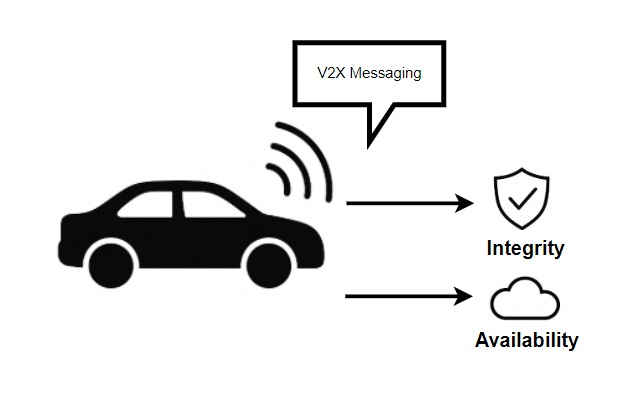
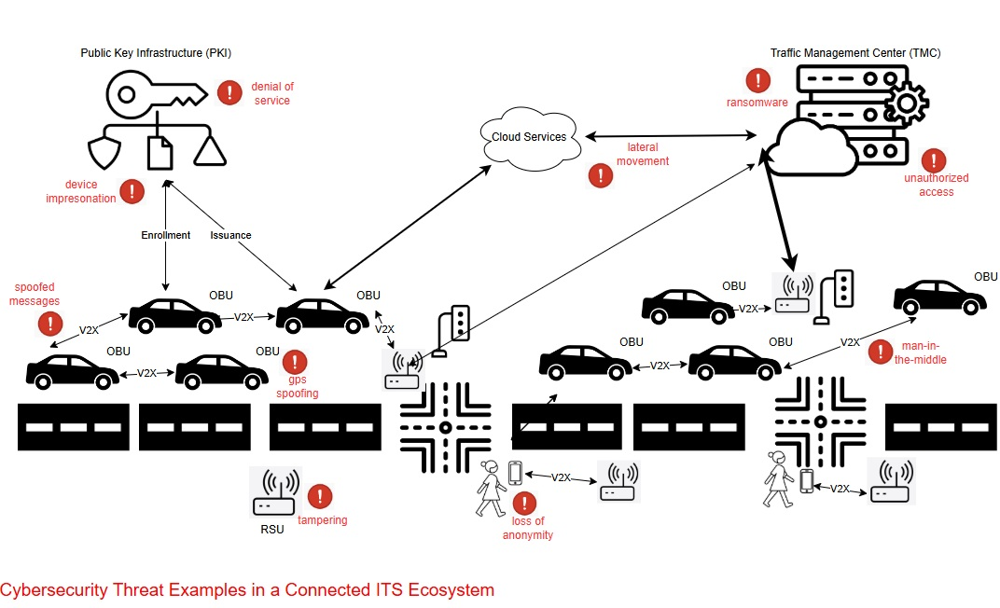
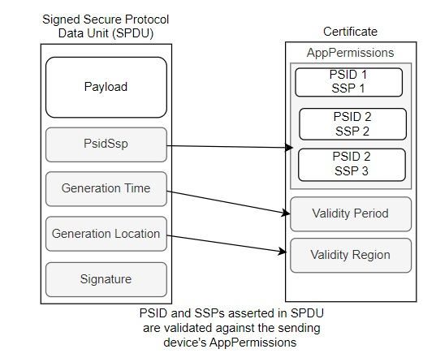
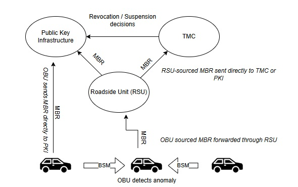
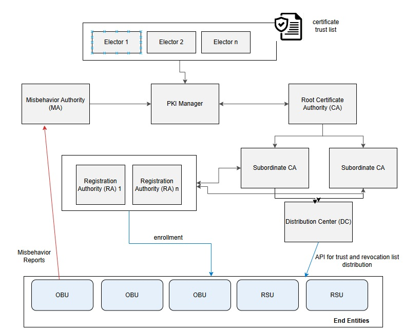

# A Beginner's Guide to Intelligent Transportation System (ITS) Cybersecurity

## An Introduction to ITS and ITS Cybersecurity

### ITS Systems of Systems

Intelligent Transportation Systems (ITS) enhance mobility, safety, and operational efficiency through connected and automated technologies. Modern ITS deployments function as a system of systems composed of vehicles, roadside equipment, traffic management centers, communications infrastructure, and cloud or backend services. These components exchange near real-time data to support traffic operations, cooperative services, and safety applications. ITS architectures are distributed. Components may be owned and operated by different entities, including public authorities, private operators, vehicle manufacturers, and service providers. Interoperability and trust must extend across organizational and jurisdictional boundaries. An ITS Station represents a logical entity capable of sending, receiving, and processing ITS messages. An ITS Station may reside within a vehicle, roadside device, or backend infrastructure component. The station concept provides a consistent architectural abstraction for defining security functions, trust relationships, and message processing behaviour across heterogeneous platforms. The figure below illustrates representative components of an ITS deployment and their interaction within a system-of-systems architecture.

Vehicles, roadside systems, and backend services exchange time-sensitive data that can influence traffic control decisions and vehicle behaviour. As a result, failures in communication integrity, authentication, or availability can produce operational disruption or safety impacts. ITS environments operate under conditions of mobility, wireless communication, and low-latency decision-making. These characteristics increase exposure to spoofing, message manipulation, denial-of-service, misconfiguration, and compromised endpoint behaviour. Systems must be designed to ensure that messages are authentic, unaltered, authorized, and available when required.

## ITS Cybersecurity

Cybersecurity protects digital systems and data from unauthorized access, manipulation, or disruption. In transportation environments, cybersecurity directly affects operational control and safety-related functions. ITS components influence traffic signal timing, roadway advisories, cooperative vehicle messaging, and automated decision support.

Unauthorized modification of traffic control commands, roadside device configurations, or connected vehicle message streams can alter operational behaviour. Suppression, injection, or replay of safety messages can degrade system reliability. Compromise of infrastructure services can reduce visibility, coordination, or trust within the transportation network.

{ width="67%" }

Connected and Automated Vehicle (CAV) cybersecurity focuses on vehicle-based ITS stations and their associated communications. CAV environments rely on wireless broadcast messaging, distributed trust management, and time-sensitive data exchange. Vehicles and infrastructure may act on received information with minimal human intervention. Security controls in CAV ecosystems must ensure that safety-relevant data is authentic, unmodified, authorized, and available under dynamic operating conditions.

CAV systems implement these security properties using a dedicated credential framework designed for V2X communications. This framework is defined by IEEE Std. 1609.2. The 1609.2 certificate format differs from traditional X.509 certificates used in enterprise networks. It is optimized for low-latency broadcast environments, high message frequency, and large-scale credential rotation. A 1609.2 certificate binds a public key to defined service permissions and operational constraints. Vehicles use private keys associated with these certificates to digitally sign outgoing safety messages. Receiving stations validate the certificate, evaluate its permissions, and verify the digital signature before accepting the message for processing.

### Message Authentication and Data Integrity

Integrity protection prevents unauthorized modification of data in transit or at rest. Authenticity validation confirms that a message was generated by a credentialed entity within the trust ecosystem. These properties are enforced through cryptographic hashing and digital signature mechanisms bound to provisioned certificates.

In cooperative and connected vehicle environments, safety messaging relies on asymmetric cryptography. The sending station computes a cryptographic hash of the message payload using an approved secure hash algorithm and signs that hash using its private key. The resulting signature, together with a reference to the signing certificate, accompanies the message so that other participants in the trust ecosystem can verify its origin and integrity.

IEEE Std. 1609.2 defines the security services used to protect Cooperative ITS communications. Rather than signing application data directly, IEEE 1609.2 places the application payload inside a standardized secure container called Ieee1609Dot2Data. This container carries the signed or encrypted content together with the metadata and credential references required for validation.

At a high level, the signing process follows these steps:

1. The sending ITS station prepares the application message to be transmitted.
2. The message is placed into a structure called To-Be-Signed Data (tbsData) together with metadata such as the generation time and the application service identifier (ITS-AID).
3. A cryptographic hash is computed over the entire tbsData structure.
4. The sending station signs the hash using its private key.
5. The resulting signature and a reference to the signing certificate are attached to the message container.

The receiving station validates the certificate against its trust anchors, confirms that the certificate is within its operational validity period, and verifies the digital signature using the public key contained in the certificate. Successful verification demonstrates that the message has not been modified and that it was generated by the holder of the corresponding private key.

Symmetric mechanisms such as message authentication codes are suitable for controlled point-to-point exchanges where a shared secret exists. Broadcast safety messaging, however, requires asymmetric digital signatures in order to support scalable trust among large numbers of independent participants without shared secrets.

#### Secure Message Structures

CAV safety messages are transmitted within a cryptographically protected container defined by the applicable V2X security standard. In IEEE-based deployments, this container is defined by IEEE Std. 1609.2 and carried within the `Ieee1609Dot2Data` structure. The container encapsulates the application payload together with the cryptographic elements required for validation and trust evaluation.

The `SignedData` portion of the structure binds the application payload to the signer’s credential. It contains the tbsData element holding the payload and associated metadata, along with the digital signature generated by the sending station. Header fields identify parameters such as protocol version, message generation time, and the application identifier associated with the message. The signer’s certificate, or a reference to it, accompanies the structure so that the receiver can validate the signature.

When a receiving ITS station processes a secured message, it evaluates the security container before releasing the payload to higher-layer applications. The station validates the signer’s certificate against locally configured trust anchors, confirms that the certificate is within its validity period and authorized for the indicated service, and verifies the digital signature using the public key bound to the certificate. The station reconstructs the message hash from the received payload and compares it against the signed value. Successful verification confirms both message integrity and the authenticity of the sender.

European C-ITS deployments implement a functionally equivalent encapsulation mechanism defined in ETSI TS 103 097. While the encoding and container naming differ, ETSI profiles the same underlying security concepts. The structure binds the payload to a signer credential, includes the metadata required for validation, and ensures that application processing occurs only after cryptographic verification.

### Authorization

Authentication confirms possession of a valid credential. Authorization determines whether the credential holder is permitted to perform a specific function within the CAV ecosystem. CAV authorization decisions rely on structured service identifiers and permission attributes encoded within certificates and evaluated locally by each ITS station. CAV messages are associated with defined applications or services. Each service is identified by an ITS Application Identifier (ITS-AID(. The ITS-AID uniquely identifies the protocol or application context under which a message is generated and interpreted. It provides the receiver with the semantic context required to apply the correct validation and policy rules.

In North American deployments, certificates encode service permissions using Provider Service Identifiers and Service Specific Permissions. A Provider Service Identifier defines the service or application domain in which the credential is authorized to operate. Service Specific Permissions further constrain the scope of that authorization by defining permitted message types, roles, or operational parameters. Together, these elements express what functions the credential holder is allowed to perform.

{ width="67%" }

When a CAV ITS station receives a signed message, it extracts the associated ITS-AID from the secured header and retrieves the permission attributes embedded within the signer’s certificate. The station evaluates whether the ITS-AID indicated in the message corresponds to a service for which the certificate grants authorization. The station then evaluates any additional constraints encoded in the Service Specific Permissions to determine whether the requested action falls within permitted operational bounds.

Each ITS station maintains a local policy and access control database that defines acceptable services, trust anchors, and operational constraints. This local configuration governs authorization decisions. The station compares the received certificate permissions and message context against its locally defined policy rules. If the certificate grants the required service permissions and satisfies local policy constraints, the station releases the message to the relevant application. If the permissions are insufficient or inconsistent with policy, the station rejects the message.

### Pseudonymity and Privacy Protection

CAV ecosystems are designed to support authenticated safety messaging without enabling long-term tracking of individual vehicles. To achieve this, vehicles operate using short-lived credentials known as pseudonym certificates. These certificates allow a vehicle to prove membership in a trusted system while limiting the ability of observers to correlate messages over time. A pseudonym certificate binds a short-lived public key to defined service permissions without embedding persistent identity information. The vehicle signs outgoing safety messages using the private key corresponding to the active pseudonym certificate. Receiving stations validate the certificate and signature but do not learn the long-term identity of the sender.

The credential management infrastructure separates enrolment identity from operational pseudonyms. Enrolment certificate authorities provision vehicles into the trust system. Pseudonym certificate authorities issue batches of short-lived certificates derived from approved enrolment credentials. Architectural separation between these roles prevents any single authority from directly correlating long-term identity with active pseudonym certificates under normal operating conditions. To support scalable issuance of large numbers of pseudonym certificates, deployments commonly use butterfly key expansion techniques. In this model, a vehicle generates a seed key pair and derives multiple public keys through deterministic expansion. The certificate authority signs the expanded public keys without learning the corresponding private keys.

Pseudonym certificates have limited validity periods. Vehicles rotate active certificates at defined intervals to reduce linkability between successive transmissions. Rotation frequency is a configurable parameter influenced by privacy policy and application requirements. Shorter rotation intervals increase privacy protection but may increase certificate management overhead and validation processing.

### Secure ITS Interfaces

ITS cybersecurity must address multiple interface types operating under different trust and threat models. Broadcast safety communications and backhaul network communications impose distinct security requirements. Each interface class requires controls appropriate to its operational role and exposure.

#### Local and Physical Interfaces

ITS field devices frequently expose local interfaces used for installation, diagnostics, and maintenance. Examples include serial console access, USB service ports, debugging interfaces such as JTAG or UART, removable media interfaces, and local web administration endpoints. These interfaces may be physically accessible in roadside environments where equipment is mounted on poles, cabinets, or gantries.

Attackers may attempt to obtain direct device access in order to extract credentials, modify firmware, or bypass network security controls. Systems must therefore protect local interfaces through hardware and software mechanisms such as authenticated maintenance access, secure boot enforcement, firmware integrity verification, disabled debug interfaces in production devices, and hardware protections that prevent unauthorized firmware modification.

Physical interface exposure is particularly relevant for roadside units and other distributed ITS devices deployed outside controlled facilities. Devices must assume that local access may occur and enforce protections that prevent persistent compromise even when physical access is obtained.

#### Broadcast Safety Interfaces

Broadcast interfaces distribute safety-relevant information to multiple recipients without prior session establishment. Examples include vehicle-to-vehicle messaging, roadside safety broadcasts, signal phase and timing transmissions, and work zone advisories. These interfaces operate in open wireless environments. Participants do not share pre-established symmetric secrets and cannot rely on connection-oriented session security. Security controls must therefore ensure message integrity, authenticity, and authorization without requiring pairwise trust relationships.

ITS broadcast messages are encapsulated within secure data objects defined by the applicable V2X security standard. The sender signs the message payload using a provisioned private key bound to a certificate issued within the ITS trust ecosystem. The certificate encodes service permissions and operational constraints. Recipients validate the certificate against locally configured trust anchors and verify the digital signature before processing the message. Broadcast safety interfaces prioritize integrity and authenticity. Confidentiality is generally not applied to safety broadcasts, as message content is intended for situational awareness within the local environment.

Broadcast safety interfaces must also implement strict message validation and defensive parsing. Receivers may process messages from unknown or potentially malicious transmitters operating within radio range. Implementations must therefore enforce schema validation, field bounds checking, certificate authorization validation, and replay protection before passing messages to higher-level applications. Failure to correctly validate broadcast inputs can allow malformed or unauthorized messages to influence infrastructure behaviour.

#### Backhaul and Networked Interfaces

Backhaul interfaces connect roadside equipment, traffic management centers, cloud services, and administrative systems. Many ITS deployments logically separate operational data channels from device management channels to reduce the risk that compromise of operational interfaces exposes administrative control functions. These interfaces typically operate over IP-based networks and may traverse public or shared infrastructure. Backhaul interfaces support session establishment, mutual authentication, and encrypted transport. Transport Layer Security is commonly used to protect backhaul communications. TLS provides confidentiality, integrity, and endpoint authentication using X.509 certificates issued by a recognized certificate authority. X.509 remains the dominant credential format for enterprise and infrastructure network security due to its broad tool support and integration with existing IT systems.

ISO 21177 defines the use of TLS within ITS station architectures, specifying profiles appropriate for transportation deployments. It addresses certificate validation, cipher suite selection, and secure channel establishment within ITS contexts. In certain architectures, IEEE 1609.2 credentials may also be used to authenticate application-layer messages transported over IP networks.

Backhaul security must also address configuration management, remote administration, firmware updates, logging, and credential provisioning interfaces. Systems must enforce mutual authentication, certificate validation, and strict access control for management endpoints. Compromise of backhaul channels can undermine trust distribution, certificate lifecycle management, and operational visibility across the ITS deployment. Backhaul interfaces typically require confidentiality in addition to integrity and authenticity. Encryption protects operational data, credentials in transit, and administrative commands from disclosure or manipulation.

### Physical Cybersecurity Protections

ITS infrastructure operates in environments where physical access cannot always be prevented. Roadside cabinets, traffic controllers, dynamic message signs, roadside units, and communications enclosures are deployed in publicly accessible locations. Vehicles also operate outside controlled facilities. Mechanical protections such as locked cabinets, controlled key distribution, and tamper-evident enclosures provide a first layer of defence. For some ITS equipment, cabinet design impacts security. Enclosures that conceal internal wiring, limit exposed ports, and restrict direct access to removable media reduce the opportunity for manipulation. Physical separation of power, communications, and control components within cabinets can further limit accidental or intentional interference.

Maintenance procedures directly affect physical security. Field devices require periodic inspection, configuration updates, and repair. Access logs, documented work orders, and dual-control procedures increase transparency and reduce the risk of unauthorized modification during legitimate maintenance activities. Uncontrolled distribution of mechanical keys or universal access tools increases systemic risk.

Physical tampering may include forced cabinet entry, device substitution, unauthorized hardware installation, cable interception, or manipulation of local interfaces. These actions can disrupt operations even in the absence of network compromise. Systems should therefore consider environmental hardening, intrusion detection switches, and visible tamper indicators as part of deployment strategy.

### Misbehaviour Detection

Misbehaviour detection systems are designed to identify faulty or deceptive behaviour by evaluating whether observed behaviour aligns with protocol rules, physical plausibility, and expected operational patterns. Detection mechanisms may identify inconsistent position reports, implausible motion dynamics, contradictory safety messages, or anomalous transmission patterns. Detection occurs at multiple layers. Vehicles and roadside units may perform local plausibility checks on received Basic Safety Messages and other cooperative data. When a station determines that observed behaviour deviates from defined thresholds or policy constraints, it generates a Misbehaviour Report. The report captures relevant message evidence, contextual data, and identifying information associated with the credential used to sign the suspect messages.

Misbehaviour Reports are transmitted to designated authorities through available network paths. An onboard unit may forward a report directly to the credential management authority or route it through a roadside unit. Roadside units may independently generate reports based on aggregated observations and forward them to a traffic management center or credential authority. Backend systems analyze submitted reports, correlate observations from multiple sources, and assess whether the reported behaviour reflects malfunction, environmental anomaly, or intentional misuse. If analysis confirms persistent or severe misbehaviour, the responsible authority may initiate suspension or revocation actions within the credential management system. Updated revocation information is then distributed to participating ITS stations for enforcement. The figure above illustrates a simplified view of how misbehaviour is detected, validated, and responded to in a credential-based ITS environment.

### Credential Management

A Credential Management System is a specialized public key infrastructure designed for cooperative ITS environments. It establishes and maintains the trust relationships required for authenticated V2X communications and is engineered to support large-scale issuance of short-lived pseudonym certificates, distributed trust validation, and credential revocation under mobility and broadcast constraints. The credential management system provisions vehicles and roadside units with enrolment credentials and batches of pseudonym certificates.

#### Credential Management System Architecture

Credential management systems used in cooperative ITS deployments are typically deployed as federated public key infrastructures designed to support large-scale issuance of pseudonym credentials while preserving operational privacy. The architecture separates governance, certificate issuance, distribution of trust material, and misbehaviour response functions so that no single component controls all aspects of identity management.

Trust governance operates above the certificate authority hierarchy. Participating domains maintain a Certificate Trust List (CTL) that enumerates the root certificate authorities accepted within the ecosystem. Governance entities approve the inclusion or removal of these authorities and publish updated trust lists to participating ITS stations. In some deployments, a Central Point of Contact (C-POC) coordinates trust list management and cross-domain trust relationships.

Within the credential management infrastructure, Root Certificate Authorities (RCAs) establish the roots of certificate chains used by operational authorities. These roots are recognized by end entities only if they appear in the applicable CTL. Beneath the root authorities, Subordinate Certificate Authorities issue operational credentials used within the ecosystem.

Registration Authorities (RAs) process enrolment requests and validate device eligibility prior to certificate issuance. During enrolment, the RA verifies that a vehicle, roadside unit, or other ITS station satisfies the certificate policy requirements defined for participation in the ecosystem. Upon successful validation, enrolment credentials are issued and may later be used to request batches of pseudonym certificates for operational messaging.

Distribution Centers (DCs) provide mechanisms for ITS stations to retrieve updated trust anchors, certificate trust lists, and revocation information. Devices periodically synchronize with these services to maintain an up-to-date view of trusted authorities and revoked credentials.

The architecture also incorporates misbehaviour management functions. A Misbehaviour Authority receives reports of anomalous or malicious behaviour from participating devices or infrastructure. After evaluating supporting evidence, the authority may coordinate with governance entities and certificate authorities to suspend or revoke credentials associated with the offending device. Revocation information is propagated through the distribution infrastructure so that relying ITS stations can reject messages associated with revoked credentials.

### Trust Management

Trust management defines how an ITS station evaluates whether received communications originate from authorized participants within the cooperative transportation ecosystem. Vehicles, roadside units, and backend stations perform these evaluations locally using previously provisioned trust material and periodically updated credential status information.

Each ITS station maintains a local trust store containing the root authorities accepted within the deployment domain. These trust anchors are derived from the applicable Certificate Trust List distributed through the credential management infrastructure. The trust list establishes the set of certificate authorities whose credentials are recognized by participating stations. Message validation and authorization decisions rely on this locally maintained trust state rather than real-time connectivity to external services.

When an ITS station receives a secured message, it evaluates the security container before releasing the payload to higher-layer applications. The station extracts the signed message structure defined by the applicable V2X security standard and evaluates the credential used to sign the message. Certificate validation confirms that the signer’s credential chains to a trusted root authority and that the certificate is within its operational validity period.

Following certificate validation, the station verifies the digital signature associated with the message. The receiver reconstructs the message hash from the received payload and compares it to the signed value using the public key bound to the certificate. Successful verification confirms that the message has not been altered and that it was generated by the holder of the corresponding private key.

Authorization is evaluated as part of this validation process. V2X certificates encode permissions that restrict the services and message types a credential holder may generate. The receiving station evaluates these permissions together with the application identifier associated with the message to determine whether the sender is authorized to transmit the indicated message type. Authorization decisions are performed locally according to policy rules configured within the station.

Revocation status must also be considered during credential evaluation. ITS stations periodically obtain updated revocation data from the credential management distribution infrastructure and maintain this information locally. During message processing, the station checks whether the credential used to sign the message has been revoked or suspended. Messages associated with revoked credentials are rejected before application processing.

Trust management also incorporates credential lifecycle considerations. During initial provisioning, an ITS station receives enrolment credentials that establish its membership within the ecosystem. These credentials enable the station to request operational pseudonym certificates used for message signing. Pseudonym certificates are intentionally short-lived and are rotated periodically in order to limit long-term correlation of transmitted messages while preserving authenticated participation in the trust system.

End entities, including onboard units and roadside units, rely on locally stored trust anchors and periodically updated trust lists to validate received credentials. Each ITS station performs credential validation independently using locally provisioned trust material. Trust anchors define the root certificate authorities that a station recognizes as trusted issuers within the ITS system.

## Why ITS Cybersecurity is Unique

The Internet connects servers and clients. Servers are very often physically static, meaning they are not on-the-move devices. This client/server architecture is well suited to the use of a centralized trust model, often relied upon when using X.509 certificates, whereby a central trust authority issues identity certificates to a server, and the server then uses the certificate to enable authenticated, integrity protected and encrypted communications.  End-users install the trust authority's certificate into their trusted root store, and validate that the server's certificate "chains" to the root certificate loaded in the trusted root store. Sessions like this can be established using security protocols such as Transport Layer Security (TLS) Datagram TLS (DTLS), Internet Protocol Security (IPsec) and others.

An ITS integrates myriad devices and services, each of which may be provisioned certificates from different trust authorities. This requires a more decentralized trust model. In addition, it is important that vehicles cannot be tracked by surreptitious actors (including insiders). This means that way of asserting identities within X.509 certificates, is not acceptable. As well, the ability to assert authorizations for participating in different ITS services, is important, and that is not a built-in capability when using X.509 certificates.

## 1. Real-Time, Safety-Critical Operations

<table>
  <tr>
    <td style="width: 170px; vertical-align: middle; text-align: center;">
      
    </td>
    <td>
      
      ITS involve real-time interactions that directly affect safety. For example, vehicle-to-RSU messaging requires minimal latency so that vehicles can immediately process messages. Any delays that would be introduced through the use of traditional internet security protocols, which are often optimized for less time-sensitive applications, could lead to safety hazards. ITS-specific mechanisms, such as IEEE Std. 1609.2 certificates, are designed to prioritize low-latency communication while maintaining security, making them better suited to the unique considerations associated with ITS real-time operations.
    </td>
  </tr>
</table>

## 2. Mobility Requirements

<table>
  <tr>
    <td style="width: 170px; vertical-align: middle; text-align: center;">
      
    </td>
    <td>
   
      An ITS is a dynamic environment where devices (e.g., vehicles, pedestrians, RSUs) continuously join and leave networks. IEEE Std. 1609.2 certificates are optimized for use in these dynamic environments, with support for example for short duration lifetimes. Traditional X.509 systems are less equipped to handle frequent certificate updates and revocations required for mobile, decentralized networks.
    </td>
  </tr>
</table>

## 3. Anonymity Requirements

<table>
  <tr>
    <td style="width: 170px; vertical-align: middle; text-align: center;">
      
    </td>
    <td>
       
  Credential management systems such as the CCMS or SCMS issue pseudonym certificates to vehicle On Board Units (OBUs), enabling trusted communication while preserving subscriber anonymity. X.509 certificates have no mechanism for preserving subscriber anonymity.
    </td>
  </tr>
</table>

## 4. Multi-Entity Trust Management

<table>
  <tr>
    <td style="width: 170px; vertical-align: middle; text-align: center;">
      
    </td>
    <td>
      
ITS environments involve a wide range of stakeholders, including vehicles from multiple Original Equipment Manufacturers (OEMs), infrastructure owned by various jurisdictions, and multiple communication providers. Establishing trust across these entities requires specialized structures, such as the Certificate Trust List (CTL) in North America or the European Certificate Trust List (ECTL). These mechanisms enable the extension of trust to differing policy domains and support the dynamic operation of vehicles with infrastructures owned and managed by differing entities. X.509 lacks these built-in cross-trust mechanisms and require substantial planning and processes for trust extension, making them less suited for managing complex ITS trust requirements.
    </td>
  </tr>
</table>

## 5. Embedded Permissions within Certificates

<table>
  <tr>
    <td style="width: 170px; vertical-align: middle; text-align: center;">
      
    </td>
    <td>
      
Traditional network security approaches control who can join a system and provides fine-grained access through user accounts and roles. In ITS, however, devices often share the same network infrastructure, so connecting alone does not grant any special rights. Instead, each device must present a certificate that embeds explicit permissions, defining exactly which applications and roles it is allowed to use. For example, IEEE Std. 1609.2 certificates contain Intelligent Transport System Application Identifiers (ITS-AID), Provider Service Identifiers (PSID), and Service Specific Permissions (SSP) that control which messages a participant may send and what actions it may request. This ensures that only properly authorized vehicles can request signal priority or transmit safety-critical data, even on a shared network.</td>
    </tr>
</table>

## 6. Continuous Adaptation to Evolving Threats in Dynamic Environment

<table>
  <tr>
    <td style="width: 170px; vertical-align: middle; text-align: center;">
      
    </td>
    <td>
         
        ITS cybersecurity requires a continuous risk assessment process that adapts to the evolving technologies and attacker capabilities within this large-scale, dynamic, and safety-critical domain. The vast scale increases the attack surface (millions of vehicles/devices) and means that a widespread attack could have massive impact. Managing trust and detecting anomalies across so many entities is challenging especially given the dynamic environment where network topologies change rapidly and communication is characterized by intermittent connectivity and high mobility. This make establishment of persistent trust relationships and the identification of malicious nodes more difficult.</td>
    </tr>
</table>

## 7. Velocity of Change

<table>
  <tr>
    <td style="width: 170px; vertical-align: middle; text-align: center;">
      
    </td>
    <td>
      
The scalability and certificate management challenge in V2X ITS comes from the extremely high frequency of change and sheer volume of short-lived pseudonym certificates required for privacy.  The velocity of change in V2X pseudonymity (e.g., a vehicle might use dozens of certificates per week or even per day of driving) creates unique operational loads on the SCMS for issuance, and on vehicles for storage and selection. In addition, ITS devices are expected to encounter previously unknown ITS devices regularly, requiring that ITS certificates be shared regularly.
    </td>
  </tr>
</table>

## Internet vs. ITS Cybersecurity

ITS deployments use both transport-layer and application-layer security mechanisms. These mechanisms address different interface classes and operate under different trust assumptions. IP-based backhaul and management interfaces typically use Transport Layer Security with X.509 certificates. These channels connect traffic management centers, roadside infrastructure, cloud services, and credential management components. TLS provides encrypted session establishment, mutual authentication, and integrity protection for configuration traffic, operational data exchange, credential provisioning, and software distribution. ISO 21177 defines the use of TLS within ITS station architectures and profiles its application for transportation environments.

V2X communications do not rely on session establishment. Safety messages are broadcast to any receiving participant within range. These messages require application-layer protection independent of transport sessions. IEEE 1609.2 defines the certificate formats and secure message encapsulation used to bind message content to a signing credential. Validation occurs at message reception using locally stored trust anchors and revocation information. X.509 certificates and IEEE 1609.2 certificates serve distinct roles. X.509 secures network sessions between defined endpoints. IEEE 1609.2 secures broadcast safety messages in decentralized environments. An ITS station may implement both simultaneously. Broadcast messages are signed using V2X credentials, while backend communications are protected using TLS.

The table below contrasts typical deployment characteristics associated with transport-layer X.509 security and application-layer ITS certificate frameworks.

| Deployment Consideration                                     | X.509 Certificates | ITS Certificates (IEEE 1609.2/TS 103 097) |
| ------------------------------------------------------------ | ------------------ | ----------------------------------------- |
| Safety-critical message exchange requiring millisecond-level validation and immediate local processing (e.g., cooperative awareness, signal phase and timing broadcasts) | ✘                  | ✔                                         |
| Highly mobile participants dynamically entering and leaving communication range without pre-established trust relationships | ✘                  | ✔                                         |
| Broadcast communication where messages must be trusted by any receiving participant within range, without session establishment | ✘                  | ✔                                         |
| Privacy-sensitive deployments requiring short-lived credentials and periodic rotation to reduce long-term linkability | ✘                  | ✔                                         |
| Enforcement of application-specific permissions embedded directly within the credential for decentralized authorization decisions | ✘                  | ✔                                         |
| Operation in environments where backend connectivity may be intermittent or unavailable during message validation | ✘                  | ✔                                         |
| Persistent client–server communication between defined endpoints over managed IP networks | ✔                  | ✘                                         |
| Integration with enterprise identity management, cloud APIs, and traditional IT infrastructure components | ✔                  | ✘                                         |
