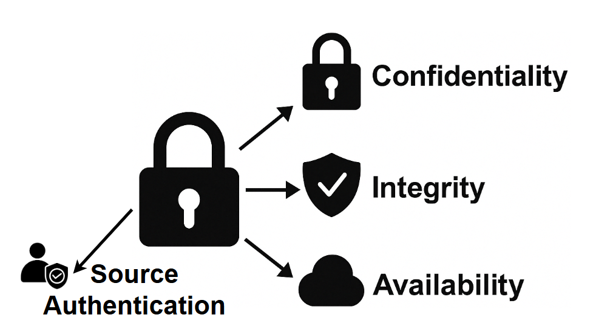

# A Beginner's Guide to Intelligent Transportation System (ITS) Cybersecurity

## An Introduction to ITS and ITS Cybersecurity

### ITS Systems of Systems

Intelligent Transportation Systems (ITS) enhance mobility, safety and efficiency through connected and automated technologies. ITS systems rely on near real-time data exchange between vehicles, infrastructure, and cloud services to optimize traffic flow and improve vehicular safety as well as the safety of the integrated transportation system more broadly.. Connected vehicles use vehicle-to-everything (V2X) communication to help prevent collisions, while roadside units (RSUs) relay information such as signal phase changes, work zone alerts, and dynamic speed limits. The figure below illustrates the key components of a typical ITS deployment and how they interact as a system of systems.

The complexity and interconnectedness of these systems create new operational benefits but also introduce new types of risk. Because vehicles and infrastructure often interact dynamically and at high speeds, reliability, precision, and trust in communications are important.

### Introduction to Cybersecurity

Cybersecurity is the protection of digital systems, communications, and data from unauthorized access, manipulation, or disruption. In critical infrastructure sectors such as transportation, controls enabled through cybersecurity directly affect directly affect physical safety. A cybersecurity failure could disrupt traffic signals, disable roadside infrastructure, or compromise the information provided to a connected vehicle which could impact vehicle operator decision making. Cybersecurity principles include confidentiality, integrity, and availability.

{ width="60%" }

Confidentiality ensures that data is protected from unauthorized access, preserving privacy and preventing misuse. Integrity guarantees that data and messages remain accurate and unaltered during transmission or storage. Sender authentication ensures that whomever transmits a message was authorized by a trusted entity to send the information. Availability ensures that systems and services remain operational and accessible when needed. In transportation, these principles apply to traffic control commands, vehicle messaging, digital road signage, and other systems. In systems where timing is important, accuracy, and authentication of source or destination entities are critical.

### ITS Cybersecurity

ITS cybersecurity ensures the integrity, confidentiality, and availability of data exchanged across an ITS system. It protects against cyber threats that could disrupt traffic management, compromise vehicle behaviour, or manipulate digital traffic controls. This includes securing communication between vehicles and infrastructure, ensuring that only trusted devices participate in ITS applications, and protecting sensitive data from misuse or exposure. In the context of V2X, although confidentiality is not always required, data integrity and availability remain critical requirements at all times. This is due to the latency-sensitive nature of V2X messages such as Basic Safety Messages (BSMs), where encryption processing and messaging overhead may reduce the ability to receive information in a timely manner.

{ width="67%" }

Modern ITS environments face a broad and evolving threat landscape. Communications between vehicles and infrastructure—known as Vehicle-to-Everything (V2X)—must be protected from interception, manipulation, and unauthorized injection of false data. Network infrastructure is vulnerable to denial-of-service (DoS) and malware-based attacks, which can disable roadside systems or overwhelm traffic management centers. IoT devices such as smart traffic signals, cameras, and sensors may be physically or remotely exploited due to weak default configurations or unpatched software. Location-based services can be compromised through GPS spoofing and jamming, causing vehicles to misreport their positions or lose navigation capability. As cyber-physical systems, ITS deployments must defend not just against digital exploits, but against threats that have direct safety consequences in the physical world—from manipulating emergency vehicle priority to triggering unsafe driving conditions. The following diagram provides a simplified view of the types of threats that can affect different components of the ITS environment.

Unlike traditional internet-based systems, ITS cybersecurity must function in highly mobile, latency-sensitive environments where anonymity of participants is often important. Vehicles must trust messages from other vehicles or roadside systems they have never encountered before—often with no direct internet connection or central authority available at the time of interaction. As a result, ITS requires specialized cybersecurity tools and protocols that go beyond traditional cybersecurity tools such as Transport Layer Security (TLS) and X.509 certificates.

In the sections that follow we will further explore these challenges. First, we will introduce the unique characteristics of ITS cybersecurity. Next, we will explain why general-purpose cybersecurity tools are insufficient. Finally, we will describe the unique characteristics of ITS cybersecurity, explain why general-purpose cybersecurity tools are insufficient, and describe the standards and trust frameworks that support secure ITS deployments.

## Why ITS Cybersecurity is Unique

Transportation systems integrate real-time cyber-physical operations with direct safety implications. Unlike traditional IT systems, which can often tolerate centralized trust models, identity-bound certificates, and latency, ITS requires decentralized, privacy-preserving, and low latency security models that operate across jurisdictions. These systems support millions of highly mobile vehicles and infrastructure components that must be able to securely interact often without continuous connectivity.

ITS relies on the use of Public Key Infrastructure (PKI) which provides proven best practices including scalability and affordability. ITS-specific certificate structures have been introduced to overcome specific challenges associated with ITS operations, for example IEEE 1609.2 and ETSI TS 103 09. The characteristics below highlight specific ITS characteristics.

## 1. Real-Time, Safety-Critical Operations

<table>
  <tr>
    <td style="width: 170px; vertical-align: middle; text-align: center;">
      
    </td>
    <td>
      **Real-Time, Safety-Critical Operations** 
      ITS involve real-time interactions that directly affect safety. For example, vehicle-to-roadside unit (RSU) communication requires minimal latency so that vehicles can immediately process messages. Any delays that would be introduced through traditional internet security protocols, which are often optimized for less time-sensitive applications, could lead to safety hazards. ITS-specific mechanisms, such as IEEE Std. 1609.2 certificates, are designed to prioritize low-latency communication while maintaining security, making them better suited to the unique considerations associated with ITS real-time operations.
    </td>
  </tr>
</table>

## 2. Mobility Requirements

<table>
  <tr>
    <td style="width: 170px; vertical-align: middle; text-align: center;">
      
    </td>
    <td>
      **Mobility Requirements** 
      Unlike stationary internet systems, transportation systems operate in highly dynamic environments where devices (e.g., vehicles, pedestrians, RSUs) continuously join and leave networks. IEEE Std. 1609.2 certificates are optimized for use in these dynamic environments, with support for example for short duration lifetimes. Traditional X.509 systems are less equipped to handle frequent certificate updates and revocations required for mobile, decentralized networks.
    </td>
  </tr>
</table>

## 3. Anonymity Requirements

<table>
  <tr>
    <td style="width: 170px; vertical-align: middle; text-align: center;">
      
    </td>
    <td>
      **Anonymity Requirements** 
  PKI systems such as the Cooperative Intelligent Transportation Systems Credential Management System (CCMS) and Security Credential Management System (SCMS) issue pseudonym certificates to vehicle OBUs, enabling trusted communication while preserving subscriber anonymity. X.509 certificates have no mechanism for preserving subscriber anonymity.
    </td>
  </tr>
</table>

## 4. Multi-Entity Trust Management

<table>
  <tr>
    <td style="width: 170px; vertical-align: middle; text-align: center;">
      
    </td>
    <td>
      **Multi-Entity Trust Management** 
ITS environments involve a wide range of stakeholders, including vehicles from multiple Original Equipment Manufacturers (OEMs), infrastructure owned by various jurisdictions, and multiple communication providers. Establishing trust across these entities requires specialized structures, such as the Certificate Trust List (CTL) in North America or the European Certificate Trust List (ECTL). These mechanisms enable the extension of trust to differing policy domains and support the dynamic operation of vehicles with infrastructures owned and managed by differing entities. Generic systems like X.509 lack these built-in cross-trust mechanisms and require substantial planning and processes for trust extension, making them less suited for managing complex ITS trust requirements.
    </td>
  </tr>
</table>

## 5. Embedded Permissions within Certificates

<table>
  <tr>
    <td style="width: 170px; vertical-align: middle; text-align: center;">
      
    </td>
    <td>
      **Embedded Permissions within Certificates** 
Traditional network security controls who can join a system and provides fine-grained access through user accounts and roles. In ITS, however, devices often share the same network infrastructure, so connecting alone does not grant any special rights. Instead, each device must present a cryptographic certificate that embeds explicit permissions, defining exactly which applications and roles it is allowed to use. For example, IEEE Std. 1609.2 certificates contain Intelligent Transport System Application Identifiers (ITS-AID), Provider Service Identifiers (PSID), and Service Specific Permissions (SSP) that control which messages a participant may send and what actions it may request. This ensures that only properly authorized vehicles can request signal priority or transmit safety-critical data, even on a shared network.</td>
    </tr>
</table>

## 6. Continuous Adaptation to Evolving Threats in Dynamic Environment

<table>
  <tr>
    <td style="width: 170px; vertical-align: middle; text-align: center;">
      
    </td>
    <td>
        **Dynamic Threats in Highly Mobile Environment** 
        ITS cybersecurity requires a continuous risk assessment process that adapts to the evolving technologies and attacker capabilities within this large-scale, dynamic, and safety-critical domain. The vast scale increases the attack surface (millions of vehicles/devices) and means that a widespread attack could have massive impact. Managing trust and detecting anomalies across so many entities is challenging especially given the dynamic environment where network topologies change rapidly and communication is characterized by intermittent connectivity and high mobility. This make establishment of persistent trust relationships and the identification of malicious nodes more difficult.</td>
    </tr>
</table>

## 7. Velocity of Change

<table>
  <tr>
    <td style="width: 170px; vertical-align: middle; text-align: center;">
      
    </td>
    <td>
      **Pseudonymity at Scale** 
The scalability and certificate management challenge in V2X ITS comes from the extremely high frequency of change and sheer volume of short-lived pseudonym certificates required for privacy.  The velocity of change in V2X pseudonymity (e.g., a vehicle might use dozens of certificates per week or even per day of driving) creates unique operational loads on the SCMS for issuance, and on vehicles for storage and selection. In addition, ITS devices are expected to encounter previously unknown ITS devices regularly, requiring that ITS certificates be shared regularly.
    </td>
  </tr>
</table>

## ITS Cybersecurity Building Blocks

Now that we've established what makes ITS cybersecurity unique, it's useful to introduce the key mechanisms that have been developed to meet those needs. These mechanisms include secure certificate formats tailored for mobile use, frameworks for distributing and managing credentials across millions of devices, and systems for detecting and responding to misbehaviour in the network. While specific implementations vary by region—for example, between North America’s SCMS and Europe’s CCMS—the core building blocks share common goals and are aligned with international standards.

The following section provides a high-level overview of these mechanisms, written for non-experts. More technical readers are encouraged to explore the [ITS Cybersecurity Mechanisms and Building Blocks](its-security-patterns.md) section for deeper background.

### Credential Management Systems

A Credential Management System (SCMS or CCMS) is a specialized type of public key infrastructure (PKI) designed for ITS. It provides the foundation of trust for communications between vehicles, infrastructure, and backend systems. Unlike traditional PKI systems that issue long-term identity certificates, SCMS and CCMS issue short-lived pseudonym certificates that protect user privacy while still enabling strong authentication and authorization. The diagram below introduces the core components of a credential management system used to enable trusted communication in ITS, based on an SCMS architecture.

The credential management system shown here includes key roles that work together to provide trusted V2X communication. Electors approve or revoke Root Certificate Authorities (CAs) and maintain the Certificate Trust List (CTL). The PKI Manager oversees policy enforcement and trust anchor updates. The Root CA is a top-level trust anchor, while Subordinate CAs handle certificate issuance for specific purposes or regions. Registration Authorities (RAs) process enrolment requests from end entities like OBUs and RSUs. The Distribution Center (DC) provides an API for devices to download current trust lists and revocation lists. The Misbehaviour Authority (MA) collects reports about suspected misbehaviour and coordinates with the PKI Manager to revoke trust when necessary. This structure ensures vehicles and infrastructure can authenticate each other’s messages while preserving privacy through short-lived certificates.

### ITS Certificate Standards

ITS uses certificate formats specifically tailored for the real-time, decentralized, and mobile nature of V2X communications. Two major standards are used globally: IEEE 1609.2, which is primarily deployed in North America, and ETSI TS 103 097, which is used in Europe. While developed in parallel, both standards share key features that address the specific challenges of ITS. They support privacy-preserving pseudonymity, allowing vehicles to authenticate messages without revealing long-term vehicle or personal identities. They also include geolocation constraints and flexible permission structures that enable fine-grained control over what actions a device is authorized to perform.

{ width="67%" }

### Entitlements

ITS certificates can carry embedded entitlements—policy assertions that define what a device is authorized to do in the context of specific ITS applications. These entitlements are expressed using certificate fields such as the ITS-AID/PSID and Service-Specific Permissions (SSP) in IEEE deployments, or the ITS Application Identifier (ITS-AID) and corresponding permissions in ETSI-based systems. For example, in an IEEE 1609.2 certificate, AppPermissions carries a sequence of authorized ITS-AID/PSID and SSP entries, representing the applications and roles that the device possessing the certificate is authorized to participate in.

For example, a certificate may include an entitlement that authorizes a vehicle to request signal priority, while restricting that capability from others. A sending device, for example an OBU transmits a message as a signed secure protocol data unit (SPDU), and the receiving device validates message authenticity, followed by a check against the ITS-AID/PSID and SSP permissions asserted in the message. These permissions are checked against the sending devices' certificates, using the appPermissions field.

{ width="67%" }

By supporting fine-grained entitlements, ITS certificates enable strong access control mechanisms that align with specific use cases, user roles, or organizational policies.

### Misbehaviour Detection

Even in a well-secured system, trusted devices can malfunction or behave maliciously. In ITS, where safety depends on the accuracy and integrity of real-time data, it is important to continuously evaluate whether participants are acting in accordance with expected behaviours. Misbehaviour detection systems are designed to identify faulty or deceptive behaviour; for example  inconsistent vehicle position updates, spoofed GPS signals, or invalid safety alerts, and initiate a response that preserves trust in the network. These systems operate at both the edge and the backend. Local detection capabilities onboard vehicles or infrastructure can flag suspicious messages, while backend authorities analyze reported incidents, corroborate evidence, and determine whether a device's credentials should be suspended or revoked. The figure below illustrates a simplified view of how misbehaviour is detected, validated, and responded to in a credential-based ITS environment.

This diagram shows how misbehaviour reports (MBRs) flow through an ITS security environment. An OBU detects an anomaly in a received Basic Safety Message (BSM) and generates an MBR. This report can be sent directly to the Public Key Infrastructure (PKI) or passed through a RSU. RSUs themselves may detect misbehaviour and send reports directly to a Traffic Management Center (TMC) or the PKI. The PKI analyses reports, and decides whether revocation or suspension is necessary, then update revocation lists or takes other action as necessary.

---

## Internet vs. ITS Cybersecurity

Digital security architectures are typically built as layered stacks, with each layer addressing different types of threats and trust requirements. The traditional internet stack, built around protocols such as TLS and certificate formats like X.509, is well-suited for securing static web services, enterprise systems, and client-server communications. ITS involves mobile actors, short-lived trust relationships, and real-time decision-making in safety-critical contexts. These differences have led to the development of an ITS-specific cybersecurity stack, designed for decentralized communication, scalability, privacy, and performance in dynamic environments.

It's crucial to recognize that these certificate types are not mutually exclusive; X.509 and IEEE 1609.2 certificates can and often do co-exist on a single ITS device (e.g., a vehicle or RSU). A vehicle might use an IEEE 1609.2 certificate for broadcasting its position via BSMs, while simultaneously using an X.509 certificate to establish a secure TLS session with a backend service provider for a non-safety application (e.g., infotainment update, diagnostics upload).

- X.509 Certificates for Conventional IT/Enterprise Communications: X.509 certificates, the backbone of web security (SSL/TLS), are typically used in ITS for securing Backend Communications:  Connections between ITS centers (e.g., METR Regulation System, METR Distribution Centre, SCMS components) and Secure Device Provisioning/Management: Potentially for initial bootstrapping or secure software updates to ITS stations (vehicles, RSUs) where a traditional client-server secure channel is appropriate.

- IEEE 1609.2 Certificates for V2X Communications:  IEEE 1609.2 standard defines certificates and security services specifically tailored for Vehicle-to-Everything (V2X) direct communications. This includes: (a) Securing Safety Messages e.g BSMs, CAMs, (b) Enabling Pseudonymity: Using short-lived, frequently changing pseudonym certificates to protect vehicle location privacy.

The following comparison outlines where each stack is typically applied. It is intended as a decision tool. It identifies common deployment considerations and helps clarify which certificate format is better suited to address each one. Readers should evaluate each row in the context of their deployment environment and use case. A key takeaway is that in ITS there is a role for X.509 certs next to 1609.2 certs as they cover different operational requirements.

| Deployment Consideration                                     | X.509 Certificates | ITS Certificates (IEEE 1609.2/TS 103 097) |
| ------------------------------------------------------------ | ------------------ | ----------------------------------------- |
| Is the environment latency-sensitive or safety-critical? For example, does the system require real-time processing of messages. | ✘                  | ✔                                         |
| Are devices mobile and frequently entering/leaving networks? | ✘                  | ✔                                         |
| Is user anonymity or pseudonymity required? For example, does the deployment need to preserve privacy while still verifying message authenticity? | ✘                  | ✔                                         |
| Is fine-grained access control required? For example, do you need to define what specific actions a device can take within a given application (e.g., request signal priority)? | ✘                  | ✔                                         |
| Are devices expected to send messages without a connection to a server? | ✘                  | ✔                                         |
| Is the environment bandwidth-constrained or using wireless links? | ✘                  | ✔                                         |
| Is the deployment centralized and session-based?             | ✔                  | ✘                                         |
| Will the deployment integrate with traditional IT infrastructure (e.g., TMC servers, cloud APIs)? | ✔                  | ✘                                         |

X.509 certificates are still a valid and widely used option for securing communications in backend systems, including data exchanges between traffic management centers, cloud platforms, and enterprise services. However, for on-road communication, safety-critical applications, and mobility-centric environments, X.509 lacks the necessary support for short-lived credentials, anonymity, decentralized trust, and application-specific permissions.
