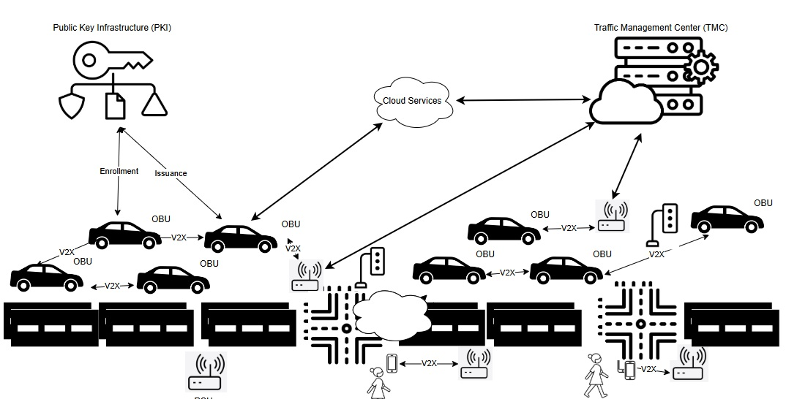
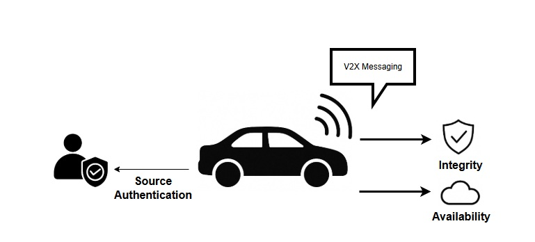
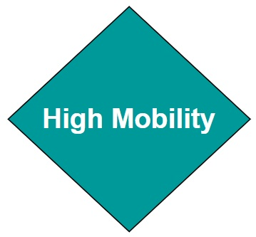
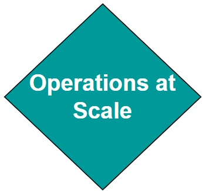

# A Beginner's Guide to Intelligent Transportation System (ITS) Cybersecurity

## An Introduction to ITS and ITS Cybersecurity

### ITS Systems of Systems

Intelligent Transportation Systems (ITS) enhance mobility, safety and efficiency through connected and automated technologies. ITS systems rely on near real-time data exchange between vehicles, infrastructure, and often cloud services, to optimize traffic flow and improve safety. Connected vehicles (CV) use vehicle-to-everything (V2X) communication for many use cases, for example to aid in preventing collisions. A type of ITS device, called a Roadside unit (RSU) can relay information across the CV environment, for example signal changes, work zone alerts, and dynamic speed limit changes. The figure below illustrates components of a typical ITS deployment and how they interact as a system of systems.

The complexity and interconnectedness of these systems create new operational benefits but also introduce new types of risk. Because vehicles and infrastructure often interact dynamically and at high speeds, reliability, availability, and trust in communications are important.

### Introduction to Cybersecurity

Cybersecurity involves the protection of digital systems and data from unauthorized access, manipulation, or disruption. In critical infrastructure sectors such as transportation, cybersecurity controls also impact the physical world, since exploitation of ITS devices or services could result in kinetic effects. Successful exploitation of system weaknesses and vulnerabilities could could disrupt traffic signals, disable roadside infrastructure, or compromise the CV data feeds, resulting in on-road collisions.  The cybersecurity principles of confidentiality, integrity, and availability are used within a secure system design to safeguard against these threats. 

{ width="67%" }

Confidentiality requirements may be levied on an ITS to protect data from unauthorized access. For example, by encrypting information contained within digital messages, an attacker that has access to those messages will not be able to read them. The ITS domain is somewhat unique in that many ITS messages, for example V2V messages, do not require confidentiality protections because they contain information that is meant to be broadcast to surrounding vehicles. Confidentiality is enabled through encryption algorithms (for example, the Advanced Encryption Standard (AES)), key exchange algorithms (for example, Elliptic Curve Diffie Hellman (ECDH)), and by the protection of cryptographic keys used by these and other algorithms. 

Maintaining the integrity of ITS messages is always important. Vehicles and ITS systems may perform actions based on the contents of a digital message.  Therefore, data integrity requirements are levied on an ITS to safeguard against the unauthorized modification of data whether in-transit or at-rest.  Data integrity can be enabled within an ITS through the use of approaches such as Message Authentication Codes (MACs), hashing algorithms, and /or digital signature algorithms. For example, an ITS developer may choose to append a keyed MAC to a message, whereby a tag is created by combining the message with a secret key, before running through a hashing algorithm. In this case, the secret key is shared between two parties. An alternative to this approach is to use digital certificates and asymmetric key pairs.  IEEE Std. 1609.2 defines certificates that can be used to validate both the integrity and authenticity of ITS messages. A sender may use a hashing algorithm, for example Secure Hash Algorithm (SHA) to hash message contents, and then apply a digital signature to the hash, using algorithms such as Elliptic Curve Digital Signature Algorithm (ECDSA). Receivers can then use the public key of the sender, contained within the IEEE 1609.2 certificate, to validate that the message was signed by a trusted entity, and that the contents of the message have not been tampered. 

Authentication is also critical within  an ITS. As mentioned above, approaches such as IEEE 1609.2 can be used to authenticate that the sender of a message is (1) the actual sender of that message, and (2) is trusted by the receiver to send that message.  Note that this is different than validating that the sender of a message is authorized to send the message. Within an ITS, the ability to validate authorization is also important, and to do so, sender certificates may include one or more Provider Service Identifiers (PSIDs) and Service Specific Permissions (SSPs). These entitlements communicate to the receiver of a message, what specifically that the sender is authorized to request or perform.  

The principle of availability within a cybersecurity design focuses on ensuring that ITS systems and services remain operational and accessible when needed. In transportation, these principles apply to traffic control commands, vehicle messaging, digital road signage, and other systems.

### ITS Cybersecurity

Modern ITS environments face a broad and evolving threat landscape. V2V/V2X communications must be protected from manipulation and unauthorized injection of false data. Network services may be vulnerable to denial-of-service (DoS) and malware-based attacks, which can potentially disable roadside systems or overwhelm Traffic Management Centers (TMCs). ITS devices, for example such as signal controllers, closed-circuit televisions (CCTV), dynamic message signs (DMS), and environmental sensors may be physically or remotely exploited due to weak default configurations, unpatched software, or other vulnerabilities. Location-based services can be compromised through GNSS spoofing or disabled through jamming, causing vehicles to misreport their positions or lose navigation capability. And, since an ITS is a cyber-physical system, an ITS operator must be aware of the physical safety risks associated with exploitation of digital systems. The diagram below provides a simplified view of the types of threats that can affect different components of an ITS. 

ITS cybersecurity designs must address highly mobile, latency-sensitive environments where anonymity of participants is important. Vehicles must trust messages from other vehicles or roadside systems they have never encountered before, often with no direct internet connection or central authority available at the time of interaction. As a result, ITS security often requires specialized cybersecurity protocols, tools and approaches that are specifically tailored to the unique needs of an ITS.  

In the sections that follow we will further explore these challenges. First, we will introduce the unique characteristics of ITS cybersecurity. Next, we will explain why general-purpose cybersecurity tools are insufficient. Finally, we will describe the unique characteristics of ITS cybersecurity, explain why general-purpose cybersecurity tools by themselves are insufficient, and describe the standards and trust frameworks that reduce risk associated with operating an ITS.  

## Why ITS Cybersecurity is Unique

The Internet connects servers and clients. Servers are very often physically static, meaning they are not on-the-move devices. This client/server architecture is well suited to the use of a centralized trust model, often relied upon when using X.509 certificates, whereby a central trust authority issues identity certificates to a server, and the server then uses the certificate to enable authenticated, integrity protected and encrypted communications.  End-users install the trust authority's certificate into their trusted root store, and validate that the server's certificate "chains" to the root certificate loaded in the trusted root store. Sessions like this can be established using security protocols such as Transport Layer Security (TLS) Datagram TLS (DTLS), Internet Protocol Security (IPsec) and others. 

An ITS integrates myriad devices and services, each of which may be provisioned certificates from different trust authorities. This requires a more decentralized trust model. In addition, it is important that vehicles cannot be tracked by surreptitious actors (including insiders). This means that way of asserting identities within X.509 certificates, is not acceptable. As well, the ability to assert authorizations for participating in different ITS services, is important, and that is not a built-in capability when using X.509 certificates. 

## 1. Real-Time, Safety-Critical Operations

<table>
  <tr>
    <td style="width: 170px; vertical-align: middle; text-align: center;">
      
    </td>
    <td>
      
      ITS involve real-time interactions that directly affect safety. For example, vehicle-to-RSU messaging requires minimal latency so that vehicles can immediately process messages. Any delays that would be introduced through the use of traditional internet security protocols, which are often optimized for less time-sensitive applications, could lead to safety hazards. ITS-specific mechanisms, such as IEEE Std. 1609.2 certificates, are designed to prioritize low-latency communication while maintaining security, making them better suited to the unique considerations associated with ITS real-time operations.
    </td>
  </tr>
</table>

## 2. Mobility Requirements

<table>
  <tr>
    <td style="width: 170px; vertical-align: middle; text-align: center;">
      
    </td>
    <td>
   
      An ITS is a dynamic environment where devices (e.g., vehicles, pedestrians, RSUs) continuously join and leave networks. IEEE Std. 1609.2 certificates are optimized for use in these dynamic environments, with support for example for short duration lifetimes. Traditional X.509 systems are less equipped to handle frequent certificate updates and revocations required for mobile, decentralized networks.
    </td>
  </tr>
</table>

## 3. Anonymity Requirements

<table>
  <tr>
    <td style="width: 170px; vertical-align: middle; text-align: center;">
      
    </td>
    <td>
       
  Credential management systems such as the CCMS or SCMS issue pseudonym certificates to vehicle On Board Units (OBUs), enabling trusted communication while preserving subscriber anonymity. X.509 certificates have no mechanism for preserving subscriber anonymity.
    </td>
  </tr>
</table>

## 4. Multi-Entity Trust Management

<table>
  <tr>
    <td style="width: 170px; vertical-align: middle; text-align: center;">
      
    </td>
    <td>
      
ITS environments involve a wide range of stakeholders, including vehicles from multiple Original Equipment Manufacturers (OEMs), infrastructure owned by various jurisdictions, and multiple communication providers. Establishing trust across these entities requires specialized structures, such as the Certificate Trust List (CTL) in North America or the European Certificate Trust List (ECTL). These mechanisms enable the extension of trust to differing policy domains and support the dynamic operation of vehicles with infrastructures owned and managed by differing entities. X.509 lacks these built-in cross-trust mechanisms and require substantial planning and processes for trust extension, making them less suited for managing complex ITS trust requirements.
    </td>
  </tr>
</table>

## 5. Embedded Permissions within Certificates

<table>
  <tr>
    <td style="width: 170px; vertical-align: middle; text-align: center;">
      
    </td>
    <td>
      
Traditional network security approaches control who can join a system and provides fine-grained access through user accounts and roles. In ITS, however, devices often share the same network infrastructure, so connecting alone does not grant any special rights. Instead, each device must present a certificate that embeds explicit permissions, defining exactly which applications and roles it is allowed to use. For example, IEEE Std. 1609.2 certificates contain Intelligent Transport System Application Identifiers (ITS-AID), Provider Service Identifiers (PSID), and Service Specific Permissions (SSP) that control which messages a participant may send and what actions it may request. This ensures that only properly authorized vehicles can request signal priority or transmit safety-critical data, even on a shared network.</td>
    </tr>
</table>

## 6. Continuous Adaptation to Evolving Threats in Dynamic Environment

<table>
  <tr>
    <td style="width: 170px; vertical-align: middle; text-align: center;">
      
    </td>
    <td>
         
        ITS cybersecurity requires a continuous risk assessment process that adapts to the evolving technologies and attacker capabilities within this large-scale, dynamic, and safety-critical domain. The vast scale increases the attack surface (millions of vehicles/devices) and means that a widespread attack could have massive impact. Managing trust and detecting anomalies across so many entities is challenging especially given the dynamic environment where network topologies change rapidly and communication is characterized by intermittent connectivity and high mobility. This make establishment of persistent trust relationships and the identification of malicious nodes more difficult.</td>
    </tr>
</table>

## 7. Velocity of Change

<table>
  <tr>
    <td style="width: 170px; vertical-align: middle; text-align: center;">
      
    </td>
    <td>
      
The scalability and certificate management challenge in V2X ITS comes from the extremely high frequency of change and sheer volume of short-lived pseudonym certificates required for privacy.  The velocity of change in V2X pseudonymity (e.g., a vehicle might use dozens of certificates per week or even per day of driving) creates unique operational loads on the SCMS for issuance, and on vehicles for storage and selection. In addition, ITS devices are expected to encounter previously unknown ITS devices regularly, requiring that ITS certificates be shared regularly.
    </td>
  </tr>
</table>

## ITS Cybersecurity Building Blocks

There are many mechanisms that can be used to design a trusted and secure ITS. These mechanisms include fundamental standards such as IEEE Std. 1609.2, as well as frameworks for managing and distributing those certificates across ITS devices at scale. Misbehavior detection and response capabilities are also available.  Specific details and configurations may vary by region, for example in North America the framework for managing IEEE Std. 1609.2 certificates is the Security Credential Management System (SCMS) while in Europe it is the Cooperative Credential Management System (CCMS). The core building blocks (or patterns) for enabling a secure and trusted ITS however, share common goals and are aligned with international standards.

The following section provides a high-level overview of these mechanisms, written for non-experts. More technical readers are encouraged to explore the [ITS Cybersecurity Mechanisms and Building Blocks](its-security-patterns.md) section for deeper background.

### Credential Management Systems

A Credential Management System (SCMS or CCMS) is a specialized type of public key infrastructure (PKI) designed for ITS. It provides the foundation of trust for communications between vehicles, infrastructure, and backend systems.  An ITS credential management system issue and manages short duration pseudonym certificates that are designed to rotate, thereby preserving vehicle anonymity, while still providing authentication and authorization services. The diagram below introduces the core components of an ITS credential management system, based on an SCMS architecture.

The credential management system shown here includes key roles that work together to provide trusted V2X communication. Electors approve or revoke Root Certificate Authorities (CAs) and maintain the Certificate Trust List (CTL). The PKI Manager oversees policy enforcement and trust anchor updates. The Root CA is a top-level trust anchor, while Subordinate CAs handle certificate issuance for specific purposes or regions. Registration Authorities (RAs) process enrolment requests from end entities like OBUs and RSUs. The Distribution Center (DC) provides an API for devices to download current trust lists and revocation lists. The Misbehavior Authority (MA) collects reports about suspected misbehavior and coordinates with the PKI Manager to revoke trust when necessary. This structure ensures vehicles and infrastructure can authenticate each other’s messages while preserving privacy through short-lived certificates.

### ITS Certificate Standards

ITS uses certificate formats specifically tailored for the real-time, decentralized, and mobile nature of V2X communications. Two major standards are used globally: IEEE 1609.2, which is primarily deployed in North America, and ETSI TS 103 097, which is used in Europe. While developed in parallel, both standards share key features that address the specific challenges of ITS. They support privacy-preserving pseudonymity, allowing vehicles to authenticate messages without revealing long-term vehicle or personal identities. They also include geolocation constraints and flexible permission structures that enable fine-grained control over what actions a device is authorized to perform.

{ width="67%" }

### Entitlements

ITS certificates can carry embedded entitlements—policy assertions that define what a device is authorized to do in the context of specific ITS applications. These entitlements are expressed using certificate fields such as the ITS-AID/PSID and Service-Specific Permissions (SSP) in IEEE deployments, or the ITS Application Identifier (ITS-AID) and corresponding permissions in ETSI-based systems. For example, in an IEEE 1609.2 certificate, AppPermissions carries a sequence of authorized ITS-AID/PSID and SSP entries, representing the applications and roles that the device possessing the certificate is authorized to participate in.

For example, a certificate may include an entitlement that authorizes a vehicle to request signal priority, while restricting that capability from others. A sending device, for example an OBU transmits a message as a signed secure protocol data unit (SPDU), and the receiving device validates message authenticity, followed by a check against the ITS-AID/PSID and SSP permissions asserted in the message. These permissions are checked against the sending devices' certificates, using the appPermissions field.

{ width="67%" }

By supporting fine-grained entitlements, ITS certificates enable strong access control mechanisms that align with specific use cases, user roles, or organizational policies.

### Misbehavior Detection

Even in a well-secured system, trusted devices can malfunction or behave maliciously. In ITS, where safety depends on the accuracy and integrity of real-time data, it is important to continuously evaluate whether participants are acting in accordance with expected behaviors. Misbehaviour detection systems are designed to identify faulty or deceptive behavior; for example  inconsistent vehicle position updates, spoofed GPS signals, or invalid safety alerts, and initiate a response that preserves trust in the network. These systems operate at both the edge and the backend. Local detection capabilities onboard vehicles or infrastructure can flag suspicious messages, while backend authorities analyze reported incidents, corroborate evidence, and determine whether a device's credentials should be suspended or revoked. The figure below illustrates a simplified view of how misbehaviour is detected, validated, and responded to in a credential-based ITS environment.

This diagram shows how misbehaviour reports (MBRs) flow through an ITS security environment. An OBU detects an anomaly in a received Basic Safety Message (BSM) and generates an MBR. This report can be sent directly to the Public Key Infrastructure (PKI) or passed through a RSU. RSUs themselves may detect misbehaviour and send reports directly to a Traffic Management Center (TMC) or the PKI. The PKI analyses reports, and decides whether revocation or suspension is necessary, then update revocation lists or takes other action as necessary.

---

## Internet vs. ITS Cybersecurity

Digital security architectures are typically built as layered stacks, with each layer addressing different types of threats and trust requirements. The traditional internet stack, built around protocols such as TLS and certificate formats like X.509, is well-suited for securing static web services, enterprise systems, and client-server communications. ITS involves mobile actors, short-lived trust relationships, and real-time decision-making in safety-critical contexts. These differences have led to the development of an ITS-specific cybersecurity stack, designed for decentralized communication, scalability, privacy, and performance in dynamic environments.

It's crucial to recognize that these certificate types are not mutually exclusive; X.509 and IEEE 1609.2 certificates can and often do co-exist on a single ITS device (e.g., a vehicle or RSU). A vehicle might use an IEEE 1609.2 certificate for broadcasting its position via BSMs, while simultaneously using an X.509 certificate to establish a secure TLS session with a backend service provider for a non-safety application (e.g., infotainment update, diagnostics upload).

- X.509 Certificates for Conventional IT/Enterprise Communications: X.509 certificates, the backbone of web security (SSL/TLS), are typically used in ITS for securing Backend Communications:  Connections between ITS centers (e.g., METR Regulation System, METR Distribution Centre, SCMS components) and Secure Device Provisioning/Management: Potentially for initial bootstrapping or secure software updates to ITS stations (vehicles, RSUs) where a traditional client-server secure channel is appropriate.

- IEEE 1609.2 Certificates for V2X Communications:  IEEE 1609.2 standard defines certificates and security services specifically tailored for Vehicle-to-Everything (V2X) direct communications. This includes: (a) Securing Safety Messages e.g BSMs, CAMs, (b) Enabling Pseudonymity: Using short-lived, frequently changing pseudonym certificates to protect vehicle location privacy.

The following comparison outlines where each stack is typically applied. It is intended as a decision tool. It identifies common deployment considerations and helps clarify which certificate format is better suited to address each one. Readers should evaluate each row in the context of their deployment environment and use case. A key takeaway is that in ITS there is a role for X.509 certs next to 1609.2 certs as they cover different operational requirements.

| Deployment Consideration                                     | X.509 Certificates | ITS Certificates (IEEE 1609.2/TS 103 097) |
| ------------------------------------------------------------ | ------------------ | ----------------------------------------- |
| Is the environment latency-sensitive or safety-critical? For example, does the system require real-time processing of messages. | ✘                  | ✔                                         |
| Are devices mobile and frequently entering/leaving networks? | ✘                  | ✔                                         |
| Is user anonymity or pseudonymity required? For example, does the deployment need to preserve privacy while still verifying message authenticity? | ✘                  | ✔                                         |
| Is fine-grained access control required? For example, do you need to define what specific actions a device can take within a given application (e.g., request signal priority)? | ✘                  | ✔                                         |
| Are devices expected to send messages without a connection to a server? | ✘                  | ✔                                         |
| Is the environment bandwidth-constrained or using wireless links? | ✘                  | ✔                                         |
| Is the deployment centralized and session-based?             | ✔                  | ✘                                         |
| Will the deployment integrate with traditional IT infrastructure (e.g., TMC servers, cloud APIs)? | ✔                  | ✘                                         |

X.509 certificates are still a valid and widely used option for securing communications in backend systems, including data exchanges between traffic management centers, cloud platforms, and enterprise services. However, for on-road communication, safety-critical applications, and mobility-centric environments, X.509 lacks the necessary support for short-lived credentials, anonymity, decentralized trust, and application-specific permissions.
