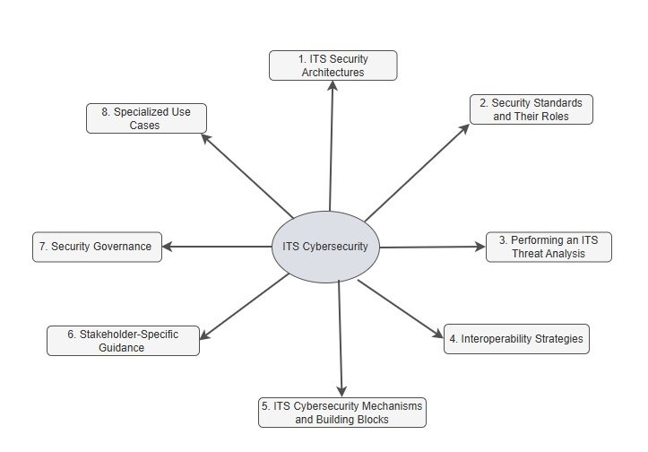

# Introduction to ITS Cybersecurity Guidance

Welcome to the ISO Guide to cybersecurity for Intelligent Transportation Systems (ITS). This site provides information on securing ITS deployments across all layers of a system of system (SoS), including interfaces, communication protocols, certificate and permission management, device security, and misbehavior detection and remediation. The site map is illustrated below: 

This site includes:

- Guidance on cybersecurity standards relevant to ITS, such as [ISO 21177](https://www.iso.org/standard/87225.html), [IEEE 1609.2](https://standards.ieee.org/ieee/1609.2/10258/), [ETSI TS 102 940](https://www.etsi.org/deliver/etsi_ts/102900_102999/102940/02.01.01_60/ts_102940v020101p.pdf), and [ETSI TS 103 097](https://www.etsi.org/deliver/etsi_ts/103000_103099/103097/02.01.01_60/ts_103097v020101p.pdf)
- Regional cybersecurity systems such as the [Security Credential Management System](https://www.scmsmanager.org/) in North America and the Cooperative ITS Trust Model (C-ITS) in Europe. 
- Information on how to apply standards to protect Onboard Units (OBU), Roadside Units (RSU), and backend systems
- Explanations of certificate issuance, revocation, permissions (PSIDs and SSPs) and policy enforcement
- Design considerations for trust management, cross-border interoperability, and lifecycle governance

This site is intended for public agencies, standards bodies, system integrators, manufacturers, and other stakeholders responsible for secure design and operation of ITS technologies. 

---

## Start Here: [Introduction to ITS Cybersecurity – A Beginner's Guide](dummys-guide.md)

Begin with this introductory guide to understand why ITS-specific security mechanisms—such as IEEE 1609.2—are designed to meet the unique requirements of vehicular networks, and why conventional internet security frameworks like X.509 may not be sufficient.

## Regional Considerations: [Understand regional differences in regulation and approach](Regional-considerations.md) 

While ITS cybersecurity standards aim for global interoperability, implementation often varies across regions due to different legal frameworks, privacy expectations, governance models, and deployment architectures. These differences directly affect how trust is established, how permissions are granted, and how secure communications are managed. Understanding regional approaches, such as the SCMS model in North America and the C-ITS Trust Model in Europe is important for organizations deploying cross-border systems or designing interoperable ITS devices and services.  These differences must be taken into account when designing systems intended for multi-regional interoperability.

---

## Key Topics in ITS Cybersecurity

### 1. [ITS Security Architectures](its-security-architectures.md)

ITS cybersecurity architectures define how security protections are applied across devices, vehicles, communications networks, and backend systems. These architectures provide a structured approach to managing digital trust, securing data exchanges, and protecting infrastructure components. They incorporate regional models, such as the SCMS used in North America and the C-ITS Trust Model adopted in Europe, each of which applies different governance structures and cryptographic processes. Standards such as IEEE 1609.2, ISO 21177, and ETSI TS 103 097 form the foundation for securing V2X messaging and managing certificate-based trust. This section outlines how these components and standards are integrated to enable secure and interoperable ITS deployments.  A key focus is the use of public key infrastructures to support secure messaging. 

### 2. [Security Standards and Their Roles](security-standards.md)
This section outlines key international standards that enable ITS cybersecurity across different layers of the system. It explains how standards define certificate formats, secure message structures, revocation processes, and permission models used to control authorized behavior in ITS deployments. Regional implementations often profile or extend these standards to meet specific requirements. For example, the SCMS architecture in North America applies a profile of IEEE-based standards for certificate and permissions management, while the C-ITS model in Europe leverages ETSI-defined formats and uses the CPOC protocol for onboarding Root Certificate Authorities. Understanding the role of each standard helps implementers select the appropriate specifications for their technical and regional needs.

### [3. Performing an ITS Threat Analysis](ITS-Threat-Analysis.md)

Threat analysis is a critical activity that supports the secure design and deployment of ITS Stations. By identifying system vulnerabilities, understanding likely threats, and assessing potential impacts, stakeholders can prioritize security measures and select appropriate controls. Several frameworks exist to guide this process, depending on regional context. 

In Europe, threat analysis activities are often shaped by ETSI TR 102 893, a technical report that provides a structured approach for assessing risks in cooperative ITS environments. European station operators and manufacturers are also expected to conduct and maintain operational risk assessments in alignment with ISO/IEC 27005, as outlined in the CCMS Security Policy. In North America, threat analysis is typically informed by the NIST Cybersecurity Framework and the ITS Cybersecurity Profile, which together provide a foundation for identifying risks and applying controls across systems such as Dynamic Message Signs, Closed-Circuit Television cameras, Roadside Units and other systems. 

This section provides an overview of each of these documents and a high level view of the ITS threat assessment process. 

### 4. [Interoperability Strategies](trust-bridges.md)
Trust bridges are mechanisms that enable secure communication between independent security domains. They are used when two systems operate under separate certificate authorities, trust policies, or technical standards. Trust bridges help establish a common framework for validating credentials, enabling interoperability across domains that may use different cybersecurity models, bridging between systems based on [X.509](https://datatracker.ietf.org/doc/html/rfc5280) as defined in Internet Engineering Task Force (IETF) Request For Comment (RFC) 5280, IEEE 1609.2 or ETSI TS 103 097 formats. This is especially important in cross-jurisdictional deployments, such as where regional ITS infrastructures must exchange authenticated messages despite using distinct certificate management systems. Trust bridges can also support selective trust, allowing one domain to recognize only specific permissions or roles from another domain. An example is shown below where a trust bridge translates messages signed using X.509 certificates to messages signed using IEEE Std. 1609.2 certificates. 

### 5. [ITS Cybersecurity Mechanisms and Building Blocks](system-specific-security.md)
Cybersecurity systems and components provide the building blocks that can be used to create a cybersecurity architecture for individual ITS systems.  These include core security services such as certificate issuance, revocation, and permissions management, which ensure that only authorized entities can participate in communications. Trust is anchored by entities like Electors in the SCMS model or Root Certificate Authorities in the C-ITS model, each governing certificate validation within their domain. Misbehavior detection capabilities support real-time monitoring and response, identifying suspicious activity such as implausible Basic Safety Messages (BSM) or message patterns that deviate from expected norms. Also, protections for OBUs, RSUs, and backend systems ensure that credentials remain secure and communications are authenticated. Together, these components enable a scalable and adaptable cybersecurity architecture for ITS.

### 6. [Stakeholder-Specific Guidance](stakeholder-guidance.md)
This section provides guidance tailored to different stakeholder perspectives, helping decision-makers, standards developers, and implementers identify processes, standards, and practices to secure ITS deployments while addressing regional variations in architecture and trust management. Guidance is included for:

- **Policy Makers**, who play a key role in enabling trust infrastructure. This may include supporting the deployment of a national SCMS in North America or participating in Root CA onboarding processes within the European C-ITS framework. Decision makers focus on defining secure operational priorities for ITS systems of systems. 
- **Standards developers**, who must ensure cross-border alignment with international specifications such as ISO 21177, while also addressing regional profiles and extensions, including IEEE 1609.2.1 in North America and ETSI TS 103 097 in Europe.
- **Implementers**, who are responsible for applying these standards during deployment. This includes tasks such as deploying RSUs, managing PSID and SSP entitlements, and enforcing security policies at the device and network level.

### 7. [Security Governance](security-policies.md)
This section explains the role of PKI certificate policy in the context of ITS security governance. Trust within a PKI is fundamentally established and maintained through policy documents that include Certificate Policy (CP) and Certificate Practices Statements (CPS). These documents define the rules, responsibilities, and requirements for all stakeholders involved in PKI operations. CP and CPS documents detail processes and policies associated with lifecycle management activities such as certificate enrollment, management, and revocation processes, along with mechanisms to ensure cross-jurisdictional interoperability and adherence to privacy regulations. 

PKI governance models vary by region but often include formal structures such as elector-based approval policies in North America’s SCMS and defined onboarding procedures for Root CAs in Europe’s C-ITS. Additional examples include end entity security requirements for OBUs and RSUs, and policy controls that govern how permissions (such as PSIDs and SSPs) are issued and enforced.

### 8. [Specialized Use Cases](specialized-use-cases.md)
This section presents targeted examples that illustrate how cybersecurity measures are applied to specific ITS technologies and message types. Use cases include emerging system architectures such as Cooperative Driving Automation (CDA) and Mobile Edge Computing (MEC), where secure communication and trust management are critical to safe and efficient operation. At the message level, the section highlights how protections are implemented for key V2X message types such as Basic Safety Messages (BSMs), Traveler Information Messages (TIMs), and Probe Data Messages. These examples help demonstrate how security standards and policies are tailored to meet the unique operational and trust requirements of different ITS functions.

---
