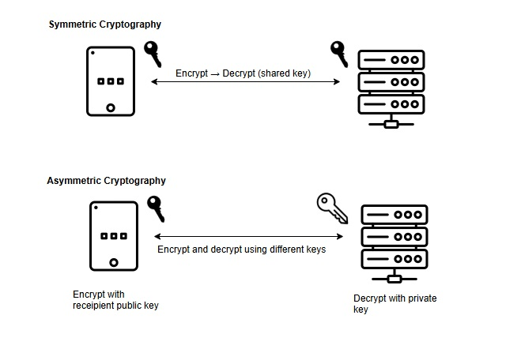
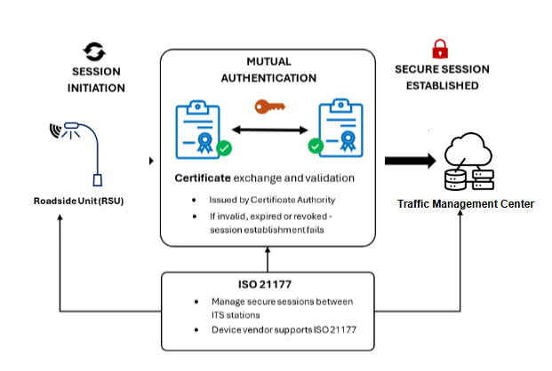

# Primer on ITS Cryptography

## What is Cryptography?

Cryptography is the use of mathematics and carefully designed algorithms to protect information and establish trust. In ITS, it is used to help devices and systems prove who they are, verify that messages have not been altered and protect sensitive communications.  

A cryptographic algorithm is a defined method for performing a security function, such as encrypting data, creating a digital signature, or checking integrity. Algorithms depend on cryptographic keys, which are secret values used by the algorithm to produce a result. In general, the security of a cryptographic system does not depend on hiding the algorithm, but instead on keeping the key used by the algorithm secret.

Some cryptographic systems use the same secret key to protect and recover information. This is called symmetric cryptography, and it is commonly used when two parties already share a trusted secret and need efficient protection for data. Common symmetric algorithms include AES and ChaCha20. Other systems use a pair of related keys: a private key that is kept secret and a public key that can be shared. This is called asymmetric cryptography, and it is widely used for digital certificates, digital signatures, and trust establishment between parties that do not already share a secret. Common asymmetric algorithms include Rivest Shamir Adelmen (RSA) and Elliptic Curve Cryptography (ECC), such as Elliptic Curve Digital Signature Algorithm (ECDSA).

The figure below illustrates differences between symmetric and asymmetric cryptography.

## The Role of Cryptography in ITS

Cryptography is used in ITS to verify messages, protect communications, and control which devices are allowed to participate in applications. V2X messaging relies on cryptography to sign messages so that receiving devices can verify that the sending device is trusted and that messages have not been altered. Cryptography is also used in secure communications between infrastructure and backend systems.

Cryptography is also used to secure communications between infrastructure and backend systems. Roadside units, traffic management centers, and cloud services use cryptographic protocols to authenticate systems and protect data in transit or at rest.

Security functions such as device provisioning, certificate management, and software updates also rely on cryptography. These processes ensure that only authorized devices can join the system, that credentials are issued and managed securely, and that software originates from trusted sources.

### V2X Message Security

In V2X communications, messages are digitally signed so that receiving devices can verify the sender and confirm the message has not been altered. Because most V2X messages are broadcast and received by many unknown devices, encryption is generally not used. Instead, trust is established through certificates and digital signatures.

To generate a signature, the sending device constructs a standardized secure data structure, encodes it in a deterministic format, computes a cryptographic hash over the encoded data, and signs that hash using its private key. The resulting signature is attached to the message along with a reference to the signing certificate.

When a message is received, the receiving device reconstructs the signed data, validates the certificate against its trusted authorities, checks certificate validity and revocation status, and verifies the signature using the sender’s public key. If any of these steps fail, the message is rejected.

Authorization is enforced through application identifiers and permissions carried in certificates. Receiving devices evaluate whether the sender is permitted to generate the specific type of message being processed before accepting it.

Short-lived pseudonym certificates are used to reduce the ability to track devices over time. Messages remain verifiable without exposing long-term identity, supporting both trust and privacy in broadcast environments.

### Backhaul/Infrastructure Communications

Communications between infrastructure components and backend systems are protected using secure communication channels. These communications typically occur between known systems, such as roadside units and traffic management centers. Transport Layer Security (TLS) is used to establish a secure session between systems. During session establishment, both endpoints authenticate each other using digital certificates. If certificate validation fails, the session is not established.

In ITS environments, secure session establishment and communication are defined by ISO 21177. This standard specifies how TLS is applied to ITS communications, including mutual authentication between systems and the protection of data in transit. The figure below illustrates a secure TLS connection between an RSU and TMC.

Once a secure session is established, data exchanged between systems is encrypted and protected against interception, modification, and replay while in transit.

### Security Management Functions

Cryptography is used to support system management functions such as device provisioning, credential management, and operational control. These functions ensure that only authorized devices can join the system and that system integrity is maintained over time.

#### Firmware and Software Update Signing

Software and firmware updates are digitally signed to ensure they originate from a trusted source and have not been modified. Devices verify the signature before installing an update. If signature validation fails, the update is rejected.

Signing is typically performed using a private key held by the software provider or operator. Devices are provisioned with the corresponding trusted public keys or certificates used to validate updates. This process prevents unauthorized or malicious code from being installed on ITS devices.

#### Trust Enrolment

Trust enrolment establishes the initial trust relationship between a device and the credential management system. During enrolment, a device is provisioned with cryptographic keys and issued an enrolment credential that allows it to request additional certificates.

The enrolment process includes authentication of the device, validation of its eligibility to participate in the system, and secure delivery of credentials. Private keys are generated and stored securely on the device and are not shared. Once enrolled, the device can obtain operational certificates and participate in trusted communications within the ITS environment.

#### Operational Management

Cryptography is used to secure operational management functions such as device configuration, monitoring, and control. These functions are typically performed over management protocols and interfaces used to operate field devices, including traffic signal controllers, dynamic message signs, and other roadside equipment.

Management communications are protected using secure transport mechanisms to authenticate systems and prevent unauthorized access. This ensures that only authorized operators or systems can issue commands, retrieve status information, or modify device configurations.

In environments using protocols such as NTCIP, cryptography is applied to protect management sessions and, where supported, to authenticate commands and responses. This may include the use of secure versions of management protocols, credential-based authentication, and encrypted communication channels. These protections help prevent unauthorized control of infrastructure devices, interception of sensitive operational data, and modification of commands in transit.

### The difference between message security and transport security

Transport security protects the communication channel between two systems. It ensures that data cannot be read or modified while in transit, but protection typically ends once the data reaches its destination. Message security protects the data itself. Security information, such as digital signatures, travels with the message so that any receiving system can verify the sender and confirm the message has not been altered, even after it has been forwarded or stored.

In ITS, transport security is used for point-to-point communications such as backhaul connections, while message security is used for broadcast communications such as V2X, where messages are received by many unknown devices.

## Cryptographic Algorithms and Primitives

### Hash functions

A hash function takes input data and produces a fixed-length output (a hash). It is designed so that even a small change in the input produces a completely different result. Hashes are used to check data integrity. Examples include SHA-256 and SHA-384.

### Public-key cryptography

Public-key cryptography uses a pair of related keys: a public key that can be shared and a private key that is kept secret. It is used for authentication, key exchange, and establishing trust between systems that do not share a secret. Examples include RSA and Elliptic Curve Cryptography (ECC).

### Digital signatures

A digital signature is created using a private key and can be verified using the corresponding public key. It proves who sent a message and that the message has not been altered. Examples include ECDSA and RSA signatures.

### Symmetric cryptography

Symmetric cryptography uses a single shared secret key for both encryption and decryption. It is efficient and commonly used to protect data in transit once a secure session is established. Examples include AES (e.g., AES-128, AES-256).

### Key Derivation

Key derivation takes a secret value and produces one or more cryptographic keys from it. This allows systems to generate fresh keys for different purposes without exchanging new secrets. Examples include HKDF and PBKDF2.

### Message Authentication Code (MAC) vs Digital Signature

A Message Authentication Code (MAC) uses a shared secret key to verify data integrity and authenticity between trusted parties. It is efficient but requires both sides to share the same key. A digital signature does not require a shared secret. It uses a private/public key pair and allows any receiver to verify the sender.

## Key Protection

ITS devices must protect cryptographic keys from unauthorized access and use. This includes how keys are generated, stored, and used during operations such as signing and decryption.

Private keys must not be exposed in plaintext to applications, users, or external interfaces. Cryptographic operations should be performed in a way that limits access to key material and reduces the risk of extraction.

Key protection can be implemented using secure hardware components, software-based protections, or a combination of both, depending on the device and deployment environment. Examples of stronger protection mechanisms include Trusted Platform Modules (TPMs), Hardware Security Modules (HSMs), and secure elements, which provide isolated environments for key storage and use.

## Credential Lifecycle Management

Credentials, such as certificates have lifetimes and expire. They follow an operational management lifecycle. The lifecycle begins with key generation and initial provisioning, where a device is issued credentials that establish its eligibility to participate in the system. Devices then obtain additional certificates used for operational communications, such as signing V2X messages.

During operation, credentials are used, rotated, and periodically renewed. Short-lived certificates are replaced frequently to support privacy and limit exposure if a credential is compromised. Credentials may be revoked before expiration if a device is compromised, misbehaves, or is no longer authorized. Devices must be able to receive and process revocation information to stop trusting those credentials. At the end of the lifecycle, credentials expire or are decommissioned, and devices must obtain new credentials to continue participating in the system.

Credential management systems implement and enforce this lifecycle across all participating devices and infrastructure.

## Credential Management Systems

Credential Management Systems provide trust services for modern ITS, allowing ITS services and components to establish trust relationships, authenticate peers, authorize device behaviour, and protect privacy across distributed and safety-critical operating environments. A Credential Management System issues, manages and revokes cryptographic credentials that enable vehicles, RSUs, and backend services to securely exchange information.

In North America and other regions, the credential management function is performed by a Security Credential Management System (SCMS). The SCMS is a distributed credential management system designed specifically to enable V2X and ITS trusted communications. In Europe, credential management is provided through a Cooperative ITS Credential Management System (CCMS) framework. The European CCMS can be considered more centralized when compared with the North American SCMS architecture.

### Certificate Management System Components

Both SCMS and CCMS architectures introduce a hierarchy of certificate authorities (CAs) and other components, each with a distinct role in establishing trust, authorizing behaviour, and preserving privacy.  An example SCMS architecture is provided below.

These authorities work together to ensure that devices can securely participate in ITS communications without exposing long-term identity or enabling unauthorized behaviour.

- Electors: An SCMS-specific governance component responsible for establishing and maintaining trust relationships between independent SCMS deployments. Electors participate in decisions about which Root CAs and peer SCMS's are trusted, and these decisions are reflected in the CTL. Electors provide a mechanism for coordinated trust establishment across organizational and jurisdictional boundaries.
- A Root Certificate Authority (Root CA) provides the cryptographic starting point for one or more certificate chains within the SCMS. It issues certificates to subordinate authorities, such as enrolment and authorization authorities, but does not by itself establish trust at the device level. In an SCMS architecture, an ITS device only trusts a Root CA's certificates if that Root CA is included the ITS device's Certificate Trust List (CTL).
- The Enrolment Certificate Authority (ECA) issues enrolment certificates that establish a device’s eligibility to participate in the credential management system. Enrolment certificates are typically long lived and are used for authentication during provisioning, management, and certificate request processes. Possession of an enrolment certificate does not grant authorization to transmit operational ITS messages.
- The Authorization Certificate Authority (ACA) issues authorization certificates, commonly referred to as pseudonym certificates. These certificates are used for operational messaging and include application identifiers and associated permissions. Authorization certificates are short lived and are rotated to support privacy requirements. The Authorization Certificate Authority operates without access to long term device identity information, enforcing separation between identity and operational behaviour.
- Linkage Authority (LA) supports accountability while preserving privacy. It generates and manages cryptographic linkage values that are embedded into pseudonym certificates. These linkage values cannot be used to track devices during normal operations and can only be resolved through authorized processes involving multiple independent authorities, enabling conditional identification and revocation in cases of misbehaviour.
- Registration Authority (RA) acts as a policy enforcement and validation function within the credential management system. It verifies certificate requests, ensures that devices are authorized to request specific certificate types and permissions.
- Distribution Center (DC) provides a distribution point for files to be sent to ITS devices. ITS devices implement an Application Programming Interface (API) per IEEE 1609.2.1 Specification guidelines that allows for the secure delivery of CRLs and CTLs.

### Trust Anchors

An SCMS architecture relies on a Certificate Trust List (CTL) as the root of trust. The CTL explicitly defines which certificate authorities are trusted and the scope under which they are trusted. ITS devices rely on the CTL when validating certificates, reconstructing implicit public keys, and enforcing application-level authorization. No certificate authority is trusted unless it is explicitly referenced in the CTL. ITS devices rely on the CTL to validate certificate issuers, reconstruct implicit public keys, and enforce authorization constraints.

The CTL is provisioned during manufacturing or enrolment and updated over time. Devices must manage CTL updates carefully, as stale trust information can lead to validation failures, interoperability issues, or delayed response to security incidents.

In Europe, trust between ITS deployments is coordinated using the C ITS Point of Contact Protocol (CPOC). Rather than relying on a Certificate Trust List as defined in SCMS based systems, the C ITS Point of Contact Protocol provides a standardized mechanism for establishing and managing trust relationships between certificate authorities and operational domains across Europe. Through this protocol, participating entities exchange trust information, certificate authority references, and policy constraints that enable devices and backend systems to validate certificates and support interoperability across national and organizational boundaries.

### Certificate Types

ITS credential management systems use multiple certificate types to balance security, operational needs, scalability, and privacy. Different certificates serve different roles within the system, ranging from long-lived credentials used for provisioning and management to short-lived credentials used for operational messaging. Together, these certificate types enable trusted communications while preventing long-term tracking and unauthorized behaviour.

#### Pseudonym Certificates

Pseudonym certificates are used for operational ITS messaging, such as V2X safety and mobility communications. They are intentionally designed to minimize linkability between messages while still enabling authentication and authorization.

- Pseudonym certificates are short lived and rotated frequently. They are used to sign V2X messages and are designed to prevent long term tracking of devices. Frequent rotation is a deliberate privacy mechanism.
- Non pseudonym certificates are longer lived and provide more stable identity binding. They are typically used for enrolment, backend services, and management functions rather than broadcast safety messaging.

Both certificate types may carry application permissions, but they serve different operational and privacy purposes.

##### Butterfly Key Expansion

To support large numbers of short-lived certificates at scale, ITS deployments rely on efficient key management techniques. Butterfly key expansion enables devices to generate many cryptographic keys without exposing private key material. Butterfly key expansion is a certificate generation technique that allows a device to derive many key pairs from a single initial key. The device retains exclusive knowledge of private keys, while the SCMS issues certificates for derived public keys. This approach supports large pseudonym certificate pools, frequent rotation, and strong separation between device identity and operational credentials. It is a critical enabler of scalable ITS deployments.

##### Linkage Values and Accountability

While pseudonym certificates protect privacy, ITS systems must still support accountability when misbehaviour occurs. Linkage values provide this capability without enabling routine tracking. Pseudonym certificates include linkage values that support conditional accountability. During normal operations, these values cannot be used to track or correlate certificates. Linkage requires combining information held by multiple independent linkage authorities. No single authority can perform linkage alone. This design preserves privacy while allowing authorized investigation and revocation when misbehaviour is detected.

#### Explicit and Implicit Certificates

Certificate management systems also differ in how cryptographic public keys are represented within certificates. This distinction affects bandwidth usage, storage requirements, and validation complexity.

- Explicit certificates include the public key directly within the certificate. This simplifies validation and inspection but increases certificate size.
- Implicit certificates do not contain an explicit public key. Instead, the receiving device reconstructs the public key using certificate data and issuer information. Implicit certificates reduce bandwidth and storage requirements and are commonly used with large pseudonym certificate populations.

The choice between explicit and implicit certificates reflects a trade-off between simplicity and scalability.

### Entitlements

In ITS credential management systems, entitlements define what a device is allowed to do, not who the device is. Entitlements are expressed by binding application identifiers and associated permissions into certificates, enabling receiving devices to make authorization decisions based on the intended use of a message rather than the long-term identity of the sender. This model supports interoperability, scalable authorization, and privacy-preserving communications across diverse ITS deployments.

Each ITS application or service is identified by an application identifier, referred to as a Provider Service Identifier (PSID) in North American deployments and an ITS Application Identifier (ITS-AID) in European deployments. These identifiers uniquely designate the application context under which a message is generated and processed. Authorization decisions are evaluated per PSID or ITS-AID rather than per device, allowing a single device to participate in multiple ITS services with distinct permissions and constraints.

Service Specific Permissions (SSPs) are associated with PSIDs or ITS-AIDs and define the permitted behaviors for a given application. SSPs constrain how an application may behave, such as the types of messages it may generate, operational limits, or contextual restrictions. They are evaluated by receiving devices during message processing to determine whether a message is authorized within its declared application context.

Together, application identifiers and SSPs form the core authorization model for ITS communications. This approach enables fine-grained, application-level authorization while avoiding reliance on persistent device identities, supporting both security and privacy objectives.

#### Role and Entitlement Binding

Role and entitlement binding occurs during enrolment and certificate issuance, where policy decisions are made regarding which applications and permissions a device is authorized to assert. These decisions are based on deployment context, operational role, and governing policy.

Once issued, entitlements are cryptographically bound into certificates and cannot be modified by the device. Devices cannot self-declare roles or permissions. Enforcement occurs at message receipt, where receiving devices validate application identifiers and SSPs, and through monitoring and misbehaviour detection mechanisms that identify misuse or policy violations over time.

### ITS Device Certificate Management

#### Certificate File Management

ITS devices must be able to manage the files provided by the credential management service. In an SCMS architecture, this includes certificates, Certificate Revocation Lists (CRLs), and the Certificate Trust List (CTL). Proper handling of these files is important for maintaining trust, enforcing authorization decisions, and enabling interoperability across jurisdictions.

ITS devices store and process certificate chains associated with received messages, including issuer certificates needed to validate signatures and reconstruct public keys when implicit certificates are used. Devices must also manage updates to trust and revocation information over time, ensuring that validation decisions reflect current policy and security state rather than stale or incomplete data.

##### Certificate Trust list Management

The Certificate Trust List defines which certificate authorities are trusted by an ITS device and the scope under which that trust applies. Devices rely on the CTL when validating certificate chains, reconstructing implicit public keys, and enforcing application-level authorization constraints. No certificate authority is trusted unless it is explicitly referenced in the CTL.

CTLs are typically provisioned during manufacturing or enrolment and updated periodically. Devices must be capable of securely storing CTLs, validating CTL authenticity and integrity, and applying updates without disrupting operational messaging. Failure to manage CTLs correctly can result in trust failures, loss of interoperability, or acceptance of unauthorized certificates.

##### Certificate Revocation List (CRL) Management

Certificate Revocation Lists provide a mechanism for invalidating certificates that are no longer authorized for use, such as those associated with compromised devices or confirmed misbehaviour. ITS devices use CRLs to determine whether a certificate that would otherwise validate should be rejected.

#### Pseudonym Certificate Rotation

Pseudonym certificate rotation is a core privacy mechanism in ITS credential management systems. Because operational ITS messages are broadcast and may be observed by multiple parties, long-lived certificates would allow messages to be correlated over time, enabling tracking of vehicles or infrastructure devices. Rotating pseudonym certificates limits this linkability by ensuring that no single certificate is used long enough to establish persistent identity or movement patterns.

Pseudonym certificates are rotated to reduce linkability and tracking risk. Rotation may be based on time, usage, or operational context. ITS devices manage local certificate inventories and select active certificates according to policy. Rotation is performed autonomously without requiring network interaction at the moment of change, ensuring uninterrupted operation even in disconnected or constrained environments. Improper rotation configuration can lead to privacy loss, certificate exhaustion, or operational disruption.
