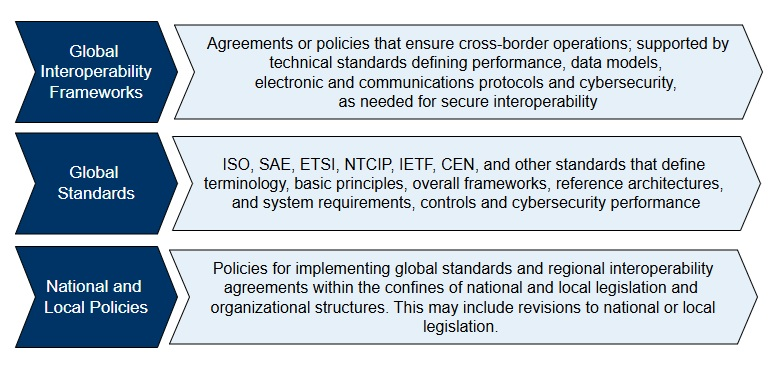

## **Stakeholder Groups and Their Cybersecurity Focus Areas**

ITS Cybersecurity requires collaboration across international bodies, national policymakers, standards developers, and deployment implementers. Because ITS systems involve mobile, decentralized, and real-time communication between vehicles, infrastructure, and backend systems, a shared approach to cybersecurity is essential. This page introduces guidance for three key stakeholder groups: decision-makers, standards developers, and implementers—each of whom plays a unique role in shaping and sustaining cybersecurity for ITS deployments.

To understand how different responsibilities and policy frameworks interact, it's important to recognize the multi-tiered governance structure that supports secure and interoperable ITS systems:

This layered model shows how global interoperability frameworks provide the foundation for secure cross-border ITS operations. These are supported by global standards developed by international organizations like ISO, ETSI, IEEE, SAE, and IETF. Finally, national and local policies tailor these standards for regional needs and legal contexts. Each stakeholder group contributes to the development or implementation of one or more of these layers.

### [**1. Policy Makers**](decision-makers.md)

Who they are: Government officials, regulatory agencies, and executives shaping ITS strategies and prioritizing security investment and procurements.

**ITS Cybersecurity responsibilities:**

- Establishing national / regional ITS cybersecurity policies and governance models. 
- Aligning legislation with global interoperability requirements. 
- Mandating compliance with international standards (ISO, IEEE, ETSI, etc)

[Click here for more details](decision-makers.md)

### **2. Standards Developers**
Who they are: Organizations, industry consortia, and research institutions that define technical ITS cybersecurity standards. 

ITS Cybersecurity responsibilities: 
- Ensuring global interoperability and alignment across regional systems  

- Harmonizing regional and international security standards and technologies

- Maintaining and advancing standards like IEEE 1609.2 and ETSI TS 103 097  
- Addressing evolving threat models, cryptographic agility, and system lifecycles

- Developing security controls for future ITS applications. 

[Click here for more details](standards-developers.md)

### **3. [Implementers](implementers.md)**
Who they are: Vehicle OEMs, infrastructure operators, service providers, and ITS vendors.

ITS Cybersecurity Requirements: 
- Securing ITS components such as OBUs and RSUs, and ensuring compatability with the security of the backend infrastructure, operations centers, and field devices. Interests also include how to incorporate new data sources from outside of transportation and thus leveraging the emerging IoT opportunities.  

- Deploying certificates and keys based on IEEE 1609.2 or X.509 formats  
- Implementing countermeasures for spoofing, DoS, and unauthorized access  
- Ensuring conformance with deployment policies and trust frameworks
- Leverage ARC-IT to identify applicable security classifications, select relevant NIST-aligned controls, and reference standardized security profiles tailored to ITS subsystems and communications interfaces.

[Click here for more details](implementers.md)

Note: While the pages above are tailored to each group, effective ITS cybersecurity requires shared responsibility. Stakeholders must align on architecture, policies, and operational practices to ensure safety, privacy, and trust at every level of the transportation system.
