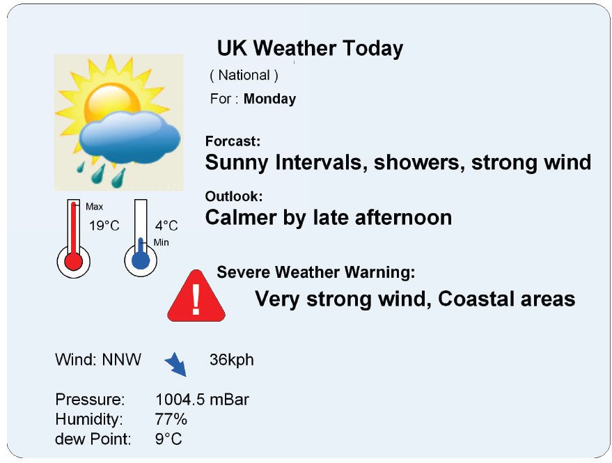
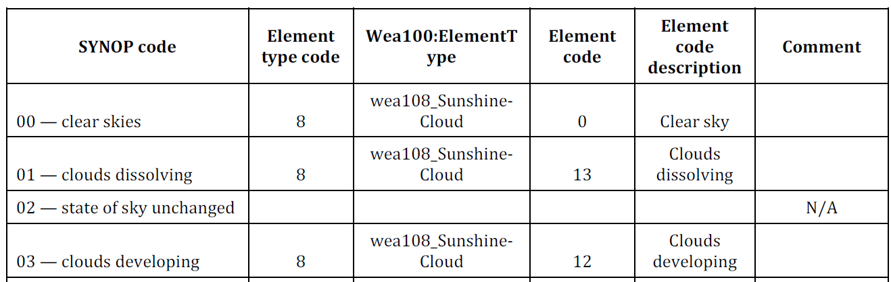

## Introduction

The ISO 21219 Technical Specification defines the TPEG format and protocol intended for delivering traffic information to end users. TPEG is designed for high-capacity media and enables information to be structured with increasing levels of detail, including comprehensive location referencing.

Individual domains of traffic-related information are described separately in TPEG using a platform-independent model (UML) and two derived platform-dependent models (binary and XML). The parts of the specification define the modelling rules and the conversion into platform-dependent representations.

More information on the TPEG context is provided in the introduction of the extract for Part 1 of the TPEG standard (21219-1).

The ISO 21219 Technical Specification covers the second generation of the TPEG protocol, referred to as TPEG2. The distinction TPEG/TPEG1/TPEG2 is typically mentioned only in the introductory sections of standards and specifications, while the remaining chapters do not differentiate between TPEG and TPEG2 — this is implicit from context.

This extract covers Part 19 of the TPEG standard, *Weather Information Application (TPEG2-WEA)*, which defines the encoding of weather reports of varying scope.

*Note: This Extract presents selected chapters of the described document and retains the original chapter numbering.*

## Usage

The described document defines the method for providing weather information and assumes that such information will be presented to the end user. It contains a substantial number of enumerations (tables) defining weather types, as well as a mapping between these tables and WMO SYNOP codes. It is essential for analysts of a weather information service provider and for analysts of a terminal or application manufacturer responsible for designing the system’s data model and the operational rules applied by the system. It is used during system design.

## Scope

The described document defines the TPEG WEA application, the *Weather Information Application*. It enables the provision of weather information for various geographic areas (including hierarchically related areas) and for different time horizons. Weather information may be highly detailed. These information services are intended for travellers in general and are not restricted to any specific mode of transport, nor are they intended to provide warnings of hazardous weather conditions to drivers; such warnings are covered by a different TPEG application (TPEG-TEC, 21219-15).

## Related Documents (selection)

The described document contains three normative references to TPEG2 ISO 21219 Parts 5, 6 and 9. In addition, the Bibliography lists several normative references cited in the text.

## 3 Terms and definitions

This chapter defines five terms, including:

**message management container (MMC)** — the part of the message containing information required to assemble the message from the “application” and “location” containers, or to manage the message (for example, to cancel it).

**location referencing container (LRC)** — the part of the message containing information about the location referenced by the traffic information or the referenced state of the traffic situation.

**location referencing** — means enabling a system to accurately identify a location.

## 4 Abbreviated terms

This chapter defines 16 abbreviations; the ones relevant for this extract are:

**MMC** — Message Management Container

**ADC** — Application Data Container

**LRC** — Location Referencing Container

**WEA** — Weather information application

**TPEG** — framework providing formats and protocols for delivering traffic information, optimised for distribution via digital radio or the Internet

Other terms and abbreviations from the ITS domain can be found in the *ITS Terminology* dictionary ([www.itsterminology.org](http://www.itsterminology.org)), the *StandardLand* website ([www.standardland.cz](http://www.standardland.cz)) or the *OBP platform* ([www.iso.org/obp](http://www.iso.org/obp)).

## 5 Application constraints

This chapter, one and a half pages in length, defines the constraints applicable to the TPEG2-WEA application. It specifies the application identifier and versioning rules defined in ISO 21219-1, the required order of message containers (MMC, optionally ADC and LRC), and the requirements for extensibility and backward compatibility, including the ability of decoders to skip unknown elements. It also references the TPEG service component framework defined in ISO 21219-5

## 6 WEA structure

This chapter, consists of one UML diagram of the WEA application message.

## 7 WEA message components

This chapter, eight pages long and containing tables and figures, describes the individual components of a WEA message. Its purpose is to introduce a hierarchical structure of interlinked messages with different coverage or forecast time horizons.

It defines the basic structure of a WEA message and provides a detailed description of its components. The basic *WeatherMessage* may contain weather information (*WeatherInformation*) and a location reference (*LocationReferencingContainerLink*), though not necessarily within the same message.

Weather information consists of the type of the described area, the weather report (*WeatherReport*), and related reports referenced through an ID. Each weather report consists of a report type, a *WeatherItem*, and an optional detailed report. The *WeatherItem* contains the actual weather information, including forecast trends (*OutlookTrend*), detailed numerical statistics (*WeatherStatistics*), specific weather warnings (*WeatherWarning*), and altitude-dependent weather elements (*AltitudeElements*).

The *WeatherStatistics* item (Section 7.5) covers 25 numerical weather parameters such as temperature, wind, dew point, sunrise, pressure, precipitation and others.

Location referencing is not specified.

## 8 WEA datatypes

This chapter, one page in length, defines two data structures (types) used in the WEA application.

Specifically, *LinkedMessage*, which enables hierarchical linking of messages using a *messageID*, and *Element*, which provides a qualitative description of a weather element.

## 9 WEA tables

This chapter, twenty pages long, contains the definitions of the enumerated types used by the WEA application (in 29 tables). The following table lists all WEA tables by name and provides a description and an example of their content.

<table>
  <tr>
    <th>WEA table</th>
    <th>Description</th>
    <th>Example</th>
  </tr>
  <tr>
    <td>wea000:ReportType</td>
    <td>Report type (0–5)</td>
    <td>e.g. 002: Daily</td>
  </tr>
  <tr>
    <td>wea001:Period</td>
    <td>Description of validity period (0–50)</td>
    <td>e.g. 019: Dusk</td>
  </tr>
  <tr>
    <td>wea002:TrendItem</td>
    <td>Weather trend (0–16)</td>
    <td>e.g. 004: hotter</td>
  </tr>
  <tr>
    <td>wea003:Direction</td>
    <td>Weather direction (0–16)</td>
    <td>e.g. 013: W (west)</td>
  </tr>
  <tr>
    <td>wea004:PressureTendency</td>
    <td>Pressure trend (0–6)</td>
    <td>e.g. 003: Falling</td>
  </tr>
  <tr>
    <td>wea005:Visibility</td>
    <td>Visibility (0–4)</td>
    <td>e.g. 002: Poor</td>
  </tr>
  <tr>
    <td>wea006:SeaState</td>
    <td>Sea wave height (0–7)</td>
    <td>e.g. 003: Rough</td>
  </tr>
  <tr>
    <td>wea007:PollenCount</td>
    <td>Pollen concentration (0–3)</td>
    <td>e.g. 002: High</td>
  </tr>
  <tr>
    <td>wea008:AirQuality</td>
    <td>Air quality (0–6)</td>
    <td>e.g. 003: Unhealthy</td>
  </tr>
  <tr>
    <td>wea009:WarningLevel</td>
    <td>Weather threat level (0–4)</td>
    <td>e.g. 002: Bad weather</td>
  </tr>
  <tr>
    <td>wea010:UVIndex</td>
    <td>UV index (0–11)</td>
    <td>e.g. 010: 10very high</td>
  </tr>
  <tr>
    <td>wea011:GeoSignificance</td>
    <td>Geographical significance (0–9)</td>
    <td>e.g. 006: City</td>
  </tr>
  <tr>
    <td>wea012:WindDirectionTrend</td>
    <td>Wind direction trend (0–2)</td>
    <td>e.g. 001: Veering</td>
  </tr>
  <tr>
    <td>wea013:WindSpeedTrend</td>
    <td>Wind speed trend (0–4)</td>
    <td>e.g. 003: Decreasing</td>
  </tr>
  <tr>
    <td>wea014:ContentType</td>
    <td>Content type (0–6)</td>
    <td>e.g. 004: Pressure</td>
  </tr>
  <tr>
    <td>wea099:ElementSubTable</td>
    <td>Subtable of weather elements (0)</td>
    <td>empty</td>
  </tr>
  <tr>
    <td>wea100:ElementType</td>
    <td>Weather element table (0–12)</td>
    <td>e.g. 006: wea106_FogElements</td>
  </tr>
  <tr>
    <td>wea101:RainElements</td>
    <td>Rainrelated weather (0–12)</td>
    <td>e.g. 012: Damp</td>
  </tr>
  <tr>
    <td>wea102:SnowElements</td>
    <td>Snowrelated weather (0–14)</td>
    <td>e.g. 006: Low drifting snow</td>
  </tr>
  <tr>
    <td>wea103:SleetHailElements</td>
    <td>Sleet/hail weather (0–11)</td>
    <td>e.g. 002: Light sleet</td>
  </tr>
  <tr>
    <td>wea104:WindElements</td>
    <td>Windrelated weather (0–27)</td>
    <td>e.g. 012: Hurricane</td>
  </tr>
  <tr>
    <td>wea105:StormElements</td>
    <td>Stormrelated weather (0–12)</td>
    <td>e.g. 012: Sand storm</td>
  </tr>
  <tr>
    <td>wea106:FogElements</td>
    <td>Fogrelated weather (0–13)</td>
    <td>e.g. 004: Shallow fog</td>
  </tr>
  <tr>
    <td>wea107:FrostElements</td>
    <td>Frostrelated weather (0–5)</td>
    <td>e.g. 004: Severe frost</td>
  </tr>
  <tr>
    <td>wea108:SunshineCloudElements</td>
    <td>Sunshine/cloudiness</td>
    <td>e.g. 005: A few clouds</td>
  </tr>
  <tr>
    <td>wea109:TemperatureElements</td>
    <td>Temperaturerelated weather (0–12)</td>
    <td>e.g. 008: Heatwave</td>
  </tr>
  <tr>
    <td>wea110:HazardElements</td>
    <td>Hazard types (0–13)</td>
    <td>e.g. 005: Landslides</td>
  </tr>
  <tr>
    <td>wea200:ElementQualifier</td>
    <td>Environmental qualifier (0–25)</td>
    <td>e.g. 003: Urban areas</td>
  </tr>
  <tr>
    <td>wea201:ElementQualifierProbability</td>
    <td>Probability of occurrence</td>
    <td>e.g. 001: 10%</td>
  </tr>
</table>

/// caption | <
Table 1 — List of WEA tables (enumerations) (source: author of the extract)
///

The following table provides an example from the described document for *wea200:ElementQualifier*.

<table>
  <tr>
    <th>Code</th>
    <th>Phrase</th>
    <th>Comment</th>
  </tr>
  <tr>
    <td>000</td>
    <td>In some areas</td>
    <td>The element may not occur everywhere within the referenced area, but only in some locations.</td>
  </tr>
  <tr>
    <td>001</td>
    <td>Low lying areas</td>
    <td>Elements such as fog may occur more frequently in valleys and lowlying areas near rivers.</td>
  </tr>
  <tr>
    <td>002</td>
    <td>High ground</td>
    <td>Elements such as frost and snow may be more likely in elevated areas.</td>
  </tr>
  <tr>
    <td>003</td>
    <td>Urban areas</td>
    <td>Urban areas have their own microclimate, sometimes being warmer or affected by smog.</td>
  </tr>
</table>

/// caption | <
Table 2 — Example of the enumerated type wea200:ElementQualifier (Table 41 of the standard)
///

## Annex A (normative) — TPEG-binary representation of WEA

This annex, nine pages long, defines the binary representation of the WEA application for use in DAB. The binary representation is described using pseudocode, where each keyword of the defined structure has a known binary form.

The annex contains separately listed binary representations of the TPEG frame, the WEA message and its components, elements reserved for future extension, and datatypes. It also includes component identifiers and an explanation of the use of general TPEG attributes.

An example of the pseudocode for the binary specification of the *WeatherReport* element is shown in the following table.

/// caption
Table 3 — Example pseudocode of the binary specification of the WeatherReport element (Table A.4 of the standard)
///

```
<WeatherReport(6)> :=
  <IntUnTi>(6),                              : Id of this component
  <IntUnLoMB>(lengthComp),                   : Number of bytes in the component, excluding id
                                             : and lengthComp
  <IntUnLoMB>(lengthAttr),                   : Number of bytes in the attributes
  <wea000:ReportType>(reportType),           : defines the time frame of the report
  ordered {
      <WeatherItem>(weatherDefinition),      : main part of the weather report
      n * <WeatherReport>(moreDetailedReport): optional additional report levels
  };
```

## Annex B (normative) — TPEG-ML representation of WEA

This annex, fourteen pages long, first provides the XML schema of the TPEG framework, followed by the schemas of the WEA message and its components, elements reserved for future extension, datatypes and WEA tables (defined as *xs:complexType*), as illustrated in the example below.

It then presents all of the above in a single functional XML schema.

Example from Clause B.1.3 of the standard

```
<xs:complexType name="WeatherReport">
  <xs:sequence>
    <xs:element name="reportType" type="wea000_ReportType"/>
    <xs:element name="weatherDefinition" type="WeatherItem"/>
    <xs:element name="moreDetailedReport" type="WeatherReport" minOccurs="0" maxOccurs="unbounded"/>
  </xs:sequence>
</xs:complexType>
```

## Annex C (informative) — Worked examples

This annex, five pages long, contains possible visualisations of weather information and UML diagrams (mostly unreadable) for three example weather reports, ranging from a simple report to a hierarchical area-based report using linked weather reports.

{.figure}

/// caption
Figure 1 - Sample visualisation of a simple weather report (Figure C.1 of the standard)
///

## Annex D (informative) — Recommended translation between WEA tables and WMO SYNOP observation codes

This annex, six pages long, contains a table defining the mapping between SYNOP codes and the codes defined in the described document.

{.figure}

/// caption | <
Table 3 — Excerpt from the SYNOP–WEA mapping table (Table D.1 of the standard)
///

**Bibliography**

This section, one page in length, contains references to literature and standards cited in the described document.
