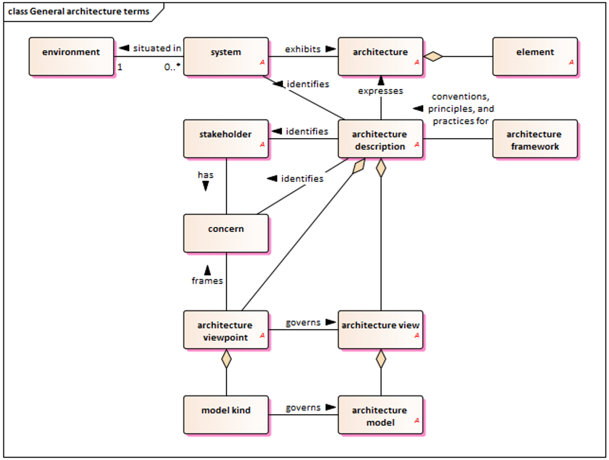
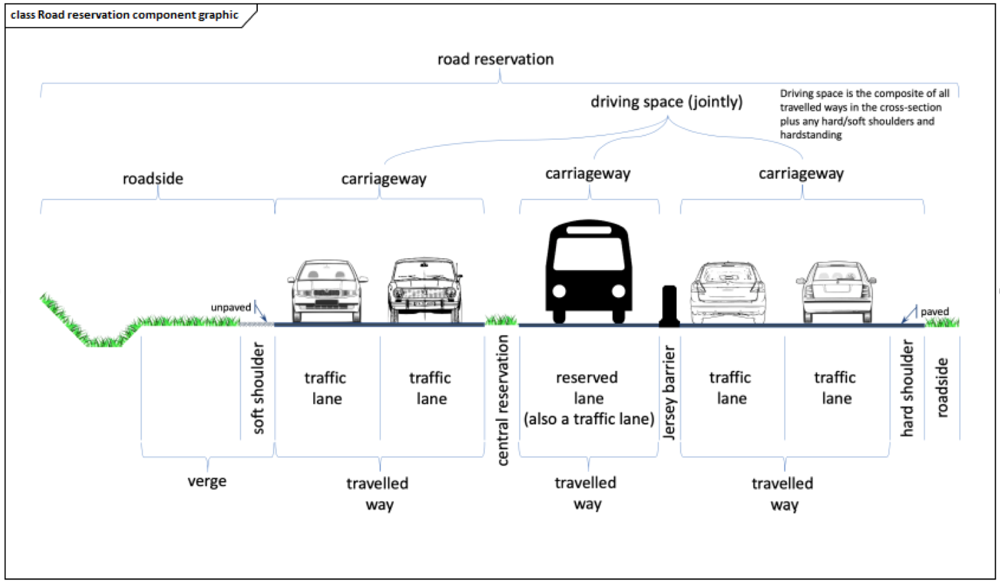

## Introduction

The ISO/TS 14812 standard (hereinafter referred to as “the described document”) contains a terminology dictionary for the field of Intelligent Transport Systems (ITS). In addition to the terms themselves, the standard contains annexes, where an essential part is a conceptual terminology model based on UML.

In most cases, the definitions given in the described document are suitable for general use within the ITS framework. In cases where a term is intended for another area or where a term can be used in more than one area, the intended context is given at the beginning of the definition in brackets (e.g., “<ITS>”). If it is necessary to distinguish between multiple definitions of the same term, the term of the area can be added before the defined term (e.g., “service” can be changed to “ITS service”).

The terms and definitions contained in the described document can be searched online on the ISO Online Browsing Platform (OBP), which is available at [https://www.iso.org/obp](https://www.iso.org/obp). Other related terms can be found in ISO/IEC/IEEE 24765.

This is the second edition of the standard, which has been significantly expanded compared to the first edition from 2022 to reflect modern technologies such as autonomous vehicles or connected mobility. The main changes compared to the first edition are summarized in the introductory chapter with a preface, which lists the terms and groups of terms that have been modified.

*Note: This Extract presents selected chapters of the described document and retains the original chapter numbering.*

## Usage

The described document serves as a core terminology dictionary for the ITS field. It provides a unified view of the terminology and clearly indicates the relationships between terms. This is useful for the creation of documentation, including technical standards, and helps ensure the clarity and comprehensibility of the wording of documents, which is especially helpful when working with a larger number of documents and supports interoperability at the level of documentation and technical solutions for ITS.

The described document establishes the preferred terminology within ISO/TC 204. Standards developed by this technical committee should adopt the definitions given in the described document, as they have been formulated in accordance with the main ISO standards, such as ISO 704 “Terminology work – principles and methods”, and are based on a consistent concept model.

Other standardization groups and organizations are also encouraged to adopt the terminology given in the described document, to promote a better understanding of the terms among ITS professionals worldwide.

## Related Documents

All vocabulary standards related to the ITS field are related to the described document, many of which are listed in the “Bibliography” chapter. All these items are available on the OBP website. The “Normative references” chapter explicitly states a link to the terminology dictionary for systems and software engineering, ISO/IEC 24765:2017.

## 1 Scope

The purpose of the described document is to formally document the vocabulary used and developed by the entire ITS community using a formal concept model as recommended by ISO 704.

The concept model is illustrated using Unified Modelling Language (UML) class diagrams as shown in Annex A, together with other supporting figures. The terms and definitions are being developed in an open environment according to the principles defined in Annex B, with specific versions being formally adopted through updates to the described document.

It is recognized that the content of the described document is not exhaustive and that terminology evolves over time. It is recommended that ISO/TC 204 standards adopt the definitions contained in the described document; however, it is recognized that each document may require the definition of additional terms to meet its own needs. Annex C provides good practices for defining terms in other documents. The procedure used to maintain the described document is set out in Appendix D.

In addition to the bibliography, the described document also contains an “Index of Term Definitions” which provides an alphabetical listing of all preferred, accepted and obsolete terms contained in the described document. There is also an “Index of Terms in Concept Model Diagrams” which identifies the page number of the concept model diagram that contains each preferred term.

## 3 Terms and Definitions

Chapter 3, with a scope of 54 pages, is the main and last chapter of the normative part of the described document – ​​terminological standard. The terms are maintained in relation to the ISO and IEC terminology databases. The terms are organized into 8 subchapters of the second level, followed by another (third) hierarchical level of subdivision into subchapters. The terms themselves are then at the 4th level of the hierarchy. In Chapter 3, there is a pure hierarchical structure with terms attached, there is no other accompanying text.

The second hierarchical level consists of the following items:

- 3.1: Core terms;

- 3.2: Technology terms;

- 3.3: Infrastructure terms;

- 3.4: Location terms;

- 3.5: Service terms;

- 3.6: User terms;

- 3.7: Vehicle terms;

- 3.8: Financial terms.

The actual second edition of the standard contains more than 300 terms. The entire chapter 3, i.e., all terms from the described document and the hierarchical structure mentioned, are available on the OBP website.

Each term is described in the classic form of the structure of terms mentioned in standards. One specific example of a term is given here:

**3.1.2.4 intelligent transport system (ITS)** – a system (3.1.2.1) composed of information, communication, sensor and control technologies that is designed to provide the benefits of a surface transport system (3.1.2.3)

Note 1 to entry: “Intelligent Transportation System” containing the adjective “transportation” in the original (as opposed to the original “transport”) is the equivalent in American English.

Note 2 to entry: Benefits may include, but are not limited to, increased safety, sustainability, efficiency, and convenience.

Note 3 to entry: The full verbal term (i.e., “intelligent transportation system”) is often used when a noun is used as a subject or object, while the abbreviated term (i.e., “ITS”) is often used as an adjective to qualify another noun (e.g., “Intelligent transportation systems provide ITS services.”).

As can be seen in the example, the terms are interconnected by direct references to another term (where the term number in the hierarchical four-level structure is given in brackets). At the same time, the terms are interconnected in graphic diagrams, see Appendix A.

The described document does not contain all thematic areas of ITS. During successive editions of the publication (approximately every 3 years), new terms and topics at level 2 or 3 of the hierarchy are added.

Other terms and abbreviations from the ITS domain can be found in the *ITSTerminology* dictionary ([www.itsterminology.org](http://www.itsterminology.org)), the *StandardLand* website ([www.standardland.cz](http://www.standardland.cz)) or the *OBP plataform* ([www.iso.org/obp](http://www.iso.org/obp)).

## Annex A (informative) – Concept model diagrams

The 40-page annex is ​​hierarchically divided into 2 subordinate levels identically to Chapter 3 and is therefore closely linked to the normative part. It contains graphic diagrams in UML form for each topic at the third level of the hierarchy. The nodes of the graphs in the UML diagrams represent individual terms, and several types of mutual connections (oriented edges) are also graphically illustrated. The legend to the graphic symbols is not given in the standard, however, standard arrow symbols and other graphic symbols commonly used in UML are used.

In addition to the UML diagrams, three other images are used in Annex A to explain selected terms or groups of terms. These are:

- Spatial arrangement of a road in a cross-section (definition of individual components);

- Orthophoto of an example of the use of the “hardstanding” term;

- Spatial arrangement of infrastructure components intended for alternative modes of transport.

Below is an example of a UML diagram used in Annex A of the described document (specifically, it is a UML diagram for general terms) and the first of the three special figures from this annex mentioned above, which explains the spatial arrangement of road components. These components are among the terms contained in the described document.

{.figure}

/// caption
Figure 1 – General architecture terms (Fig. A-3 of the source standard)
///

{.figure}

/// caption
Figure 2 – Road reservation component graphic (Fig. A-24 of the source standard)
///

## Annex B (informative) – Purpose and methodology for ITS vocabulary

The annex has 6 pages, which contain its 5 subchapters.

### B.1 Purpose

This part of the annex describes in more detail the effort to harmonize terminology across the ITS scope. Different standards (e.g., from ISO/TC 204) use their own definitions for the same concepts in ITS, which often differ slightly. This leads to inconsistency and potential misunderstandings. The goal of the ISO 14812 project is unification, quality and visualization of the issue. The issue of gradual addition of terms and references from standards to the dictionary is also described.

### B.2 Methodology

This part of the annex describes the methodology for unifying terminology within ISO standards (specifically for ITS). The goal is to avoid ambiguities by applying the ISO 704:2009 standard. The procedure is described in 6 steps and demonstrated on the example of a moped, including an image. It includes the selection of a field, analysis of the intension and extension of the term, determination of relationships between terms, graphic representations (diagrams), formulation of definitions and assignment of a name (term). Emphasis is placed on inheritance. For example, if we know that a vehicle has an engine, we do not need to mention the engine in the definition of a moped, if we define a moped as a specific type of vehicle. This keeps the system of standards clean and logically connected.

### B.3 Overview of the concept model diagrams

This part of the annex explains how the graphical language UML, originally intended for software, is used to model concepts in technical standards, adapted according to the ISO 24156-1 standard. The overview of the main rules and symbols used in the diagrams is divided into 3 parts – the representation of concepts (rectangles), types of relationships (lines) and additional elements. UML diagrams in terminology serve to visually and unambiguously define what a given concept means and how it logically relates to other terms in the field.

### B.4 Concept models and data models

This part of the annex discusses the relationship between concept models (for people) and data models (for systems/programmers). The main message is that both worlds should be in as much agreement as possible, even if their practical implementation differs. Both approaches have a common basis but a different goal. There are practical differences between them, and they also differ in the details of the information needed. When working on ITS software development, strict adherence to the nomenclature of ISO 14812 will ensure that the code complies with international standards and is easy to maintain.

### B.5 Maintaining consistency between the terminological model and data model

This section of the annex focuses very briefly on the necessity of synchronization between the world of human terminology and the world of technical data.

## Annex C (informative) – Use examples

The annex has 4 pages, on which its two subchapters are located.

### C.1 Incorporating terms into other documents

This part of the annex provides guidance on how to practically incorporate the terminology from the described document into other documents and how to proceed in case of contradictions. The content focuses on the use of the described document in other standards, defining new terms and working with existing (older) standards. The aim is for the entire ITS industry to speak the “same language”, which facilitates the interconnection of different technologies and systems.

### C.2 Using terms within the text of the document

This part of the annex provides the main formal principles for the use of terms in technical documents. This includes the first and subsequent use of a term, the use of article numbers for terms, the distinction of terms with multiple meanings and the resolution of related ambiguities and the relationship of terms and data concepts. When creating a technical document following ISO standards (especially in the field of transport and ITS), it is strongly recommended to set a rule for writing italics and references at the very beginning and then strictly follow it.

## Annex D (informative) – Procedures for maintaining the vocabulary

This 3-page annex defines the procedures for adding, revising and deleting terms within the vocabulary (the described document). The principles and tools based on the ISO 704 standard are formulated, the source is cited, the use of SW Enterprise Architect (EA) as the main tool for creating UML models, the use of the GitHub environment for version management and approving changes, or the use of the LemonTree tool for comparing differences between individual versions of models and merging them.

The maintenance process is defined (step by step, including a graphic diagram of the sequence of steps) containing a cyclical process of continuous work with the standard, where each cycle includes a change proposal, its review, preparation for publication, voting within ISO and the incorporation of comments. The advantage here is the automatic generation of documentation from SW EA. The issue of responsibility for maintaining the vocabulary is also mentioned, which lies with the team of experts of the ISO/TC 204 Technical Committee (Working Group 1). Experts from ISO/TC 204 have free licenses available for both EA and LemonTree software.

## Bibliography

The chapter contains 2 pages of references to 46 sources. These include mainly Internet guides to protocols, harmonization documents and documents related to ITS architecture. A complete list of sources can be found on the OBP website.
